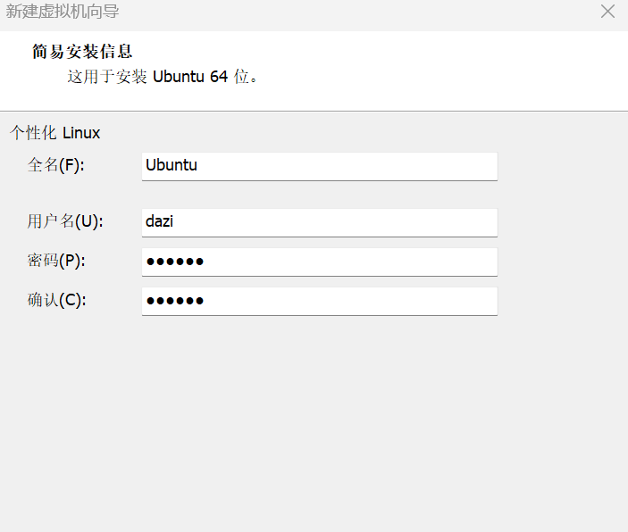
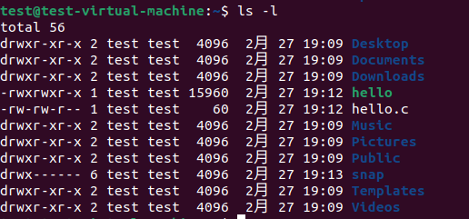
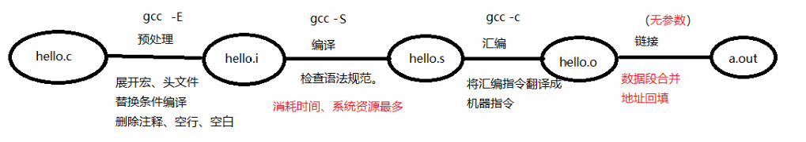
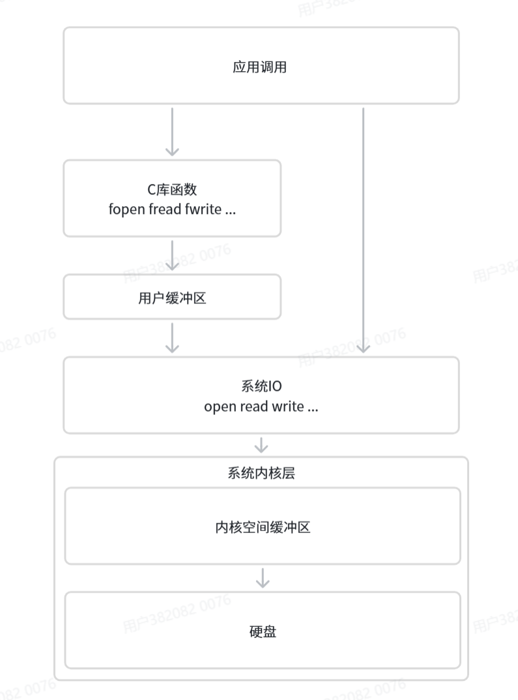
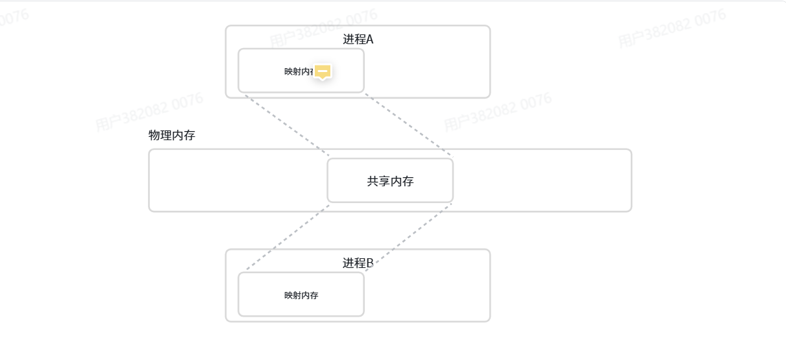
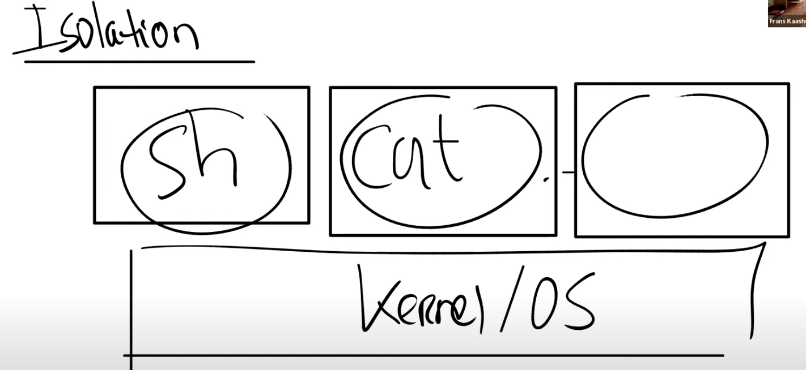
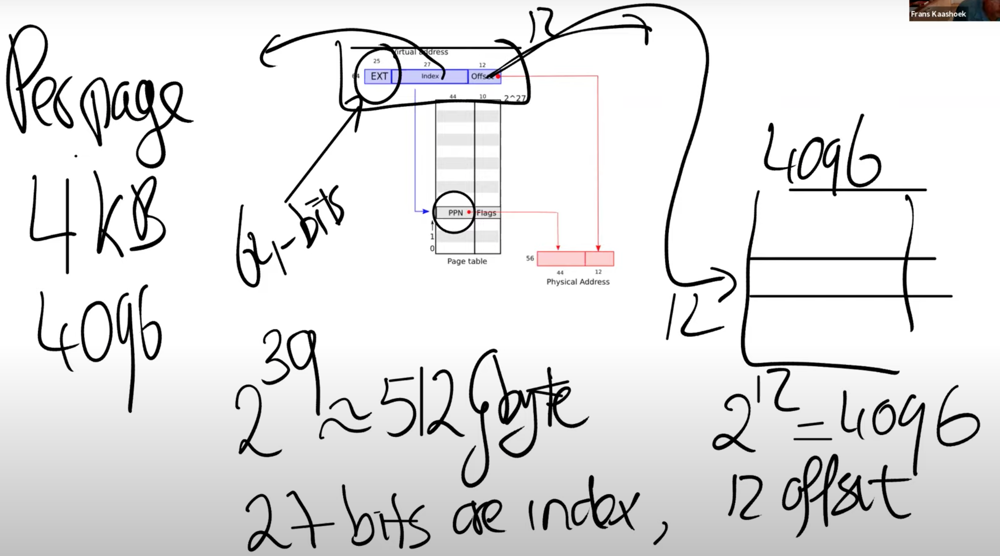

# Linux 系统编程学习笔记

> 📅 学习时间：2026年2月 - 4月  
> 🎯 目标：快速过完 Linux 系统编程核心概念

---

## 目录

- [第一章 环境搭建](#第一章-环境搭建)
  - [安装 VMware 和 Ubuntu](#安装-vmware-和-ubuntu)
  - [安装必要软件](#安装必要软件)
- [第二章 Linux 基本命令](#第二章-linux-基本命令)
  - [文件与目录操作](#文件与目录操作)
    - [ls — 列出目录及文件名](#ls-—-列出目录及文件名)
    - [cd — 切换目录](#cd-—-切换目录)
    - [pwd — 显示当前目录](#pwd-—-显示当前目录)
    - [mkdir — 创建新目录](#mkdir-—-创建新目录)
    - [cp — 复制文件或目录](#cp-—-复制文件或目录)
    - [rm — 删除文件或目录](#rm-—-删除文件或目录)
    - [mv — 移动文件与目录](#mv-—-移动文件与目录)
    - [chmod — 修改文件或目录的权限](#chmod-—-修改文件或目录的权限)
  - [压缩与磁盘管理](#压缩与磁盘管理)
    - [tar — 打包压缩](#tar-—-打包压缩)
    - [df — 查看磁盘空间](#df-—-查看磁盘空间)
- [第三章 GCC 编译与库](#第三章-gcc-编译与库)
  - [GCC 编译四步骤](#gcc-编译四步骤)
    - [编译流程示例](#编译流程示例)
  - [静态库](#静态库)
  - [动态库（共享库）](#动态库共享库)
  - [Makefile 与 CMake](#makefile-与-cmake)
    - [Makefile 核心要素](#makefile-核心要素)
    - [Makefile 示例](#makefile-示例)
    - [CMake 简介](#cmake-简介)
- [第四章 文件 I/O](#第四章-文件-i/o)
  - [系统 I/O（open / close / read / write / lseek）](#系统-i/oopen-/-close-/-read-/-write-/-lseek)
    - [open() — 打开文件](#open-—-打开文件)
    - [close() — 关闭文件](#close-—-关闭文件)
    - [open/close 基本示例](#open/close-基本示例)
    - [write() — 写入文件](#write-—-写入文件)
    - [read() — 读取文件](#read-—-读取文件)
    - [lseek() — 设置文件读写位置](#lseek-—-设置文件读写位置)
    - [综合示例：文件的写、读、定位操作](#综合示例：文件的写、读、定位操作)
    - [实战：用 read 和 write 实现 cp 命令](#实战：用-read-和-write-实现-cp-命令)
  - [系统 I/O vs 标准 I/O 对比](#系统-i/o-vs-标准-i/o-对比)
  - [缓冲区机制](#缓冲区机制)
    - [用户缓冲区（User Buffer）](#用户缓冲区user-buffer)
    - [内核缓冲区（Kernel Buffer / Page Cache）](#内核缓冲区kernel-buffer-/-page-cache)
    - [缓冲区数据何时写入设备？](#缓冲区数据何时写入设备？)
  - [标准 C I/O（fopen / fclose / fwrite / fread / fseek）](#标准-c-i/ofopen-/-fclose-/-fwrite-/-fread-/-fseek)
    - [fopen() — 打开文件](#fopen-—-打开文件)
    - [fclose() — 关闭文件](#fclose-—-关闭文件)
    - [fopen/fclose 基本示例](#fopen/fclose-基本示例)
    - [fwrite() — 写入文件](#fwrite-—-写入文件)
    - [fread() — 读取文件](#fread-—-读取文件)
    - [fseek() — 设置文件位置](#fseek-—-设置文件位置)
    - [标准 I/O 综合示例](#标准-i/o-综合示例)
    - [write 与 fwrite 的区别](#write-与-fwrite-的区别)
- [第五章 进程管理](#第五章-进程管理)
  - [进程概念](#进程概念)
    - [为什么需要进程？](#为什么需要进程？)
    - [并发 vs 并行](#并发-vs-并行)
  - [Linux 父子进程](#linux-父子进程)
  - [fork 创建子进程](#fork-创建子进程)
    - [fork 函数](#fork-函数)
    - [fork 基本示例](#fork-基本示例)
  - [进程终止与等待](#进程终止与等待)
    - [进程终止方式](#进程终止方式)
    - [waitpid — 等待子进程终止](#waitpid-—-等待子进程终止)
    - [示例：父进程等待子进程终止](#示例：父进程等待子进程终止)
  - [exec 系列函数](#exec-系列函数)
    - [示例：fork + execl 结合使用](#示例：fork-+-execl-结合使用)
  - [实战：保活进程（Monitor）](#实战：保活进程monitor)
    - [第一步：创建被监控程序 hello](#第一步：创建被监控程序-hello)
    - [第二步：实现保活程序 monitor](#第二步：实现保活程序-monitor)
- [第六章 进程间通信（IPC）](#第六章-进程间通信ipc)
  - [概述：为什么需要 IPC](#概述：为什么需要-ipc)
    - [Linux IPC 方式一览](#linux-ipc-方式一览)
  - [匿名管道（Anonymous Pipe）](#匿名管道anonymous-pipe)
    - [pipe() 函数](#pipe-函数)
    - [示例一：父子进程单向通信（父→子）](#示例一：父子进程单向通信父→子)
    - [示例二：父子进程双向通信（双管道模拟全双工）](#示例二：父子进程双向通信双管道模拟全双工)
  - [命名管道（FIFO）](#命名管道fifo)
    - [mkfifo() 函数](#mkfifo-函数)
    - [示例一：父子进程通过 FIFO 通信](#示例一：父子进程通过-fifo-通信)
    - [示例二：非亲缘进程通过 FIFO 通信（独立进程）](#示例二：非亲缘进程通过-fifo-通信独立进程)
    - [匿名管道 vs 命名管道 对比](#匿名管道-vs-命名管道-对比)
    - [FIFO 与普通文件的区别](#fifo-与普通文件的区别)
  - [共享内存（Shared Memory）](#共享内存shared-memory)
    - [shm_open() — 创建或打开共享内存对象](#shm_open-—-创建或打开共享内存对象)
    - [ftruncate() — 设置共享内存大小](#ftruncate-—-设置共享内存大小)
    - [mmap() — 将共享内存映射到进程地址空间](#mmap-—-将共享内存映射到进程地址空间)
    - [munmap() — 解除共享内存映射](#munmap-—-解除共享内存映射)
    - [shm_unlink() — 删除共享内存对象](#shm_unlink-—-删除共享内存对象)
  - [消息队列（Message Queue）](#消息队列message-queue)
    - [mq_open() — 创建或打开消息队列](#mq_open-—-创建或打开消息队列)
    - [mq_send() / mq_receive() — 发送和接收消息](#mq_send-/-mq_receive-—-发送和接收消息)
    - [mq_close() — 关闭消息队列](#mq_close-—-关闭消息队列)
    - [mq_unlink() — 删除消息队列](#mq_unlink-—-删除消息队列)
    - [示例一：父子进程通过消息队列通信](#示例一：父子进程通过消息队列通信)
    - [示例二：独立进程间传递结构体数据](#示例二：独立进程间传递结构体数据)
  - [信号（Signal）](#信号signal)
    - [信号的基本用法](#信号的基本用法)
  - [信号量（Semaphore）](#信号量semaphore)
    - [sem_open() — 创建或打开信号量](#sem_open-—-创建或打开信号量)
    - [sem_close() — 关闭有名信号量](#sem_close-—-关闭有名信号量)
    - [sem_unlink() — 删除有名信号量](#sem_unlink-—-删除有名信号量)
    - [sem_wait() / sem_trywait() — 等待信号量](#sem_wait-/-sem_trywait-—-等待信号量)
    - [sem_post() — 增加信号量值](#sem_post-—-增加信号量值)
    - [示例：共享内存 + 信号量实现同步](#示例：共享内存-+-信号量实现同步)
  - [IPC 总结与选型指南](#ipc-总结与选型指南)
- [第七章 多线程编程](#第七章-多线程编程)
  - [为什么需要线程](#为什么需要线程)
  - [核心线程函数](#核心线程函数)
  - [线程互斥锁（Mutex）](#线程互斥锁mutex)
    - [核心函数](#核心函数)
    - [互斥锁使用示例](#互斥锁使用示例)
  - [条件变量（Condition Variable）](#条件变量condition-variable)
    - [核心函数](#核心函数)
- [第八章 xv6](#第八章-xv6)


## 学习计划

结合小智的文档快速过完系统编程的基本概念，然后去做飞书的相机项目。

---

## 第一章 环境搭建

### 安装 VMware 和 Ubuntu

安装虚拟机 VMware 和操作系统 Ubuntu。



- 系统密码：`123456`
- Ubuntu 用户名密码同样为：`123456`


### 安装必要软件

安装飞书、VPN 和 MATLAB。

---

## 第二章 Linux 基本命令

### 文件与目录操作

#### ls — 列出目录及文件名

ls -l    列出详细信息



如图所示：第一位指的是文件类型，d表示目录，-表示普通文件，c表示字符设备，b表示块设备

第一位之后的九位，以三位为一个单元，分别表示文件所有者、所属用户组、其他用户的文件使用权限，rwx分别为读，写，执行权限

#### cd — 切换目录

- `cd ~` / `cd .` / `cd ..`

#### pwd — 显示当前目录

- 直接执行 `pwd`

#### mkdir — 创建新目录

- `mkdir dirname`

#### cp — 复制文件或目录

- `cp filename dirname` — 复制文件到目录
- `cp filename1 filename2` — 复制文件1并重命名为文件2
- `cp -a dirname1 dirname2` — 复制目录1及其下所有文件到目录2
- `cp -r dirname1 dirname2` — 递归复制目录1到目录2

#### rm — 删除文件或目录

- `rm filename` / `rm -r dirname`

#### mv — 移动文件与目录

- `mv file1 file2 location` — 将文件1和文件2移动到目标位置

#### chmod — 修改文件或目录的权限

- 操作码设置权限：`chmod 764 file`，设置文件权限为 `rwxrw-r--`

### 压缩与磁盘管理

#### tar — 打包压缩

- **压缩（gzip 方式）**：`tar zcvf spacefile.tar.gz hello.c nihao.c`
- **单独压缩**：`gzip filename` → 生成 `filename.gz`
- **压缩（bzip2 方式）**：`tar jcvf spacefile.tar.bz2 hello.c nihao.c`
- **解压**：将 `c` 改为 `x`
  - `tar jxvf spacefile.tar.bz2` — 解压 bzip2 压缩包
  - `tar zxvf spacefile.tar.gz` — 解压 gzip 压缩包

#### df — 查看磁盘空间

- 默认以 1KB 为单位，数字很大，可读性差
- `df -h` 会自动换算成 GB、MB、KB 等易读单位

---

## 第三章 GCC 编译与库

### GCC 编译四步骤

GCC 编译的四个步骤：**预处理 → 编译 → 汇编 → 链接**

| 步骤 | 动作 | 说明 |
|------|------|------|
| 1. 预处理 | 展开宏、头文件，替换条件编译，删除注释/空行/空白 | `gcc -E` |
| 2. 编译 | 检查语法规范，**消耗时间和系统资源最多** | `gcc -S` |
| 3. 汇编 | 将汇编指令翻译成机器指令 | `gcc -c` |
| 4. 链接 | 数据段合并，地址回填 | `gcc -o` |




#### 编译流程示例

**分步编译：**

```bash
# 编译生成目标文件（.o 文件）
gcc -c hello.c -o hello.o

# 链接目标文件生成可执行文件
gcc hello.o -o hello
```

**一步到位：**

```bash
gcc hello.c -o hello
```

**运行：**

```bash
./hello
```

**指定头文件路径：**

```bash
gcc -I ./hellodir hello.c -o hello
```

> `-I` 参数指定 hello.c 程序中头文件所在位置。

### 静态库

> 💡 **库是为了提高代码的复用效率。**

**静态库特点：**
- 对空间要求低，对时间要求高
- 在编译阶段库文件**完整复制**到程序中
- 如果库文件 100MB + 运行程序 10KB → 编译后占用 **100MB + 10KB**

静态库的生成是对目标文件（.o 文件）进行操作：

```bash
# 编译各源文件为目标文件
gcc -c add.c -o add.o
gcc -c sub.c -o sub.o
gcc -c div1.c -o div1.o

# 生成静态库（名字以 lib 开头，以 .a 结尾）
ar rcs libmymath.a add.o sub.o div1.o

# 使用静态库编译
gcc test.c libmymath.a -o a.out
./a.out
```

```c
// add.c — 加法函数
int add(int a, int b)
{
    return a + b;
}
// sub.c、div1.c 结构类似
```

```c
// test.c — 调用静态库中的函数
#include <stdio.h>
#include <stdlib.h>
#include <string.h>
#include <unistd.h>
#include <pthread.h>

int add(int, int);
int sub(int, int);
int div1(int, int);  // 函数声明

int main(int argc, char *argv[])
{
    int a = 9, b = 3;
    printf("%d + %d = %d\n", a, b, add(a, b));
    printf("%d - %d = %d\n", a, b, sub(a, b));
    printf("%d / %d = %d\n", a, b, div1(a, b));
    return 0;
}
```

### 动态库（共享库）

**动态库特点：**
- 对时间要求低，对空间要求高
- 在编译阶段库文件仅**记录库引用**
- 如果库文件 100MB + 运行程序 10KB → 编译后占用 **仅 10KB**

> 📌 **核心区别**：静态库在编译时完整复制，动态库在运行时动态加载。

动态库也是对 .o 文件进行操作：

```bash
# 编译为目标文件（-fPIC 使函数与位置无关，挂上 @plt 标识等待动态绑定）
gcc -c add.c -o add.o -fPIC
gcc -c sub.c -o sub.o -fPIC
gcc -c div1.c -o div1.o -fPIC

# 制作动态库（lib库名.so）
gcc -shared -o libmymath.so add.o sub.o div1.o

# 编译可执行程序（-l 指定库名，-L 指定库路径）
gcc test.c -o a.out -l mymath -L ./lib

# 运行
./a.out
```

**运行时加载错误分析与解决：**

| 组件 | 工作阶段 | 所需参数 |
|------|---------|---------|
| 连接器 (Linker) | 链接阶段 | `-l` 和 `-L` |
| 动态链接器 (Dynamic Linker) | 程序运行阶段 | 动态库所在目录位置 |

**解决方法：** 通过环境变量指定动态库路径：

```bash
export LD_LIBRARY_PATH=./lib
```

### Makefile 与 CMake

Makefile 主要用于大型项目管理中。

#### Makefile 核心要素

**1 个规则：**

规则的格式为：`目标 : 依赖条件`

1. 目标的时间必须晚于依赖条件的时间，否则更新目标
2. 依赖条件如果不存在，找寻新的规则去产生依赖条件
3. `ALL`：指定 Makefile 的终极目标

**2 个函数：**

```makefile
src = $(wildcard ./*.c)
# 匹配当前工作目录下的所有 .c 文件，将文件名组成列表，赋值给变量 src
# 用 src 代指 add.c, sub.c, div1.c
```

```makefile
obj = $(patsubst %.c, %.o, $(src))
# 将参数3中包含参数1的部分替换成参数2
# 用 obj 代指 add.o, sub.o, div1.o
```

**3 个自动变量：**

| 变量 | 含义 |
|------|------|
| `$@` | 在规则命令中表示规则中的目标 |
| `$<` | 将依赖条件列表中的依赖依次取出，套用模式规则 |
| `$^` | 表示规则中的所有条件，组成列表（以空格隔开），有重复项则去重 |

#### Makefile 示例

遍历当前路径下所有的 .c 文件：

```makefile
CC = gcc
SRCS = $(wildcard *.c)
OBJS = $(SRCS:.c=.o)

hello: $(OBJS)
	$(CC) $^ -o $@

%.o: %.c
	$(CC) -c $< -o $@

clean:
	rm -f $(OBJS) hello
```

**规则解释：**

- `hello: $(OBJS)` — 通过所有 .o 依赖文件生成可执行文件，`$^` 表示所有依赖文件，`$@` 表示目标文件（hello）
- `%.o: %.c` — 将任意的 .c 源文件编译成对应的 .o 目标文件，无需为每个 .c 文件单独编写编译规则，简化 Makefile 编写；`$<` 表示依赖文件（.c），`$@` 表示目标文件（.o）

#### CMake 简介

CMake 是一个 Makefile 生成器，通过 CMake 生成 Makefile 后，最终还是通过 make 编译。相对而言，CMake 工程更容易读懂和维护。


---

## 第四章 文件 I/O

> 💡 **Linux 一切皆文件**：系统将几乎所有硬件设备、进程、网络连接等资源都抽象为文件，通过统一的文件操作接口（如 `open()`、`read()`、`write()`、`close()`）来访问和管理，使得 Linux 编程更加统一和简洁。

### 系统 I/O（open / close / read / write / lseek）

系统 I/O 基于操作系统提供的系统调用实现，直接与内核交互，操作的是**文件描述符（fd）**，更加底层，灵活性高但使用相对复杂。

#### open() — 打开文件


```c
#include <fcntl.h>
int open(const char *pathname, int flags, mode_t mode);

/* 参数说明：
 * pathname — 文件路径名
 * flags    — 必选其一：O_RDONLY(只读)、O_WRONLY(只写)、O_RDWR(读写)
 *            可选组合：O_CREAT(不存在则创建)、O_TRUNC(清空)、O_APPEND(追加)
 *            高级选项：O_NONBLOCK(非阻塞)、O_SYNC(同步写入)
 * mode     — 权限（仅 O_CREAT 时有效），如 0644 对应 -rw-r--r--
 * 返回值   — 成功返回文件描述符(fd)，失败返回 -1
 */
```

#### close() — 关闭文件

```c
#include <unistd.h>
int close(int fd);
// 参数：fd — 文件描述符
// 返回值：成功返回 0，失败返回 -1
```

#### open/close 基本示例

```c
#include <stdio.h>   // 标准输入输出函数
#include <fcntl.h>   // open() 函数声明
#include <unistd.h>  // close() 函数声明

int main()
{
    int fd;
    fd = open("example.txt", O_RDWR | O_CREAT, 0644);
    if (fd == -1) {
        printf("打开文件失败");
        return 1;
    }
    // 使用文件描述符进行读写操作...
    close(fd);
    return 0;
}
```

#### write() — 写入文件

```c
#include <unistd.h>
ssize_t write(int fd, const void *buf, size_t count);

/* 参数说明：
 * fd    — 文件描述符（由 open() 返回）
 * buf   — 指向内存缓冲区的指针，存放要写入的数据
 * count — 请求写入的字节数
 * 返回值 — 成功返回实际写入的字节数，失败返回 -1
 *
 * 类型说明：
 *   size_t  — unsigned long / unsigned long long（无符号）
 *   ssize_t — signed long / signed long long（有符号，对应 size_t）
 */
```

#### read() — 读取文件

```c
#include <unistd.h>
ssize_t read(int fd, void *buf, size_t count);

/* 参数说明：
 * fd    — 文件描述符
 * buf   — 指向内存缓冲区的指针，用于存储读取的数据
 * count — 请求读取的最大字节数
 * 返回值 — 成功返回实际读取的字节数(可能小于 count)
 *          0 表示已到达文件末尾(EOF)
 *          -1 表示出错
 */
```

#### lseek() — 设置文件读写位置

```c
#include <unistd.h>
off_t lseek(int fd, off_t offset, int whence);

/* 参数说明：
 * fd     — 文件描述符
 * offset — 偏移量（正数向后移动，负数向前移动，0 不移动）
 * whence — 基准位置：
 *          SEEK_SET — 从文件开头计算
 *          SEEK_CUR — 从当前位置计算
 *          SEEK_END — 从文件末尾计算（offset 可为负数）
 * 返回值 — 成功返回新的文件偏移量（从文件头算起的字节数），失败返回 -1
 */
```


#### 综合示例：文件的写、读、定位操作

```c
#include <fcntl.h>   // open 函数
#include <unistd.h>  // read、write、close 函数
#include <stdio.h>   // 标准输入输出函数
#include <string.h>  // strlen 函数

int main()
{
    int fd;
    char write_buf[] = "Hello, World!";
    char read_buf[100];
    ssize_t bytes_written, bytes_read;

    // 打开文件，如果不存在则创建，设置读写权限
    fd = open("test.txt", O_RDWR | O_CREAT | O_TRUNC, 0644);
    if (fd == -1) {
        printf("打开文件失败");
        return 1;
    }

    // write：将 write_buf 缓冲区中的内容写入 fd 文件
    bytes_written = write(fd, write_buf, strlen(write_buf));
    if (bytes_written == -1) {
        printf("写入失败");
        close(fd);
        return 1;
    }
    printf("成功写入 %zd 字节\n", bytes_written);

    // 将文件指针重置到开头
    if (lseek(fd, 0, SEEK_SET) == -1) {
        printf("重置文件指针失败");
        close(fd);
        return 1;
    }

    // read：将 fd 文件内容读取到 read_buf 缓冲区中
    // sizeof(read_buf)-1 是为了留出最后一字节的空间存放 '\0'
    bytes_read = read(fd, read_buf, sizeof(read_buf) - 1);
    if (bytes_read == -1) {
        printf("读取失败");
        close(fd);
        return 1;
    }
    read_buf[bytes_read] = '\0';  // 必须加 '\0' 保证内容正确结束
    printf("成功读取 %zd 字节：%s\n", bytes_read, read_buf);

    close(fd);
    return 0;
}
```

#### 实战：用 read 和 write 实现 cp 命令

```c
#include <stdio.h>
#include <stdlib.h>
#include <string.h>
#include <fcntl.h>
#include <unistd.h>
#include <pthread.h>

int main(int argc, char *argv[])
{
    char buf[1024];
    int n = 0;
    int fd1 = open(argv[1], O_RDONLY);
    int fd2 = open(argv[2], O_RDWR | O_CREAT | O_TRUNC, 0664);

    // 1024 是缓冲区的最大长度
    // 内容 < 1024 字符 → 一次性传输
    // 内容 > 1024 字符 → 分批传输，n 为每次传输的字符数量
    while ((n = read(fd1, buf, 1024)) != 0) {
        write(fd2, buf, n);
    }

    close(fd1);
    close(fd2);
    return 0;
}
```

### 系统 I/O vs 标准 I/O 对比



> 此图清晰展示了系统 I/O 和标准 I/O 的层次关系。

- **系统 I/O**：基于系统调用，直接与内核交互，操作文件描述符（fd），较底层，无用户空间缓冲
- **标准 I/O**：C 标准库提供的 I/O 函数，基于系统 I/O 封装，**自带用户缓冲区**，遵循"预读入缓输出"机制

### 缓冲区机制

#### 用户缓冲区（User Buffer）

在进行数据读写时，数据先不直接写入或读入设备，而是写入或读入**内存空间**，当满足一定条件时再将数据写入文件或设备中。

> 🎯 **作用**：**减少系统调用次数**，提高读写速度和代码效率。每一次系统调用都是很浪费系统资源的。

#### 内核缓冲区（Kernel Buffer / Page Cache）

为了提高磁盘 I/O 性能，操作系统使用缓冲区（页缓存）技术。当调用 `write` 时，数据首先被复制到内核的页缓存中，而不是直接写入磁盘。

> 🎯 **作用**：将多次小的写入操作合并成一次大的写入操作，**减少磁盘寻道和旋转延迟**，提高整体性能。

#### 缓冲区数据何时写入设备？

1. 缓冲区已满
2. 手动强制写入（`fsync` / `fflush`）
3. 程序结束
4. 关闭文件

---

### 标准 C I/O（fopen / fclose / fwrite / fread / fseek）

#### fopen() — 打开文件

```c
#include <stdio.h>
FILE *fopen(const char *path, const char *mode);

/* 参数说明：
 * path — 文件路径名
 * mode — 打开模式（如 "r", "w", "r+", "w+", "a" 等）
 * 返回值 — 成功返回文件指针(FILE*)，失败返回 NULL
 */
```

#### fclose() — 关闭文件

```c
#include <stdio.h>
int fclose(FILE *fp);
// 参数：fp — 文件指针
// 返回值：成功返回 0，失败返回 EOF
```

#### fopen/fclose 基本示例

```c
#include <stdio.h>

int main()
{
    FILE *file = fopen("example.txt", "w");
    if (file == NULL) {
        printf("fopen error");
        return 1;
    }

    fclose(file);
    return 0;
}
```

#### fwrite() — 写入文件

```c
#include <stdio.h>
size_t fwrite(const void *ptr, size_t size, size_t nmemb, FILE *stream);

/* 参数说明：
 * ptr    — 需要写入的数据缓存地址
 * size   — 数据块大小（每个元素的字节数）
 * nmemb  — 要写入的数据块个数
 * stream — 目标文件指针
 * 返回值 — 成功返回写入的数据块个数（注意：不是字节数！），失败返回 0
 */
```

#### fread() — 读取文件

```c
#include <stdio.h>
size_t fread(void *ptr, size_t size, size_t nmemb, FILE *stream);

/* 参数说明：
 * ptr    — 存放数据的缓存地址
 * size   — 数据块大小（每个元素的字节数）
 * nmemb  — 要读取的数据块个数
 * stream — 源文件指针
 * 返回值 — 成功返回读取到的数据块个数（注意：不是字节数！），失败返回 0
 */
```

#### fseek() — 设置文件位置

```c
#include <stdio.h>
int fseek(FILE *stream, long offset, int whence);

/* 参数说明：
 * stream — 文件指针
 * offset — 光标偏移量
 * whence — 基准位置：
 *          SEEK_SET — 从文件头开始
 *          SEEK_CUR — 从当前位置开始
 *          SEEK_END — 从文件末尾开始
 */
```


#### 标准 I/O 综合示例

```c
#include <stdio.h>
#include <stdlib.h>
#include <string.h>

int main()
{
    FILE *fp;
    char write_buffer[] = "Hello, World!";
    char read_buffer[100];
    size_t bytes_written, bytes_read;

    // 创建并打开文件
    fp = fopen("example.txt", "w+");
    if (fp == NULL) {
        printf("无法创建文件");
        return 1;
    }

    // fwrite 写入数据
    bytes_written = fwrite(write_buffer, sizeof(char), strlen(write_buffer), fp);
    if (bytes_written != strlen(write_buffer)) {
        printf("写入失败");
        fclose(fp);
        return 1;
    }
    printf("成功写入 %zu 字节\n", bytes_written);

    // fseek 将文件指针重置到文件开头
    if (fseek(fp, 0, SEEK_SET) != 0) {
        printf("重置文件指针失败");
        fclose(fp);
        return 1;
    }

    // fread 读取数据
    bytes_read = fread(read_buffer, sizeof(char), sizeof(read_buffer) - 1, fp);
    if (bytes_read > 0) {
        read_buffer[bytes_read] = '\0';  // 添加字符串结束符
        printf("成功读取 %zu 字节：%s\n", bytes_read, read_buffer);
    } else {
        printf("读取失败");
    }

    fclose(fp);
    return 0;
}
```

#### write 与 fwrite 的区别

| 对比维度 | write（系统 I/O） | fwrite（标准 I/O） |
|----------|-------------------|---------------------|
| **层次** | 系统调用，直接与内核交互 | C 标准库函数，基于 write 封装 |
| **缓冲区** | 无用户空间缓冲 | 自带用户空间缓冲区 |
| **数据流向** | 用户空间 → 内核缓冲区 | 用户空间 → 用户缓冲区 → 内核缓冲区 |
| **强制写入** | `fsync` | `fflush` |
| **性能** | 频繁调用时系统调用次数多，性能受影响 | 缓冲机制减少系统调用，效率更高 |

---

## 第五章 进程管理

### 进程概念

| 概念 | 比喻 | 说明 |
|------|------|------|
| **程序 (Program)** | 剧本 | 死的，只占用磁盘空间，静态的可执行文件（机器指令 + 数据） |
| **进程 (Process)** | 戏 | 活的，运行起来的程序，占用内存、CPU 等系统资源 |
| **PID** | 身份证 | 每个进程唯一的标识符，由操作系统分配，方便管理 |

#### 为什么需要进程？

- **安全性**：每个进程运行在独立的地址空间中，一个进程的错误不会影响其他进程，增强系统稳定性
- **提高效率**：多进程实现并发执行，提高处理能力和响应速度
- **简化编程**：进程模型直观管理程序，方便复杂任务的分解和并行处理

#### 并发 vs 并行

| 概念 | 说明 | 硬件要求 |
|------|------|----------|
| **并发 (Concurrency)** | 逻辑上同时发生，任何瞬间只做一件事，宏观上同时推进多项任务 | 单核 CPU |
| **并行 (Parallelism)** | 物理上同时发生，同一瞬间多件事确实同时进行 | 多核 CPU |

> 📌 **结论**：单核 CPU 只能实现并发，多核 CPU 才能实现真正的并行。

### Linux 父子进程

Ubuntu 内核在启动时创建第一个 PID 为 1 的进程（init），后续所有进程都由此进程创建和管理（僵尸进程除外）。Linux 把所有进程放在一个**树状结构**中管理，可通过 `pstree` 命令查看。

| 概念 | 说明 |
|------|------|
| **父进程** | 创建子进程，可向子进程发送信号，等待子进程结束 |
| **子进程** | 是父进程的副本，继承父进程的资源，可向父进程发送信号 |
| **孤儿进程** | 父进程先终止而子进程未终止，孤儿进程被 init 进程（PID=1）收养 |
| **僵尸进程** | 子进程终止但父进程未调用 `wait`/`waitpid` 获取退出状态，占用少量资源但不消耗 CPU


### fork 创建子进程

#### fork 函数

```c
#include <unistd.h>
pid_t fork(void);
// 创建一个新进程，新进程为原进程的副本
```

**子进程特性：**
- 拥有与父进程相同的代码段、数据段、堆栈段
- 有自己的独立内存空间，但初始内容与父进程相同
- 从 fork 调用后的下一条指令开始执行

**返回值：**
- 父进程中：返回**子进程的 PID**（> 0）
- 子进程中：返回 **0**
- 失败时：返回 **-1**

> 💡 **通过 fork 的返回值区分父进程和子进程。**

#### fork 基本示例

```c
#include <stdio.h>
#include <unistd.h>

int main(void)
{
    int result;
    printf("This is a fork demo!\n\n");

    result = fork();

    if (result == -1) {
        // 出错处理
        printf("Fork error\n");
        return -1;
    }
    else if (result == 0) {
        // 返回值为 0 代表子进程
        printf("The returned value is %d, In child process!! My PID is %d\n\n",
               result, getpid());
    }
    else {
        // 返回值大于 0 代表父进程，result 为子进程 PID
        printf("The returned value is %d, In father process!! My PID is %d\n\n",
               result, getpid());
    }

    while (1);  // 让进程保持运行，方便观察
    return result;
}
```

### 进程终止与等待

#### 进程终止方式

**正常终止（两种方式）：**

```c
// 方式一：main 函数中调用 return
int main() {
    return 0;
}

// 方式二：调用 exit 函数
#include <stdlib.h>
void exit(int status);
// status — 进程退出状态码（0~255），传递给父进程，标识执行结果

void func() {
    exit(1);  // 在非 main 函数中调用，进程直接退出
}
```

**异常终止：**

进程收到某些信号（如 SIGKILL、SIGSEGV）而终止。例如：`kill -9 <PID>`

#### waitpid — 等待子进程终止

```c
#include <sys/wait.h>
pid_t waitpid(pid_t pid, int *status, int options);
// pid     — 要等待的子进程 PID
// status  — 存储子进程退出状态的指针
// options — 0 表示阻塞等待，WNOHANG 表示非阻塞模式
```

#### 示例：父进程等待子进程终止

```c
#include <stdio.h>
#include <unistd.h>
#include <sys/wait.h>

int main(void)
{
    int pid;
    printf("This is a fork demo!\n\n");

    pid = fork();

    if (pid == -1) {
        printf("Fork error\n");
        return -1;
    }
    else if (pid == 0) {
        // 子进程
        printf("The returned value is %d, In child process!! My PID is %d\n\n",
               pid, getpid());
        return 1;
    }
    else {
        // 父进程
        int status;
        waitpid(pid, &status, 0);  // 阻塞等待子进程运行完成
        printf("child return status = %d\n", WEXITSTATUS(status));
        printf("The returned value is %d, In father process!! My PID is %d\n\n",
               pid, getpid());
    }
    return 0;
}
```

### exec 系列函数

虽然 fork 创建了子进程，但子进程和父进程执行的代码是一样的（相当于复制）。如果我们希望新进程执行**不同的任务**，应该使用 exec 系列函数。

```c
#include <unistd.h>
int execl(const char *path, const char *arg, ...);

/* 功能：在当前进程中加载并执行新的程序
 * 参数：
 *   path — 可执行文件的绝对路径
 *   arg  — 参数列表，第一个参数通常为程序名（argv[0]），最后一个参数必须是 NULL
 *   例如：execl("/bin/ls", "ls", "-l", NULL)
 * 返回值：成功时无返回值，失败时返回 -1 并设置 errno
 */
```

#### 示例：fork + execl 结合使用

```c
#include <stdio.h>
#include <unistd.h>
#include <sys/wait.h>

int main()
{
    pid_t pid = fork();

    if (pid == -1) {
        printf("fork error");
        return 1;
    }
    else if (pid == 0) {
        // 子进程：执行新程序
        printf("Child process: PID = %d\n", getpid());
        if (execl("/bin/ls", "ls", "-l", "/home/xiaozhi", NULL) < 0) {
            printf("execl error");
            return 1;
        }
    }
    else {
        // 父进程：等待子进程
        printf("Parent process: PID = %d, Child PID = %d\n", getpid(), pid);
        int status;
        waitpid(pid, &status, 0);
        printf("Child exited with status %d\n", WEXITSTATUS(status));
    }
    return 0;
}
```

### 实战：保活进程（Monitor）

> 🎯 **目标**：实现一个监控程序，对另一个进程进行启动和异常重启保活。

#### 第一步：创建被监控程序 hello

```c
#include <unistd.h>
#include <stdio.h>

int main()
{
    while (1) {
        printf("hello\n");
        usleep(5000 * 1000);  // 每 5 秒打印一次
    }
    return 0;
}
```

编译生成 `hello` 可执行文件。

#### 第二步：实现保活程序 monitor

```c
#include <stdio.h>    // 标准输入输出
#include <stdlib.h>   // 标准库函数，包含 exit()
#include <unistd.h>   // 包含 fork(), execl(), sleep(), read(), write()
#include <sys/wait.h> // 包含 wait(), waitpid()

#define PROGRAM1 "./hello"

pid_t pid;  // 全局变量：保存子进程 PID

void start_program(const char *program)
{
    pid = fork();
    if (pid == 0) {
        // 子进程：执行目标程序，不再返回
        execl(program, program, (char *)NULL);
        printf("execl error");
        exit(1);
    } else if (pid < 0) {
        printf("fork error");
        exit(1);
    }
    // 父进程默认分支：pid > 0，全局变量 pid 保存了子进程 PID
}

void monitor_programs()
{
    while (1) {
        int status;
        pid_t result;
        usleep(10 * 1000);  // 每 10ms 检查一次

        // WNOHANG 非阻塞模式：子进程未结束时立即返回，父进程可以继续干其他事
        result = waitpid(pid, &status, WNOHANG);

        if (result == 0) {
            // 子进程还在运行，什么都不做
        } else if (result == -1) {
            printf("waitpid error");
            exit(1);
        } else {
            // 子进程已退出，重新启动
            printf("restart process\n");
            usleep(2 * 1000);
            start_program(PROGRAM1);
        }
    }
}

int main()
{
    start_program(PROGRAM1);
    printf("start %s\n", PROGRAM1);

    monitor_programs();
    return 0;
}
```

> 📌 **核心逻辑**：父进程用 `WNOHANG` 非阻塞轮询子进程状态，子进程退出时自动重启，实现保活。

---


---

## 第六章 进程间通信（IPC）

### 概述：为什么需要 IPC

在项目进行模块化开发时，一个大项目有多个不同的模块，可以把这些模块作为独立的仓库开发。只要规范好 IPC 接口和协议，不同模块可以由不同开发人员开发，互不影响，而且一个模块的 BUG 也不会影响到其他模块运行。

当应用被分为多个独立运行的进程时，进程之间需要有效地交换信息，这正是通过进程间通信（Inter-Process Communication, IPC）来实现的。

#### Linux IPC 方式一览

| IPC 方式 | 特点 | 适用场景 |
|----------|------|----------|
| **匿名管道 (Pipe)** | 单向，仅限亲缘进程（父子/兄弟） | 简单父子进程数据传递 |
| **命名管道 (FIFO)** | 通过文件系统路径名访问，可用于非亲缘进程 | 任意进程间简单通信 |
| **共享内存 (Shared Memory)** | 最快，多进程共享同一物理内存 | 大数据量、高频交互（视频/图像处理） |
| **消息队列 (Message Queue)** | 结构化消息，支持优先级 | 结构化数据传输 |
| **信号 (Signal)** | 异步通知机制，类似软件中断 | 事件通知、异常处理 |
| **信号量 (Semaphore)** | 同步互斥机制 | 配合共享内存实现同步 |

---

### 匿名管道（Anonymous Pipe）

> 📌 **特点**：单向通信（半双工），仅限亲缘进程（父子/兄弟），数据在内存中，管道缓冲区通常为 64KB。

#### pipe() 函数

```c
#include <unistd.h>
int pipe(int pipefd[2]);
// pipefd[0] — 读端，pipefd[1] — 写端
// 返回值：成功返回 0，失败返回 -1 并设置 errno

/* 使用注意事项：
 * 1. 只能用于亲缘进程（父子进程、兄弟进程）
 * 2. 单工通信 — 一端读，一端写（需提前设计好方向）
 * 3. 创建管道后，关闭不用的端口（防止文件描述符泄漏）
 * 4. 管道缓冲区固定大小（通常 64KB），写满会阻塞，需保证读写速度匹配
 */
```

#### 示例一：父子进程单向通信（父→子）

```c
#include <stdio.h>
#include <stdlib.h>
#include <unistd.h>
#include <string.h>
#include <sys/wait.h>

int main()
{
    int pipefd[2];     // 管道文件描述符数组
    pid_t pid;
    char buf[100];     // 缓冲区用于读取数据

    // 1. 创建管道（成功时内核将读端 ID 填入 pipefd[0]，写端 ID 填入 pipefd[1]）
    if (pipe(pipefd) == -1) {
        printf("pipe error");
        exit(1);
    }

    // 2. 创建子进程
    pid = fork();
    if (pid == -1) {
        printf("fork error");
        exit(1);
    }

    if (pid == 0) {
        // === 子进程（读取端） ===
        close(pipefd[1]);  // 关闭写端
        ssize_t bytes_read = read(pipefd[0], buf, sizeof(buf));
        // read 将内核缓冲区数据复制到用户空间的 buf 中（安全隔离）
        // strlen(msg)+1 已经包含了 '\0'，所以不用手动补
        if (bytes_read == -1) {
            printf("read error");
            exit(1);
        }
        printf("Child received: %s\n", buf);
        close(pipefd[0]);  // 关闭读端
    }
    else {
        // === 父进程（写入端） ===
        close(pipefd[0]);  // 关闭读端
        const char *msg = "Hello, World!";
        // strlen(msg)+1 把末尾 '\0' 也发送过去，子进程可正确识别字符串结尾
        ssize_t bytes_written = write(pipefd[1], msg, strlen(msg) + 1);
        if (bytes_written == -1) {
            printf("write error");
            exit(1);
        }
        close(pipefd[1]);  // 关闭写端
        wait(NULL);        // 等待子进程结束
    }
    return 0;
}
```


#### 示例二：父子进程双向通信（双管道模拟全双工）

Linux 匿名管道是单向（半双工）的，要像打电话一样你来我往，必须用**两个管道**：

```
父进程 ──pipe1[写]──▶ 子进程（收）
父进程 ◀──pipe2[读]── 子进程（发）
```

```c
#include <stdio.h>
#include <stdlib.h>
#include <unistd.h>
#include <string.h>
#include <sys/wait.h>

int main()
{
    int pipefd1[2];  // 管道1：父 → 子
    int pipefd2[2];  // 管道2：子 → 父
    pid_t pid;
    char buf[100];

    // 创建两个管道
    if (pipe(pipefd1) == -1) { printf(“pipe1 error”); exit(1); }
    if (pipe(pipefd2) == -1) { printf(“pipe2 error”); exit(1); }

    pid = fork();
    if (pid == -1) { printf(“fork error”); exit(1); }

    if (pid == 0) {
        // === 子进程 ===
        close(pipefd1[1]);  // 关掉管道1写端（只收）
        close(pipefd2[0]);  // 关掉管道2读端（只发）

        // 从管道1收父进程消息
        ssize_t n = read(pipefd1[0], buf, sizeof(buf));
        printf(“Child received from parent: %.*s\n”, (int)n, buf);

        // 向管道2发消息给父进程
        const char *msg = “Hello, Parent!”;
        write(pipefd2[1], msg, strlen(msg) + 1);

        close(pipefd1[0]);
        close(pipefd2[1]);
    }
    else {
        // === 父进程 ===
        close(pipefd1[0]);  // 关掉管道1读端（只发）
        close(pipefd2[1]);  // 关掉管道2写端（只收）

        // 向管道1发消息给子进程
        const char *msg = “Hello, Child!”;
        write(pipefd1[1], msg, strlen(msg) + 1);

        // 从管道2收子进程消息
        ssize_t n = read(pipefd2[0], buf, sizeof(buf));
        printf(“Parent received from child: %.*s\n”, (int)n, buf);

        close(pipefd1[1]);
        close(pipefd2[0]);
        wait(NULL);
    }
    return 0;
}
```

**设计思路（用端口开关表理解）：**

| 进程 | 保留端口 | 关闭端口 | 角色 |
|------|---------|----------|------|
| **子进程** | pipefd1[0]（读）、pipefd2[1]（写） | pipefd1[1]、pipefd2[0] | 管道1的接收站 + 管道2的发送站 |
| **父进程** | pipefd1[1]（写）、pipefd2[0]（读） | pipefd1[0]、pipefd2[1] | 管道1的发送站 + 管道2的接收站 |


### 命名管道（FIFO）

> 📌 **特点**：类似匿名管道，但通过文件系统路径名访问，可在**没有亲缘关系**的进程之间使用，在文件系统中占个座（权限位开头为 `p`），但数据只存在于内核缓冲区，不占用磁盘空间。


#### mkfifo() 函数

```c
#include <sys/types.h>
#include <sys/stat.h>
int mkfifo(const char *pathname, mode_t mode);
// pathname — FIFO 路径名
// mode     — 权限模式（如 0666）
// 返回值   — 成功返回 0，失败返回 -1 并设置 errno

/* 注意事项：
 * 1. 有名管道可使非亲缘的两个进程互相通信
 * 2. 通过路径名操作，在文件系统中可见，但内容存放在内存中
 */
```

#### 示例一：父子进程通过 FIFO 通信

```c
#include <stdio.h>
#include <stdlib.h>
#include <sys/types.h>
#include <sys/stat.h>
#include <fcntl.h>
#include <unistd.h>
#include <string.h>
#include <sys/wait.h>

int main() {
    const char *fifo_name = "/tmp/myfifo";
    //这个路径下的文件的权限位开头也会是p(代表pipe)，他在文件系统中占个座，但它不占用磁盘空间，数据依然只存在于内核缓冲区。
    mode_t mode = 0666;

    // 创建命名管道，理解mkfifo函数
    if (mkfifo(fifo_name, mode) == -1) {
        printf("mkfifo error");
        exit(1);
    }

    // 创建子进程
    pid_t pid = fork();
    if (pid == -1) {
        printf("fork error");
        exit(1);
    }

    if (pid == 0) {
        // 子进程
        int fd;
        char buf[100];
        // 打开命名管道进行读取
        fd = open(fifo_name, O_RDONLY, 0644);
        if (fd == -1) {
            printf("open error");
            exit(1);
        }
        // 从命名管道读取数据
        ssize_t bytes_read = read(fd, buf, sizeof(buf));
        if (bytes_read == -1) {
            printf("read error");
            exit(1);
        }
        printf("Child received: %s\n", buf);
        close(fd);
        exit(0);//exit(1)代表出错了，exit(0)代表一切正常，主动刷新缓冲区，收回内存
    } else {
        // 父进程
        int fd;
        const char *msg = "Hello, Child!";
        // 打开命名管道进行写入
        fd = open(fifo_name, O_WRONLY, 0644);
        if (fd == -1) {
            printf("open error");
            exit(1);
        }
        // 向命名管道写入数据
        ssize_t bytes_written = write(fd, msg, strlen(msg) + 1);
        if (bytes_written == -1) {
            printf("write error");
            exit(1);
        }
        close(fd);
        // 等待子进程结束
        wait(NULL);
    }
    // 删除命名管道
    unlink(fifo_name);
    return 0;
}
```


#### 示例二：非亲缘进程通过 FIFO 通信（独立进程）


##### fifo_write（写入进程）

```c
#include <stdio.h>
#include <stdlib.h>
#include <sys/types.h>
#include <sys/stat.h>
#include <fcntl.h>
#include <unistd.h>
#include <string.h>

int main()
{
    printf("run fifo write\n");
    const char *fifo_name = "/tmp/myfifo";
    mode_t mode =0666;
    char buf[100];
    if(access (fifo_name , F_OK)==-1)
    {
        if(mkfifo(fifo_name,mode)==-1)
        {
            printf("mkfifo error");
            return 1;
        }
    }
    //打开命名管道进行读取
    const char *msg ="Hello,Child!";
    //打开命名管道进行写入
    int fd =open(fifo_name,O_WRONLY,0644);
    if(fd == -1)
    {
        printf("open error");
        return 1;
    }
    while(1)
    {
        printf("write data\n");
        //向命名管道写入数据
        ssize_t bytes_written= write(fd,msg,strlen(msg)+1);
        if(byte_written == -1)
        {
            peintf("write error");
            return 1;
        }
        usleep(1000*1000);
    }
    close (fd);
    printf("write finish \n");
    return 0;
}


```


##### fifo_read（读取进程）

```c
#include <stdio.h>
#include <stdlib.h>
#include <sys/types.h>
#include <sys/stat.h>
#include <fcntl.h>
#include <unistd.h>

int main()
{
    printf("run fifo read\n");
    
    const char *fifo_name ="/tmp/myfifo";
    mode_t mode =0666;
    if(access(fifo_name,F_OK)==-1)
    {
        if(mkfifo(fifo_name,mode)==-1)
        {
            printf("mkfifo error");
            return 1;
        }
    }
    char buf[100];
    int fd = open(fifo_name,O_RDONLY,0644);
    if(fd == -1)
    {
        printf("open error");
        return 1;
    }
    while(1)
    {
        //从管道读取数据
        ssize_t bytes_read = read(fd,buf,sizeof(buf));
        if(bytes_read == -1)
        {
            printf("read error");
            return 1;
        }
        else if (bytes_read ==0)
        {
            printf("Writer closed the FIFO.\n");
            break;
        }
        else
            printf("Child received:%s\n",buf);
        
    }
    close(fd);
    return 0;
}


```


#### 匿名管道 vs 命名管道 对比


* 相同点：open打开管道文件以后，在内存中开辟了一块空间，管道的内容在内存中存放，有两个指针，头指针和尾指针指向它，读写数据是在给内存的操作，并且都是半双工通讯。
* 区别：有名在任意进程之间使用，无名在父子进程之间使用。


#### FIFO 与普通文件的区别

有名管道(FIFO):主要用于不同进程之间的单向或双向通信，FIFO提供了一种机制，使得一个进程可以向另一个进程发送数据，而不需要它们直接共享内存或文件，FIFO是一种先进先出的数据结构，数据按照顺序读取和写入。

普通文件：常规文件类型，用于存储数据，主要用于持久化存储数据，可以被多个进程读取和写入


### 共享内存（Shared Memory）


共享内存是Linux的一种高效的进程间通信方式，通过共享内存，多个进程可以访问同一块内存区域，从而实现数据的快速交换。



映射内存就是在每个人进程的虚拟地址空间中，实现了某块虚拟内存区域与物理内存中的“共享内存”的链接，但是各进程之间隔离。


#### shm_open() — 创建或打开共享内存对象

```c
#include <sys/mman.h>
#include <fcntl.h>
int shm_open(const char *name,int oflag,mode_t mode);
```

功能：创建或打开一个命名的共享内存对象。

参数： name：共享内存对象的名字，使用路径字符串(如./my_shm)。

oflag：操作标志，如 `O_CREAT`, `O_RDWR`, `O_RDONLY` 等。

 O_RDONLY（只读）、O_WRONLY（只写）、O_RDWR（读写） O_CREAT（不存在则创建）、O_TRUNC（清空）、O_APPEND（追加）

mode：权限设置，常见的权限设置包括 0666（所有用户都有读写权限）。

返回值：成功返回文件描述符(fd)，失败返回-1。

```c
 // 创建或打开共享文件（如果不存在则创建，设置读写权限）
 int shm_fd = shm_open("/my_shared_memory", O_CREAT | O_RDWR, 0666);
```

#### ftruncate() — 设置共享内存大小

```c
#include <unistd.h>
#include <sys/mman.h>
int ftruncate(int fd,off_t length);
```

功能：设置由shm_open返回的共享内存对象的大小。

参数：

* fd:由shm_open返回的文件描述符
* length:共享内存大小(字节)
* 返回值：成功返回0，失败返回-1。


#### mmap() — 将共享内存映射到进程地址空间

完成物理内存到虚拟地址空间的映射

```c
#include <sys/mman.h>
void *mmap(void *addr, size_t length, int prot, int flags, int fd, off_t offset);
```

- `addr`：建议的映射起始地址（通常为 `NULL` 让系统自动分配）。
- `length`：要映射的内存长度。
- `prot`：设置内存区域的保护模式（读/写/执行权限），如 `PROT_READ`可读、`PROT_WRITE`可写。
- `flags`：映射标志，默认 `MAP_SHARED`适用于进程间通信，`MAP_PRIVATE`不会被其他进程看到，适用于只读映射或临时数据处理。
- `fd`：由 `shm_open` 返回的文件描述符。
- `offset`：偏移量（通常为 `0`）。

返回值：成功返回映射后的指针，失败返回MAP_FAILED。

```c
//创建共享映射
char *map =mmap(NULL,1024,PROT_READ|PROT_WRITE,MAO_SHARED,fd,0);
```


#### munmap() — 解除共享内存映射

```c
#include <sys/mman.h>
int munmap(void *addr,size_t length);
```

功能：解除当前进程通过mmap建立的内存映射，要注意的是解除不是删除。

参数：

addr:由mmap返回的指针

length：映射区域的大小

返回值：成功返回0，失败返回-1


#### shm_unlink() — 删除共享内存对象

```c
#include <sys/mman.h>
int shm_unlink (const char *name);
```


功能：删除指定名称的共享内存对象(类似于unlink)

参数：
name：共享内存对象的名称

返回值：成功返回0，失败返回-1

注意：即使有进程仍在映射该内存，shm_unlink也会将其标记为删除，所有映射解除后才会真正删除。


注意事项：

共享内存本身不提供同步机制，如果要确保多个进程之间的同步，可以使用信号量或者其他同步机制。

由于共享内存是通过共享同一块内存区域，多个进程可以直接读写这块内存中的数据，所以速率会更快，更适合以下这些场景应用：

**高性能计算**：需要高速数据交换的场景，如实时数据处理、图形渲染等。

 **大数据传输**：需要传输大量数据的场景，如文件传输、数据库操作等。

 **多进程协作**：多个进程需要频繁共享和更新数据的场景。


**下面我们来看一个例子：如何使用共享内存在两个进程之间进行通信**

**父进程：创建共享内存并写入一条消息。**

**子进程：读取共享内存中的消息。**

 **不使用同步机制（如信号量），只展示共享内存的基本通信功能。**

```c
#include <stdio.h>
#include <stdlib.h>
#include <string.h>
#include <fcntl.h>
#include <unistd.h>
#include <sys/mman.h>
#include <sys/wait.h>

#define SHM_NAME "/my_shared_memory"
#define SIZE 1024

int main()
{
    //删除已有的共享内存(防止残留)
    shm_unlink(SHM_NAME);
    //创建共享内存对象
    int shm_fd =shm_open(SHM_NAME,O_CREAT|O_RDWR,0666);
    if(shm_fd == -1)
    {
        printf("shm_open failed");
        return 1;
    }
    //设置共享内存大小
    if(ftruncate(shm_fd,SIZE)==-1)
    {
        printf("ftruncate failed");
        close(shm_fd);
        return 1;
    }
    //映射共享内存到当前进程地址空间
    char *shared_data =mmap(NULL,SIZE,PROT_READ|PROT_WRITE,MAP_SHARED,shm_fd,0)；
    //这个shared_data是一个指针，进程中可以调用他，指向通过mmap映射的那块共享内存。
    if(shared_data == MAP_FAILED)
    {
        printf("mmap failed");
        close(shm_fd);
        return 1;
    }
    pid_t pid =fork();
    
    if(pid<0)
    {
        printf("fork failed");
        return 1;
    }
    if(pid == 0)
    {
        //子进程：读取者
        sleep(1);//简单等待父进程写入完成
        printf("[Child Process] Read message:%s\n",shared_data);
        
    }
    else 
    {
        //父进程：写入者
        const char *msg ="Hello from parent!";
        strcpy(shared_data,msg);
        //strcpy会把msg里的字符一个一个搬运到shared_data指向的物理地址，直到遇到结束符\0
        printf("[Parent Process] Message written to shared memory .\n");
        //等待子进程读取完成
        wait(NULL);
        
    }
    //清理资源
    munmap(shared_data,SIZE);//取消内存映射，但这并不会删除共享内存里的数据，只是切断了当前进程与那块内存的联系。
    close(shm_fd);//同样不会删除共享内存，在Linux中，只要还有一个进程打开着这个对象，或者他还没被unlink，他就一直存在于内核中。
    shm_unlink(SHM_NAME);//从系统中删除共享内存对象的名字，如果有其他进程正在使用它，内核会等所有的进程都munmap后，才真正释放物理内存，一旦unlink成功，其他进程就再也无法通过这个名字找到这块内存了。
    
    return 0;

}

```


### 消息队列（Message Queue）


提供一种在进程间传递结构化消息的机制，传输结构化数据指的是通过消息队列发送的不是简单的字符串或字节流，而是具有明确格式和逻辑结构的自定义数据类型(例如结构体)。消息队列可以存储多个消息，并且可以设置消息的优先级。

#### mq_open() — 创建或打开消息队列

```c
#include <mqueue.h>
mqd_t mq_open(const char *name,int oflag,mode_t mode,struct mq_attr *attr);
```

功能：创建或打开一个命名的消息队列

参数：

* name:消息队列名称(以/开头，如/my_queue)。

* oflag：操作标志，如O_CREAT,O_RDONLY,O_WRONLY,O_RDWR。

* mode:权限设置，如0666，仅在创建时使用

* attr：指向mq_attr结构，指定最大消息数，每条消息最大长度等属性，如果attr为NULL，则使用系统默认值(通常mq_maxmsg=10,mq_nsgsize=8192)

返回值：成功返回消息队列描述符(mqd_t),失败返回(mqd_t)-1


结构体定义：

```c
代码块
struct mq_attr
{
    long mq_flags;  //队列标志
    long mq_maxmsg; //最大消息数
    long mq_msgsize; //每条消息最大长度
    long mq_curmsgs;//当前队列中的消息数
};

使用参考:
struct mq_attr attr;
attr.mq_flags =0;
attr.mq_maxmsg = 10;
attr.mq_msgsize = 256;
attr.mq_curmsgs = 0;
```


#### mq_send() / mq_receive() — 发送和接收消息

```c
#include <mqueue.h>
int mq_send(mqd_t mqdes,const char*msg_ptr,size_t msg_len,unsigned int msg_prio);
ssize_t mq_receive(mqd_t mqdes,char *msg_ptr,size_t msg_len,unsigned int *msg_prio)
```

功能：

* mq_send 向队列中发送一条消息

* mq_receive 从队列中接收一条消息

* mqdes：由mq_open返回的消息队列描述符

* msg_ptr:消息内容缓冲区

* msg_len:消息长度

* msg_prio:消息优先级（数值越大优先级越高）。

  返回值：成功返回0（发送）或实际读取字节数（接收），失败返回-1。

#### mq_close() — 关闭消息队列

```c
#include<mqueue.h>
int mq_close(mqd_t mqdes);
```

功能：关闭之前打开的消息队列描述符

返回值：成功返回0，失败返回-1。


#### mq_unlink() — 删除消息队列

```c
#include <mqueue.h>
int mq_unlink(const char *name);
```

功能：删除指定名称的消息队列（即使仍有进程打开也不会立即删除，直到所有引用关闭）

返回值：成功返回0，失败返回-1。


#### 示例一：父子进程通过消息队列通信

**功能描述：**
- 父进程：创建并打开消息队列，向其中发送一条消息
- 子进程：打开同一队列，读取消息并打印

```c
#include <stdio.h>
#include <stdlib.h>
#include <string.h>
#include <mqueue.h>
#include <unistd.h>
#include <sys/wait.h>

#include QUEUE_NAME "/my_message_queue"
#define MAX_MESSAGES 10
#define MAX_MSG_SIZE 256
#define MSG_PRIORITY 1
int main()
{
    mqd_t mq;
    struct mq_attr attr;
    
    //设置消息队列属性
    attr.mq_flags = 0;//默认为阻塞状态
    attr.mq_maxmsg = MAX_MESSAGES;//队列深度：能塞几封信
    attr.mq_msgsize =MAX_MSG_SIZE;//消息尺寸：每一条消息最大包含多少字节
    attr.mq_curmsgs =0;
    //删除已存在的队列(防止残留)
    mq_unlink(QUEUE_NAME);
    //创建消息队列
    mq=mq_open(QUEUE_NAME,O_CREAT|O_RDWR,0666,&attr);
    //正式让内核分配内存，建立队列
    if(mq == (mqd_t)-1)
    {
        printf("mq_open failed");
        return 1;
    }
    pid_t pid =fork();
    if(pid<0)
    {
        printf("mq_open failed");
        return 1;      
    }
    if(pid == 0)
    {
        //子进程：接收者
        char buffer[MAX_MSG_SIZE];
        unsigned int priority;
        //这个变量用来记录即将收到的消息是什么优先级
        ssize_t bytes_read;
        printf("[Child] Waiting for message...\n");
        bytes_read = mq_receive(mq,buffer,MAX_MSG_SIZE，&priority)
        //记录实际到底收到了几个字节
        if(bytes_read>=0)
        {
            buffer[bytes_read]='\0';//添加字符串结束符
            printf("[Child] Received: %s\n",buffer);
        }
    }
    else
    {
        //父进程：发送者
        const char *message = "Hello from parent process!";
        printf("[Parent] Sending message : %s\n",message);
        if(mq_send(mq,message,strlen(message),MSG_PRIORITY)==-1)
        {
            printf("mq_send failed");
        }
        //等待子进程处理完成
        wait(NULL);
    }
    mq_close(mq);//关闭队列
    mq_unlink(QUEUE_NAME)//删除队列
    return 0;
}
```


#### 示例二：独立进程间传递结构体数据


```c
//mq_read
#include <fcntl.h>//提供了文件控制的宏文件
#include <sys/stat.h>//提供设置文件权限的宏
#include <mqueue.h>//核心头文件，包含所有消息队列函数的声明
#include <stdio.h>//输入输出
#include <unistd.h>//提供了对POSIX操作系统API的访问，fork()或sleep(   )
//必须与发送方相同的结构体定义
typedef struct
{
    int sensor_id;
    float temperature;
    char timestamp[20];
}SensorData;//结构体定义通信的数据协议

int main()
{
    //1.打开消息队列(只读模式)
    mqd_t mq =mq_open("/sensor_queue",O_CREAT|O_RDONLY,0666,NULL);
    if(mq==(mqd_t)-1)
    {
        printf("mq_open error");
        return 1;
    }
    //2.获取队列属性(用于确定消息大小)
    struct mq_attr attr;//声明一个系统内置的属性结构体
    mq_getattr (mq,&attr);//把attr的地址传给内核，内核会把这个队列当前的极限参数(能存几条，每条最大多大)填到这个结构体里
    printf("Queue max message size: %ld\n",attr.mq_msgsize);
    //3.接收消息
    SensorData received_data;
    ssize_t bytes_read =mq_receive(mq,(char*)&received_data,attr.mq_msgsize,NULL);
    if(bytes_read == -1)
    {
        printf("mq_receive error");
        mq_close(mq);
        return 1;
    }
    printf("Received:sensor_id=%d,temp=%.1f,time=%s\n",received_data.sensor_id,received_data.temperature,received_data.timestamp);
    //4.关闭并删除队列(避免资源泄漏)
    mq_close(mq);
    mq_unlink("/sensor_queue");
    return 0;
    
}


```


```c
#include <fcntl.h>
#include <sys/stat.h>
#include <mqueue.h>
#include <stdio.h>
#include <string.h>
#include <unistd.h>
//定义消息结构体(注意：不能直接传输指针或动态分配的内存)
typedef struct
{
    int sensor_id;
    float temperature;
    char timestamp[20];
}SensorData;

int main()
{
    //1.打开或创建消息队列
    mqd_t mq = mq_open("/sensor_queue",O_CREAT|O_WRONLY,0666,NULL);
    if(mq==(mqd_t)-1)
    {
        printf("mq_open error");
        return 1;
    }
    //2.准备结构化数据
    SensorData data ={
        .sensor_id =1001,
        .temperature =25.5,
        .timestamp ="12:00:00"
    };
    //3.发送消息
    if(mq_send(mq,(const char*)&data,sizeof(SensorData),0)==-1)
    {
        printf("mq_send error");
        mq_close(mq);
        return 1;
    }
    printf("Sent:sensor_id=%d,temp=%.1f\n",data.sensor_id,data.temperature);
    //4.关闭队列(不删除，接收方可能还需读取)
    mq_close(mq);
    return 0;
}


```


### 信号（Signal）

在 Linux 中，信号是一种常用的进程间通信（IPC）机制，用于进程之间的异步通信。通过发送信号，一个进程就可以通知另一个进程发生某些事件。信号和学习单片机的中断异常概念是非常类似的，信号是一种软件中断。


#### 信号的基本用法

```c
1、设置信号处理函数
#include <signal.h>
__sighandler_t signal(int __sig, __sighandler_t __handler)
参数：
__sig：信号编号。
__handler：信号处理函数。
返回值：
成功时返回之前的信号处理函数指针。
失败时返回 SIG_ERR。

__sighandler_t 是一个函数指针类型，我们可以基于它来传递函数。
使用示例：
void signal_handler(int sig) {
    printf("Caught signal %d\n", sig);
}
signal(SIGINT, signal_handler);  // 捕获 Ctrl+C


2、发送信号给进程。
#include <signal.h>
#include <sys/types.h>
int kill(pid_t pid, int sig);
参数：
pid：目标进程的 PID。
sig：要发送的信号编号。

3、使进程暂停，直到接收到信号。
#include <unistd.h>
int pause(void);
```


例子：例如我们可以通过注册SIGINT信号来监听按下键盘Ctrl+C的信号，更改它的实现方式

```c
#include <stdio.h>
#include <unistd.h>
#include <stdlib.h>
#include <signal.h>
/**信号处理函数*/
void signal_handler(int sig)
{
    printf("this signal number is %d \n",sig)
    if(sig == SIGINT)
    {
        printf("I have get SIGINT!\n\n");
        exit(1);
    }
}
int main(void)
{
    signal(SIGINT,signal_handler);
    while(1)
    {
        printf("waiting for the SIGINT signal , please enter \"ctrl + c\"...\n");
        sleep(1);   
    }
    return 0;
}
```


除了系统预定义的信号，你还可以使用自定义信号来进行进程间的通信。自定义信号通常使用 `SIGUSR1` 和 `SIGUSR2`，这两个信号是专门为用户自定义用途保留的。

```c
#include<stdio.h>
#include<signal.h>
#include<unistd.h>
#include<sys/wait.h>
//信号处理函数
void signal_handler(int sig)
{
    if(sig==SIGINT)//这是为了确认内核传来的确实是SIGUSR1信号
    {
        printf("I have get SIGINT!\n\n");
        exit(1);
    }
}
int main()
{
    pid_t pid;
    pid=fork();
    if(pid==0)
    {
        //子进程
        signal(SIGUSR1,signal_handler);//子进程向内核注册预案：收到信号SIGUSR1，就去执行上面的signal_handler函数
        pause();//核心阻塞点，子进程执行到这里，主动放弃CPU执行权，进入内核的休眠队列等待信号
    }
    if(pid>0)
    {
        sleep(1);//当创建父进程和子进程后，这里的父进程休息1s为了把CPU让给子进程，确保子进程能安稳地把signal()和pause()执行完。
        kill(pid,SIGUSR1);//这个是给子进程发送SIGUSR1信号
        wait(NULL);//清理子进程
    }
    return 0; 
}
```


### 信号量（Semaphore）

共享内存本身不提供同步机制，没有同步机制会导致问题：一个是数据不一致，也就是例如A和B两个进程共享一个计数器变量counter，A进程读取计数器变量并对其增加1，B在A操作之后读取还是A增加1之前的数据，并没有实现同步数据。另一个是A在往共享内存中写入结构体数据，但如果没有同步机制，B在读取这个共享内存的结构体容易出现问题。

因此需要在资源中添加同步机制，例如在共享内存中使用信号量来实现同步。

#### sem_open() — 创建或打开信号量

```c
#include <semaphore.h>
#include <fcntl.h>
sem_t *sem_open(const char *name,int oflag,mode_t mode,unsigned int value);
```

功能：创建或打开一个命名信号量

参数：

name:信号量名称（以/开头，如/my_sem）

oflag:操作标志，如O_CREAT，O_RDWR

mode:权限设置(如0666)

value:初始值

返回值：成功返回指向sem_t的指针，失败返回SEM_FAILED。

例如：

```		c++
sem_open(SEM_NAME,O_CREAT|O_RDWR,0666,0);
```

#### sem_close() — 关闭有名信号量

```c
#include<semaphore.h>
int sem_close(sem_t *sem);
```

功能：关闭之前由sem_open打开的信号量

返回值：成功返回0，失败返回-1

#### sem_unlink() — 删除有名信号量

```c
#include<semaphore.h>
int sem_unlink(const char *name);
```


功能：删除指定名称的有名信号量(即使仍有进程打开也不会立即删除)

返回值：成功返回0，失败返回-1。


#### sem_wait() / sem_trywait() — 等待信号量

sem_wait

```c
int sem_wait(sem_t *sem);
```

阻塞直到信号量大于0，并将其减1

sem_trywait

```c
int sem_trywait(sem_t *sem);
```

非阻塞，如果信号量为0，则立即返回-1，否则减1.

#### sem_post() — 增加信号量值

```c
#include<semaphore.h>
int sem_post(sem_t *sem);
```

功能：将信号量值加1，唤醒正在等待的线程/进程

返回值：成功返回0，失败返回-1


#### 示例：共享内存 + 信号量实现同步

```c
#include<stdio.h>
#include<stdlib.h>
#include<string.h>
#include<fcntl.h>
#include<sys/mman.h>
#include<unistd.h>
#include<semaphore.h>
#include<sys/wait.h>

#define SHM_NAME "/my_shared_memory"
#define SEM_NAME "/my_semaphore"
#define SIZE 1024
int main()
{
    //删除已有的共享内存和信号量(防止残留)
    shm_unlink(SHM_NAME);
    sem_unlink(SEM_NAME);
    //创建共享内存
    int shm_fd =shm_open(SHM_NAME,O_CREAT|O_RDWR,0666);
    if(shm_fd==-1)
    {
        printf("shm_open failed");
        return 1;
    }
    if(ftruncate(shm_fd,SIZE)==-1)
    {
        printf("ftruncate failed");
        close(shm_fd);
        return 1;
    }//设置共享内存大小
    char *shared_data =mmap(NULL,SIZE,PROT_READ|PROT_WRITE,MAP_SHARED,shm_fd,0);
    //对共享内存进行映射
    if(shared_data==MAP_FAILED)
    {
        printf("mmap failed");
        close(shm_fd);
        return 1;
    }
    //创建信号量
    sem_t *sem=sem_open(SEM_NAME,O_CREAT|O_RDWR,0666,0);
    if(sem==SEM_FAILED)
    {
        printf("sem_open failed");
        munmap(shared_data,SIZE);
        close(shm_fd);
        return 1;
    }
    pid_t pid =fork();
    if(pid == 0)
    {
        //子进程：读取者
        printf("[Child]Waiting for signal ...\n");
        sem_wait(sem);//等待信号量变为>0
        printf("[Child] Received message :%s\n",shared_data);
    }
    else
    {
     //父进程：写入者
        const char *msg ="Hello from parent process!";
        strcpy(shared_data,msg);
        printf("[Parent] Message written.\n");
        sem_post(sem);//发送信号,将信号量从0变成1
        wait(NULL);//等待子进程结束，等待回收子进程，消失僵尸进程
    }
    //清理资源
    sem_close(sem);//进程级清理：将这个信号量在当前进程空间里占用的内存释放掉
    sem_unlink(SEM_NAME);//系统级清理：将此信号量名字从系统目录中彻底抹除
    munmap(shared_data, SIZE);//将当前的虚拟地址(shared_data)和1024字节物理内存之间的连线剪掉，使得当前进程失去访问那块物理内存的权限。
    close(shm_fd);//共享内存本身也是一种文件，释放共享内存这个文件描述符
    shm_unlink(SHM_NAME);//把 /my_shared_memory 这个名字从系统中删掉。
    return 0; 
        
}
```


> 📝 *多进程双向通信控制框架（待补充）*


### IPC 总结与选型指南


* 匿名管道：当存在父子进程或兄弟进程，且需要进行简单的单向数据传输时，匿名管道是一个不错的选择。
* 命名管道：当需要在不同的、没有亲缘关系的进程之间进行简单的数据传递时，命名管道非常合适。
* 共享内存：当多个进程需要频繁地交互大量数据时，共享内存是效率最高的选择。如视频处理、图像处理等，共享内存可以减少数据传输的延迟，确保数据能够及时被处理。
* 消息队列：当进程之间需要传递结构化的数据，并且对数据的顺序和类型有要求时，消息队列是一个很好的选择。
* 信号：信号主要用于进程之间的异步通知，适用于处理系统中的紧急事件或者异常情况。例如，当用户按下Ctrl+C组合键时，系统会向当前进程发送SIGINT信号，进程可以捕获这个信号并进行相应的处理，如清理资源、退出程序等。

---

## 第七章 多线程编程


### 为什么需要线程


资源开销：

进程拥有独立的地址空间，这意味着每一个进程都有自己的一套数据段、堆栈段和代码段，这导致创建和销毁进程的开销较大。

线程共享同一进程的地址空间，包括内存资源和文件描述符等，因此创建和销毁线程的开销较小。

通信效率：

进程间通信(IPC)需要通过特定的机制如管道、消息队列、共享内存等来实现，这增加了通信的复杂性和开销。

同一进程内的线程可以直接访问共享的内存区域，使得线程间的通信更加高效和简单。

调度灵活性：

操作系统调度的基本单位是进程，这意味着如果一个进程中的任务需要等待I/O操作完成，整个进程都会被阻塞。

线程作为更细粒度的调度单位，可以在一个线程等待I/O操作时，让其他线程继续执行，提高了系统的响应速度和资源利用率。


### 核心线程函数

在 Linux 中，使用 C 语言进行多线程编程，pthread 库提供了几个核心函数来管理线程的创建、退出、等待和取消。

```c
#include <pthread.h>

// ========== pthread_create ==========

int pthread_create(pthread_t *thread,const pthread_attr_t *attr,void *(*start_routine)(void*),void *arg);
功能：创建一个新的线程
参数：
thread:用于存储新创建线程的标识符
attr:用于指定线程属性(如栈大小、优先级等)。通常设置为NULL表示使用默认属性
start_routine:线程的入口函数,类型为void*(*start_routine)(void*)
arg:传递给start_routine函数的参数,类型为void*。
返回值：成功时返回0，失败时返回错误码
    
pthread_join
int pthread_join(pthread_t thread,void **retval);
功能：等待指定的线程结束，并获取其返回值
参数：
thread:要等待的线程的标识符
retval:指向void*类型的指针，用于存储线程的返回值。如果不需要获取返回值，可以设置为NULL。
返回值：成功时返回0，失败时返回错误码。
    
pthread_exit
void pthread_exit(void *retval);
功能：使当前线程终止，并返回一个值。
参数：
retval：线程的返回值，类型为void*。这个值可以通过pthread_join函数获取。
返回值：无返回值，因为函数不会返回
    
pthread_cancel
int pthread_cancel(pthread_t thread)
功能：请求取消指定的线程。可以用于一个线程取消另一个线程
参数：
    thread:要取消的线程的标识符
    返回值：成功返回0，失败时返回错误码
```


线程在完成任务后调用pthread_exit正常终止，并返回一个值。

```c
#include<stdio.h>
#include<stdlib.h>
#include<pthread.h>
void *thread_function(void *arg)//子线程一出来就直接执行thread_function的第一行
{
    int *data = (int *)arg;//子线程拿到万能指针，把它变回整数指针
    printf("Thread:Data received is %d\n",*data);
    pthread_exit ((void *)123);//子进程宣告任务结束，把结果包装成指针丢给系统，然后自行消亡
}
int main()
{
    pthread_t thread;//声明一个线程句柄
    int data =42;
    if(pthread_create(&thread,NULL,thread_function,(void*)&data)!=0)
    {//创建子线程，主线程把data的内存地址&data伪装成万能指针void*丢给操作系统，让新线程执行thread_function,并把这个地址带过去。
        printf("pthread_create fail");
        return 1;
    }
    void *retval;
    if(pthread_join(thread,&retval)!=0)//这是一个阻塞挂起动作，当子线程执行了pthread_exit后，唤醒pthread_join，同时接住了子进程丢出来的123，并把它塞进主线程的retval中
    {
        printf("pthread_join fail");
        return 1;
    }
    printf("Main:Thread returned with value %ld\n",(long)retval);
    //这个(long)retval是强行把指针形式变成长整型数字处理
    return 0;
        
}
```


需要注意：

系统规定 `pthread_exit` 必须交出一个**指针**（内存坐标）。

但如果你像现在这样，只是想简单地告诉主线程“我执行成功了（状态码 123）”，难道还要专门去主线程的栈上或者用 `malloc` 开辟一块内存，把 123 塞进去，然后再把地址传出来吗？太麻烦了！

**黑客做法：** 我直接把数字 `123` 强行贴上一个指针的标签 `(void *)`。系统内核并不聪明，它一看标签是指针，就把它当成一个“极其靠前的内存地址（地址为 0x0000007B）”收了上去。

主线程准备了一个空指针变量 `retval`。

`pthread_join` 执行完后，系统内核把刚才收到的那个“假地址”交给了主线程，塞进了 `retval` 里。

此时，`retval` 的值就是 `0x0000007B`（十进制的 123）。但系统依然坚定地认为，它是一个指向某块内存的指针。

主线程心里清楚，这个 `retval` 根本不是什么真实的内存坐标，里面装的就是个纯数字状态码，那主线程怎么把它打印出来？

- **为什么要强转？** 如果你直接用 `%d` 打印 `retval`，C 编译器会立刻报错或报警：“你正在试图把一个指针当成普通数字打印！” 所以你必须用 `(long)retval` 强行扒掉它的指针外衣，告诉编译器：“闭嘴，我知道我在干什么，把它当成一个长整型数字处理！”

**为什么是 `(long)` 而不是 `(int)`？** 这是 Linux 底层开发里最容易踩的坑！在现代的 64 位 Linux 系统中：

- 指针（内存地址）是 **64 位（8个字节）**。
- 普通的 `int` 只有 **32 位（4个字节）**。
- 如果你写成 `(int)retval`，编译器会爆出极其严厉的警告：`cast from pointer to integer of different size`。因为你试图把一个 8 字节的庞大指针，硬塞进 4 字节的小盒子里，存在精度丢失的风险（哪怕里面只装了 123）。
- 而在 Linux 64 位下，`long` 刚好也是 **64 位（8个字节）**。所以用 `(long)` 强转，体积严丝合缝，绝对安全。


主线程在运行了一段时间之后调用pthread_cancel请求取消子进程

```c
#include <stdio.h>
#include <stdlib.h>
#include<pthread.h>
#include<unistd.h>
void *thread_function(void *arg)
{
    while(1)
    {
        printf("Thread:Running ...\n");
        sleep(1);
    }
    pthread_exit(NULL);
}
int main()
{
    pthread_t thread;
    if(pthread_create(&thread,NULL,thread_function,NULL)!=0)
    {
        printf("pthread_create fail");
        return 1;
    }
    sleep(3);
    if(pthread_cancel(thread)!=0)//给子进程发送了一个信号
    {
        printf("pthread_cancel fail")
            return 1;
    }
    if(pthread_join(thread,NULL)!=0)
    {
        printf("pthread_join fail");
        return 1;
    }
    return 0;
}
```


### 线程互斥锁（Mutex）

在 Linux 中，使用 C 语言多线程编程时，互斥锁是一种常用的同步机制，用于保护共享资源，防止多个线程同时访问同一资源而导致的数据不一致问题，互斥锁的主要功能是确保同一时间只有一个线程可以访问临界区。

进程间共享数据同步用信号量，线程间共享数据同步用互斥锁。


#### 核心函数

##### pthread_mutex_init() — 初始化互斥锁

```c
int pthread_mutex_init(pthread_mutex_t *mutex, const pthread_mutexattr_t *attr);
// 功能：初始化一个互斥锁
// mutex — 指向互斥锁的指针
// attr  — 互斥锁属性，通常传 NULL 使用默认属性
// 返回值：成功返回 0，失败返回错误码
```

##### pthread_mutex_lock() — 获取互斥锁（阻塞）

```c
int pthread_mutex_lock(pthread_mutex_t *mutex);
// 功能：获取互斥锁，如果锁已被其他线程占用则阻塞等待
// 返回值：成功返回 0，失败返回错误码
```

##### pthread_mutex_trylock() — 尝试获取互斥锁（非阻塞）

```c
int pthread_mutex_trylock(pthread_mutex_t *mutex);
// 功能：尝试获取互斥锁，如果锁已被占用则立即返回（不阻塞）
// 返回值：成功返回 0；锁被占用返回 EBUSY
```

##### pthread_mutex_unlock() — 释放互斥锁

```c
int pthread_mutex_unlock(pthread_mutex_t *mutex);
// 功能：释放互斥锁
// 返回值：成功返回 0，失败返回错误码
```

##### pthread_mutex_destroy() — 销毁互斥锁

```c
int pthread_mutex_destroy(pthread_mutex_t *mutex);
// 功能：销毁互斥锁
// 返回值：成功返回 0，失败返回错误码
```


#### 互斥锁使用示例

```c
#include <stdio.h>
#include <stdlib.h>
#include <pthread.h>
#include <unistd.h>

// 共享资源
int shared_data = 0;

// 互斥锁
pthread_mutex_t mutex;

// 线程入口函数
void *thread1_function(void *arg) {
    for (int i = 0; i < 1000; i++) {
        // 获取互斥锁
        pthread_mutex_lock(&mutex);
        // 临界区
        shared_data++;
        printf("Thread 1: shared_data = %d\n", shared_data);
        // 释放互斥锁
        pthread_mutex_unlock(&mutex);
        // 模拟一些工作
        usleep(1);
    }
    pthread_exit(NULL);
}

void *thread2_function(void *arg) {
    for (int i = 0; i < 1000; i++) {
        // 获取互斥锁
        pthread_mutex_lock(&mutex);
        shared_data++;
        printf("Thread 2: shared_data = %d\n", shared_data);
        pthread_mutex_unlock(&mutex); // 释放互斥锁
        usleep(1);
    }
    pthread_exit(NULL);
}

int main() {
    pthread_t thread1, thread2;
    // 初始化互斥锁
    if (pthread_mutex_init(&mutex, NULL) != 0) {
        printf("pthread_mutex_init fail\n");
        return 1;
    }

    // 创建线程
    if (pthread_create(&thread1, NULL, thread1_function, NULL) != 0) {
        printf("pthread_create fail\n");
        return 1;
    }
    if (pthread_create(&thread2, NULL, thread2_function, NULL) != 0) {
        printf("pthread_create fail\n");
        return 1;
    }

    // 等待线程结束
    pthread_join(thread1, NULL);
    pthread_join(thread2, NULL);

    // 销毁互斥锁
    if (pthread_mutex_destroy(&mutex) != 0) {
        printf("pthread_mutex_destroy fail\n");
        return 1;
    }

    return 0;
}
```

使用互斥锁并不能保证线程1先执行或者线程2先执行，不能保证顺序只能保证同一时间只有一个可以执行，主线程会一直执行，创建线程1然后继续执行创建线程2，就跟裁判一样创建两个运动员然后公平竞争，并不知道会先执行线程1还是线程2。


### 条件变量（Condition Variable）


```c
#### 核心函数

##### pthread_cond_init() — 初始化条件变量
int pthread_cond_init(pthread_cond_t *cond,const pthread_condattr_t *attr)；
功能：初始化一个条件变量
参数：
    cond:指向pthread_cond_t类型的指针，用于存储条件变量
    attr:指向pthread_condattr_t类型的指针，用于指定条件变量属性。通常设置为NULL表示使用默认属性。
返回值：成功时返回0，失败时返回错误码。
##### pthread_cond_signal() — 唤醒一个等待的线程
int pthread_cond_signal(pthread_cond_t *cond);
功能：唤醒一个等待该条件变量的线程
参数：
cond:指向pthread_cond_t类型的指针，表示要唤醒的条件变量
返回值：成功时返回0，失败时返回错误码
##### pthread_cond_wait() — 等待条件变量
int pthread_cond_wait(pthread_cond_t *cond,pthread_mutex_t *mutex)
功能：等待条件变量，调用此函数的线程会释放互斥锁并进入等待状态，直到被其他线程唤醒。
参数：
    cond:指向pthread_cond_t类型的指针，表示要等待的条件变量
    mutex:指向pthread_mutex_t类型的指针，表示与条件变量关联的互斥锁
返回值：成功时返回0，失败时返回错误码
##### pthread_cond_destroy() — 销毁条件变量
int pthread_cond_destroy(pthread_cond_t *cond);
功能：销毁一个条件变量
参数：
    cond:指向pthread_cond_t类型的指针，用于销毁条件变量。
    返回值：成功时返回0，失败时返回错误码。
```


```c
#include <stdio.h>
#include <stdlib.h>
#include <pthread.h>
#include <unistd.h>

int shared_data =0;
pthread_mutex_t mutex;
pthread_cond_t cond;

void *producer(void *arg)
{
    for(int i = 0;i<5;i++)
    {
        pthread_mutex_lock(&mutex);
        shared_data ++;
        printf("shared_data = %d\n",shared_data);
        pthread_cond_signal(&cond);
        pthread_mutex_unlock(&mutex);
        sleep(3);
    }
    pthread_exit(NULL);
}
void *consumer(void *arg)
{
    for (int i =0;i<5;i++)
    {
        pthread_mutex_lock(&mutex);
        while(shared_data==0)
        {
            pthread_cond_wait(&cond,&mutex);
         //这一行代码执行时的逻辑：一旦执行后首先是自动解锁把锁给生产者；然后是挂机状态不消耗CPU资源，最后如果生产者调用pthread_cond_signal(&cond)系统内核会让消费者重新抢夺锁然后执行下边代码。
        }
        shared_data--;
        printf("shared_data=%d\n",shared_data);
        pthread_mutex_unlock(&mutex);
        sleep(1);
    }
    pthread_exit(NULL);
}

int main()
{
    pthread_t producer_thread,consumer_thread;
    if(pthread_mutex_init(&mutex,NULL)!=0)
    {
        printf("pthread_mutex_init fail");
        return 1;
    }
    if(pthread_cond_init(&cond,NULL)!=0)
    {
        printf("fail");
        return 1;
    }
    if(pthread_create(&producer_thread,NULL,producer,NULL)!=0)
    {
        printf("pthread_create fail");
        return 1;
    }
    if(pthread_create(&consumer_thread,NULL,consumer,NULL)!=0)
    {
        printf("pthread_create fail");
        return 1;
    }
    
}
```

---

## 第八章 xv6

> 📝 *本章内容待补充*


# Linux 驱动开发学习笔记

> 📅 学习时间：2026年5月 ~ 6月
> 📦 开发板：正点原子阿尔法 (i.MX6ULL)
> 🎯 课程：正点原子 Linux 驱动开发篇

---

## 目录

- [总览：四条递进主线](#总览四条递进主线)
- [第一阶段：字符设备框架演进](#第一阶段字符设备框架演进实验-13)
  - [实验1：虚拟字符设备](#实验1虚拟字符设备基础)
  - [实验2：真实 GPIO 控制](#实验2真实-gpio-控制)
  - [实验3：新字符设备框架](#实验3新字符设备框架)
- [第二阶段：硬件描述层演进](#第二阶段硬件描述层演进实验-46)
  - [实验4：设备树与 OF 函数](#实验4设备树与-of-函数)
  - [实验5：设备树 LED 驱动](#实验5设备树-led-驱动)
  - [实验6：Pinctrl 与 GPIO 子系统](#实验6pinctrl-与-gpio-子系统)
- [第三阶段：框架巩固](#第三阶段框架巩固实验-7)
  - [实验7：蜂鸣器驱动](#实验7蜂鸣器驱动)
- [第四阶段：并发保护演进](#第四阶段并发保护演进实验-811)
  - [实验8：原子操作](#实验8原子操作)
  - [实验9：自旋锁](#实验9自旋锁)
  - [实验10：信号量](#实验10信号量)
  - [实验11：互斥体](#实验11互斥体)
  - [四种并发保护对比](#四种并发保护对比总结)
- [第五阶段：输入与定时](#第五阶段输入与定时实验-1213)
  - [实验12：按键输入驱动](#实验12按键输入驱动)
  - [实验13：内核定时器](#实验13内核定时器)
- [学习路线与下一步](#学习路线与下一步)

---

## 总览：四条递进主线

```
主线一：字符设备框架
  虚拟驱动 → 真实GPIO → 新框架(动态设备号+自动创建设备节点)
  实验1 ──→ 实验2 ──→ 实验3

主线二：硬件描述层
  硬编码寄存器地址 → 设备树分离 → 内核子系统屏蔽硬件
  实验1/2 ──→ 实验4/5 ──→ 实验6

主线三：并发保护
  裸奔(有竞态) → 原子操作 → 自旋锁 → 信号量 → 互斥体
  实验6     → 实验8   → 实验9  → 实验10 → 实验11

主线四：IO 模型
  忙等轮询 → 内核定时器(回调) → 中断(待学)
  实验12  → 实验13         → 实验14
```

> 💡 每个实验只改约 10% 的代码，但每改一次就解决一类新问题。看懂这四条线的变化，就懂了 Linux 驱动的核心设计思想。

---

## 第一阶段：字符设备框架演进（实验 1~3）

核心问题：**如何让用户空间的 `open/read/write` 调用到我们的驱动函数？**

### 实验1：虚拟字符设备基础

**要解决的问题**：理解驱动骨架——不碰硬件，建立一个"能读能写"的虚拟设备。

**核心框架（6 步套路，后续所有实验都基于此）**：

| 步骤 | 做什么 | 关键函数/结构 |
|------|--------|-------------|
| ① | 定义设备结构体 | `struct chrdev_dev { dev_t devid; struct cdev cdev; ... }` |
| ② | 实现 file_operations | `.open` / `.read` / `.write` / `.release` |
| ③ | 驱动入口 | `register_chrdev()` |
| ④ | 驱动出口 | `unregister_chrdev()` |
| ⑤ | 模块声明 | `module_init()` / `module_exit()` / `MODULE_LICENSE` |
| ⑥ | Makefile | `obj-m += xxx.o` |

**关键知识点**：

| 概念 | 说明 |
|------|------|
| **VFS 层** | `read(fd)` → 内核 VFS → 根据设备号找到驱动 → 调用 `fops->read` |
| **copy_to/from_user** | 内核不能直接访问用户空间指针，必须用这两个函数做安全拷贝 |
| **设备号 (dev_t)** | 高 12 位 = 主设备号（定位驱动），低 20 位 = 次设备号（定位实例） |

> 📌 这个框架是后续所有实验的底座，后面的实验只是在这个底座上"加东西"。

---

### 实验2：真实 GPIO 控制

**为什么变**：实验1 的数据在内存数组里，现在要控制开发板上真实的 LED。

**核心变化（只新增 3 样东西）**：

| 变化点 | 实验1（虚拟） | 实验2（真实硬件） |
|--------|-------------|------------------|
| **数据来源** | 内核内存数组 `kerneldata[]` | 硬件 GPIO 寄存器 |
| **地址映射** | 不需要 | `ioremap()` 物理→虚拟 |
| **寄存器读写** | 不需要 | `readl()` / `writel()` |

**GPIO 硬件初始化顺序（不可颠倒）**：

```
① 时钟使能     → CCM_CCGR   (不使能时钟，GPIO 模块不工作)
② 引脚复用     → SW_MUX     (设为 GPIO 功能)
③ 电气属性     → SW_PAD     (上下拉/驱动能力/速率)
④ GPIO 方向    → GDIR       (输入 or 输出)
⑤ GPIO 电平    → DR         (高 or 低)
```

> 📌 `ioremap` 转换的是物理地址→虚拟地址。因为 MMU 已开启，CPU 只能访问虚拟地址。

---

### 实验3：新字符设备框架

**为什么变**：实验1/2 的 `register_chrdev()` 有两个痛点：

| 痛点 | 旧框架 | 新框架 |
|------|--------|--------|
| **设备号** | 手动指定，可能冲突 | `alloc_chrdev_region()` 内核动态分配 |
| **设备节点** | 手动 `mknod /dev/xxx` | `class_create()` + `device_create()` 自动创建 |
| **次设备号** | 一次占满 256 个 | 按需申请 |

**新旧框架对比**：

旧（2 步搞定）：
```c
register_chrdev(MAJOR, "name", &fops);    // init
unregister_chrdev(MAJOR, "name");          // exit
```

新（5 步，但更灵活）：
```c
alloc_chrdev_region(&devid, 0, 1, "name");   // ① 动态分配
cdev_init(&cdev, &fops);                      // ② 初始化
cdev_add(&cdev, devid, 1);                    // ③ 注册
class = class_create("name");                 // ④ 创建类
device_create(class, NULL, devid, NULL, "name"); // ⑤ 自动生成 /dev/name
```

> 错误处理统一用 `goto` 链式回滚："申请到哪一步失败就回滚到哪一步"。

---

## 第二阶段：硬件描述层演进（实验 4~6）

核心问题：**硬件地址写死在驱动代码里，换板子就要改代码、重新编译，怎么办？**

### 实验4：设备树与 OF 函数

**为什么需要设备树**：ARM 生态中每个板子的外设地址都不同。如果把地址写死在内核代码里，内核源码会爆炸式膨胀。设备树（`.dts`）把硬件描述从内核代码中分离出来。

```
原来: 驱动代码 = 逻辑 + 硬件地址 (耦合)
现在: 驱动代码 = 逻辑         (不变)
      .dts文件 = 硬件地址     (换板子只改这个)
```

**最常用的 OF 函数**：

| 函数 | 作用 |
|------|------|
| `of_find_node_by_path("/xxx")` | 按路径查找设备树节点 |
| `of_property_read_string(node, "compatible", &str)` | 读字符串属性 |
| `of_property_read_u32(node, "reg", &val)` | 读 32 位整数 |
| `of_property_read_u32_array(node, "reg", arr, n)` | 读数组 |

**设备树节点示例**：
```dts
alphaled {
    compatible = "alientek,alphaled";
    reg = <0x020C406C 0x04>;   // 寄存器地址 + 长度
};
```

---

### 实验5：设备树 LED 驱动

**为什么变**：把实验2 中的硬编码地址 `#define CCM_CCGR1_BASE 0x020C406C` 移到设备树。

**核心变化**：

| 对比维度 | 实验2（硬编码） | 实验5（设备树） |
|----------|--------------|---------------|
| **地址定义** | `#define XX_BASE 0x020C406C` 写在 .h | `reg = <0x020C406C 0x04>` 写在 .dts |
| **地址映射** | `ioremap(XX_BASE, 4)` 手动指定 | `of_iomap(nd, 0)` 自动从 reg 读取 |
| **更换引脚** | 改 .h → 重新编译驱动 | 只改 .dts，驱动不用动 |

**三个容易混淆的概念**：

| 概念 | 实例 | 说明 |
|------|------|------|
| **设备节点** | `/dev/dtsled` | 用户空间 `open("/dev/dtsled")` |
| **设备号** | `MAJOR=200, MINOR=0` | 内核定位驱动的编号 |
| **设备树节点** | `/alphaled` | 设备树中描述硬件的节点 |

---

### 实验6：Pinctrl 与 GPIO 子系统

**为什么变**：实验2~5 中，驱动直接用 `readl/writel` 操作 GPIO 寄存器。如果换芯片（比如从 i.MX6ULL 换 STM32MP1），寄存器地址全变了，驱动得重写。**内核子系统就是为了屏蔽这种硬件差异。**

**核心变化**：

```
实验5: 驱动直接操作寄存器
  ioremap → writel(0x5, MUX) → writel(0x10B0, PAD)

实验6: 驱动只调 API，细节由内核处理
  gpio_request(led_gpio, "led") → gpio_direction_output(led_gpio, 1)
```

| 对比维度 | 实验5（手动寄存器） | 实验6（GPIO 子系统） |
|----------|------------------|-------------------|
| **引脚配置** | 手动 `writel` MUX/PAD 寄存器 | 设备树 `pinctrl-0`，内核自动处理 |
| **GPIO 申请** | 无（可能冲突） | `gpio_request()` 保证独占 |
| **电平控制** | `writel(1<<3, GPIO1_DR)` | `gpio_set_value(led_gpio, 1)` |
| **寄存器操作代码** | ~30 行 | **0 行** |
| **代码总行数** | ~310 | ~174 |

> 📌 **从"驱动告诉硬件怎么做"转变为"驱动告诉内核要什么，内核去操作硬件"**——这是 Linux 驱动最关键的抽象。

---

## 第三阶段：框架巩固（实验 7）

### 实验7：蜂鸣器驱动

**为什么做**：验证 GPIO 子系统框架的复用性。

**与实验6 的唯一区别**：

| 对比维度 | 实验6（LED） | 实验7（蜂鸣器） |
|----------|------------|---------------|
| 设备树节点名 | `gpioled` | `beep` |
| GPIO 属性名 | `led-gpios` | `beep-gpios` |
| 初始电平 | 高电平 | 低电平 |
| **其余全部代码** | **完全相同** | **完全相同** |

> 📌 **里程碑**：字符设备框架 + 设备树 + GPIO 子系统 = 驱动开发三大核心技能已掌握。后续所有实验都是在这套底座上"加料"。

---

## 第四阶段：并发保护演进（实验 8~11）

核心问题：**多个进程同时打开设备，怎么保证数据不坏？**

### 演进全景

```
裸奔（无保护） → 竞态条件，数据可能损坏
  ↓
int 变量做锁   → ❌ 不行！int-- 在汇编是 3 条指令，不是原子的
  ↓
atomic_t      → ✅ 单变量原子操作，但只能保护简单整数
  ↓
自旋锁        → ✅ 保护临界区。忙等(不睡眠)，适合微秒级。但不能在持锁时 sleep
  ↓
信号量        → ✅ 可以睡眠等。适合较长的临界区。但不够专门化
  ↓
互斥体        → ✅ 专为互斥优化。有 owner、死锁检测、优先级继承
```

---

### 实验8：原子操作

**解决的问题**：普通 `int` 变量的 `flag--` 不安全。

**为什么 int 不安全**：`flag--` 翻译成 3 条汇编指令（LDR→SUB→STR），中间可能被其他进程打断。

**解决方案**：ARM `LDREX/STREX` 独占指令，硬件保证原子性。

核心模式：
```c
// open："抢锁"
if (!atomic_dec_and_test(&lock)) {  // lock 1→0 抢到，否则已被占
    atomic_inc(&lock);  return -EBUSY;
}

// release："放锁"
atomic_inc(&lock);  // 恢复到 1
```

**局限性**：只能保护单个变量，保护不了结构体。

---

### 实验9：自旋锁

**解决的问题**：保护复杂共享数据（结构体），不只是单个整数。

| 特性 | 说明 |
|------|------|
| **"自旋"** | 没拿到锁时原地循环等，不释放 CPU |
| **适用** | 临界区极短（微秒级） |
| **不能** | 持锁时绝对不能 sleep |
| **中断安全** | 必须用 `spin_lock_irqsave` 同时关中断 |

**API 选择**：始终用 `spin_lock_irqsave()` / `spin_unlock_irqrestore()`——它保存并恢复中断状态，最安全。

**与原子操作的区别**：原子操作保护**单个变量**，自旋锁保护**一段代码区域**。

---

### 实验10：信号量

**解决的问题**：自旋锁不能 sleep。如果临界区里要等 I/O，必须用信号量。

| 对比维度 | 自旋锁 | 信号量 |
|----------|--------|--------|
| **等锁时 CPU** | 忙等，100% 占用 | **睡眠**，让出 CPU |
| **能否 sleep** | ❌ 不能 | ✅ 能 |
| **能否在中断用** | ✅ 能 | ❌ 不能（中断不能睡） |
| **适用** | 微秒级 | 毫秒级以上 |

**获取方式**：

| 函数 | 行为 |
|------|------|
| `down_interruptible()` | 拿不到就睡，可被信号唤醒（**推荐**） |
| `down()` | 拿不到就睡，不可中断 |
| `down_trylock()` | 拿不到立刻返回 |

---

### 实验11：互斥体

**解决的问题**：信号量是通用同步工具，互斥场景需要更优化的方案。

| 对比 | 信号量 | 互斥体 |
|------|--------|--------|
| **计数** | 可 > 1 | 严格二值 0/1 |
| **所有者** | 无（谁都能 up） | 有 `owner` 指针，谁 lock 谁 unlock |
| **递归** | 理论可以 | 不能（自死锁） |
| **调试** | 基础 | lockdep 死锁检测 + 优先级继承 |

> 📌 **选型铁律**：纯互斥 → `mutex`；需计数 → 信号量；微秒+中断 → 自旋锁；单变量 → 原子操作。

---

### 四种并发保护对比总结

实验 8~11 的代码 **90% 相同**（框架、GPIO 初始化、write 都一模一样），变化仅在这 4 个地方：

| 变化点 | atomic | spinlock | semaphore | mutex |
|--------|--------|----------|-----------|-------|
| **结构体成员** | `atomic_t lock` | `spinlock_t lock` | `struct semaphore sem` | `struct mutex lock` |
| **init** | `atomic_set(&l,1)` | `spin_lock_init` | `sema_init(&s,1)` | `mutex_init` |
| **open 抢锁** | `atomic_dec_and_test` | `spin_lock_irqsave` | `down_interruptible` | `mutex_lock_interruptible` |
| **release 放锁** | `atomic_inc` | `spin_unlock_irqrestore` | `up` | `mutex_unlock` |

**决策树**：

```
需要睡眠等？ ──否──→ 临界区多短？ ──微秒──→ spin_lock_irqsave
    │                        │
   是                       纳秒/单变量 → atomic_t
    │
    ▼
需要计数？ ──是──→ semaphore
    │
   否
    │
    ▼
  mutex（首选）
```

**一句话记忆**：纯互斥无脑 `mutex`，计数用 `semaphore`，中断上下文微秒级用 `spinlock`，单变量用 `atomic`。

---

## 第五阶段：输入与定时（实验 12~13）

### 实验12：按键输入驱动

**为什么变**：之前全是**输出**（驱动控制 GPIO 往外发信号），这是第一次做**输入**（驱动读取 GPIO 引脚状态）。

**输出 vs 输入的镜像对称**：

| 对比维度 | LED（输出） | 按键（输入） |
|----------|-----------|-------------|
| GPIO 方向 | `gpio_direction_output()` | `gpio_direction_input()` |
| 读写 | `gpio_set_value()` | `gpio_get_value()` |
| 数据方向 | `copy_from_user()` | `copy_to_user()` |
| fops 回调 | `.write` | `.read` |

**本实验的不足（为后续埋伏笔）**：
- `while(!gpio_get_value())` 忙等 → CPU 100% 空转 → 需要**中断**（实验14）
- 没有真正的消抖 → 需要**定时器+中断配合**

---

### 实验13：内核定时器

**为什么变**：实验12 的忙等轮询浪费 CPU。更优雅的方式：**"定时到了，内核回调我"**。

**核心转折：轮询 → 回调**。

**定时器生命周期**：

```
init_timer()         → 初始化
timer.function = cb  → 设置回调
timer.expires = ...  → 设置到期时间（jiffies 单位）
add_timer()          → 启动
    ↓ (到期)
cb() 自动被调用
    ↓
mod_timer()          → 续命（实现周期性）
del_timer_sync()     → 停止
```

**新引入的概念**：

| 概念 | 说明 |
|------|------|
| **jiffies** | 内核节拍计数器，`HZ` 通常 100~1000 |
| **msecs_to_jiffies(ms)** | 人类时间 → 内核时间 |
| **ioctl** | 除 read/write 外的第三大系统调用 |

> ⚠️ 定时器回调运行在**软中断上下文**，不能 sleep、不能 `copy_to_user`、不能持 mutex——和自旋锁的限制一样。

---

## 学习路线与下一步

```
已完成 ✅
  实验 1~3:   字符设备框架    ← 驱动骨架
  实验 4~6:   硬件描述层      ← 设备树 + GPIO 子系统
  实验 7:     框架巩固        ← 验证复用性
  实验 8~11:  并发保护        ← 原子/自旋/信号量/互斥体
  实验 12~13: 输入与定时      ← GPIO 输入 + 内核定时器

待学习 ▸
  实验 14: 中断处理           ← 上半部/下半部、tasklet、workqueue
  实验 15: 阻塞 IO            ← wait_event、非忙等
  实验 22: I2C 总线           ← 传感器标配
  实验 23: SPI 总线           ← 高速外设
```

> 📌 已完成 13 个实验，掌握了驱动开发的**核心基本功**。下一步补中断和阻塞 IO——这是从"玩具驱动"到"生产级驱动"的分水岭。
# MIT 6.S081 (xv6) 操作系统实验笔记

> 🎯 课程：MIT 6.S081 Operating System Engineering
> 📝 内容：xv6 源码分析 + Lab 题解 + 操作系统核心概念

---

## 目录

- [参考资料](#参考资料)
- [第一章 进程和内存](#第一章-进程和内存)
  - [Lab 1: Unix Utilities](#lab-1-unix-utilities)
    - [rm.c](#rmc)
    - [sleep.c](#sleepc)
    - [pingpong](#pingpong)
    - [primes.c](#primesc)
    - [find.c](#findc)
    - [xargs.c](#xargsc)
- [第二章 操作系统核心概念](#第二章-操作系统核心概念)
  - [Lab 2: 系统调用](#lab-2-系统调用)
    - [trace](#trace)
    - [sysinfo](#sysinfo)
- [第三章 虚拟内存](#第三章-虚拟内存)
  - [Lab 3: 页表](#lab-3-页表)
    - [print a page table](#print-a-page-table)
    - [a kernel page table per process](#a-kernel-page-table-per-process)
    - [simplify copyin/copyinstr](#simplify-copyincopyinstr)

---

## 参考资料

| 资源 | 链接 |
|------|------|
| MIT 6.1810 Lab 全解（掘金专栏） | [链接](https://juejin.cn/column/7276350321094082614) |
| 28天速通 6.S081 总结（知乎） | [链接](https://zhuanlan.zhihu.com/p/632281381) |
| 课程中文翻译文档 | [链接](https://mit-public-courses-cn-translatio.gitbook.io/mit6-s081/lec08-page-faults-frans/8.2-lazy-page-allocation) |
| 最全汇总文档（GitHub） | [链接](https://github.com/PiperLiu/CS-courses-notes/blob/master/notes/mit6.s081/README.md#课程资料) |


---

## 第一章 进程和内存

##### 内核

xv6 采用了传统的宏内核（Monolithic Kernel）形式，内核本身就是一个特殊的程序，为其他运行的程序提供服务 。**你未来要写的驱动代码，就是直接嵌在这个“特殊程序”里运行的。**

##### 用户空间与内核空间

进程在用户空间和内核空间中交替执行 。平时写的普通 C++ 或 Java 程序都在“用户空间”玩耍；而一旦你要操作底层硬件，就必须通过**系统调用 (System call)** 跨越边界，进入拥有最高权限的“内核空间” 


进程并不只存在于应用层（用户空间），它实际上是在用户空间和内核空间中交替执行的。


##### 核心系统调用一览

| 系统调用 | 功能 | 关键点 |
|----------|------|--------|
| `open()` | 创建文件描述符 | 返回一个指向打开文件的 fd（文件描述符） |
| `exit(status)` | 进程停止执行并释放资源 | `0` = 成功，`1` = 失败 |
| `wait(&status)` | 等待子进程终止 | 返回终止子进程的 PID，并将子进程退出状态写入 `&status` |
| `exec(path, argv)` | 用新程序**替换**当前进程 | 不创建新 PID，不返回（除非失败） |

##### exec 的三个关键特性

| 特性 | 说明 |
|------|------|
| **不创建新进程** | PID 不变（5 号进程 exec 后仍是 5 号），但"灵魂"被替换 |
| **内存大清洗** | 代码段、数据段、堆栈全部抹掉，从硬盘加载新二进制 |
| **通常不返回** | 成功时当前进程已不存在，没有地方可返回；只有失败时才返回 |

#### fork + exec 结合使用

```c
//写一个forkexec.c：fork then exec
#include "user/user.h"
int main()
{
    int pid,status;
    pid=fork()
    if(pid == 0)
    {
        //子进程
        char *argv[]={"echo","THIS","IS","ECHO",0};
        exec("echo",argv);
        printf("exec failed !\n");//只有exec运行失败才会运行这一行和下一行
        exit(1);
    }
    else
    {
        printf("parents waiting\n");
        wait(&status);
        peintf("the child exited with status %d\n",status);
    }
    exit(0);
}
```


#### 理解文件重定向

理解操作系统中万物皆文件，操作系统内核一开始就会有三个默认的文件描述符

0：对应标准输入，默认连接到键盘

1：对应标准输出，默认连接到屏幕

2：对应标准错误，默认连接到屏幕


```c
//redirect.c:run a command with output redirected
int main()
{
    int pid;
    pid = fork()
    {
        if(pid == 0)
        {
            close(1);//关闭标准输出(通常指向屏幕)，此时，文件描述符1变为未分配状态
            open("output.txt",O_WRONLY|O_CREATE);//打开或创建文件，由于内核总是分配最小的可用描述符，此时刚释放的1会被分配给output.txt
            char *argv[]={"echo","this","is","redirected","echo",0};
            exec("echo",argv);
            //echo启动并执行时，他会调用write(1,...)将字符发送到1号描述符，但由于1号管已经接到out.put.txt上,echo以为自己在往屏幕上打印，实际上数据全部流向了文件，也可以看出程序本身完全不需要知道重定向的存在，这正是文件描述符抽象的强大之处。
            printf("exec failed!\n")
            exit(1);
        }
        else
        {
            wait((int *)0);
        }
        exit(0);
    }
    
}
```


shell 中提供了方便的 I/O 重定向工具：

```bash
$ echo hello > out
$ cat < out
hello
```

---

## Lab 1: Unix Utilities

### rm.c

从rm.c的源码中可以看出，

* 最常见的int main(int argc,char *argv[]),其中的**agrc是参数的数目，argv则是一个数组容纳参数**，**第一个参数一定是echo**，然后才是内容。例如echo hello world 这一行命令，argc=3,而且argv[0]=echo ,argv[1]=“hello”,argv[2]=“world”

* 0是标准输入，1是标准输出，2是标准错误，对于rm.c如果传入参数过少或者删除有问题的话会把错误信息直接输出到**文件描述符2**，fprintf(2,“rm failed to dalete”);

* 在底层机制中Unix文件系统，删除文件的系统调用叫unlink(取消链接)

   原因在于在Unix的底层：

  1.数据和名字是分开的：文件在硬盘上存东西的地方是Inode(索引节点)，而在目录里看到的那个文件名只是一个指向Inode的链接。

  2.多对一的关系：允许多个不同的文件名指向同一个Inode，这就叫硬链接。

  3.unlink的真实动作：当rm调用unlink(“a.txt”)时，**内核其实并没有去硬盘上把文件的数据抹掉，它只是把a.txt这个名字从目录树里摘掉，然后把Inode的被链接次数减去1**

  

* 文件数据什么时候才真正删除(回收磁盘空间)呢：

  只有满足以下两个条件时：

  1.它的链接数减到了0(所有指向它的文件名都被unlink了)

  2.没有任何一个正在运行的进程打开着这个文件(文件的引用计数为0)

  

### sleep.c

* 需求：为 xv6 实现 UNIX 程序 sleep; 您的 sleep 应该暂停用户指定个数的 tick。tick 是由 xv6 内核定义的时间概念，即来自计时器芯片的两次中断之间的时间。您的解决方案应该在 user/sleep.c 文件中。

* The solution

  系统调用sleep(int)只接收一个整形参数，故要对通过命令行传入的参数个数进行判断，确认为一个之后还要判断其是否能转换为整数。


```c
#include "kernel/types.h"
#include "user/user.h"
int main(int argc,char *argv[])
{

    if(argc<2)
    {
        printf("no argument\n");

    }
    else if(argc >2)
    {
        printf("Excessive argument\n");

    }//上面是确保输入sleep后紧跟的是一个数字来表示时间
    else
    {
        int tag =1;
        char *p = argv[1];//明确指针的含义，这里的*p指的是argv[1]所指的第一位的地址作为开始的地址
        while (*p)//*p指的是在上面那个argv[1]的第一位，只有当读到内容最后结束\0的时候直接退出循环，因为\0的ASCLL码正好是0
        {
            if(*p<'0'||*p>'9')
            {
                tag = 0;
                break;
            }
            p++;//读内容的位数一点点往后加，读完第一位读第二位这种一直读下去
        }
        if ((tag))
        {
            sleep(atoi(argv[1]));//通过上面的循环是为了确保sleep后面的内容完全是数字，这样
            //传给atoi的也只是argv[1]的地址，atoi函数会自动从argv[1]的地址自己循环到末位\0
            //然后将这串字符算成一个整数返回
        }
        else
        printf("Illegal argument\n");    

    }
    exit(0);
}
```

### pingpong


需求：编写一个程序，使用 UNIX 系统调用通过一对管道(每个方向一个管道)在两个进程之间 "ping-pong" 传递一个字节。父进程应该向子进程发送一个字节; 子进程应该打印`<pid>: received ping`，其中 `<pid>` 是它的进程号，将管道上的字节写入父进程，然后退出; 父进程应该从子进程读取字节，打印`<pid>: received pong`，然后退出。您的解决方案应该在user/pingpong.c.文件中。

**代码流程：**首先创建父进程和子进程，然后创建两个管道Parent_fd和Child_fd，父进程向子进程发送“Ping”,子进程打印，然后子进程向父进程发送“Pong”，然后父进程打印，注意read，pipe，write的用法

* 需要注意的是例如Parent_fd[0]是读端，Parent_fd[1]是写端。


```c
#include "kernel/types.h"
#include "user/user.h"
int main(int argc,char *argv[])
{
    
    int Parent_fd[2];
    int Child_fd[2];
    pipe(Parent_fd);
    pipe(Child_fd);
    char buf[20]={0};
    int pid =fork();
    if(pid<0)
    {
        fprintf(2,"fork error\n");
        exit(1);
    }
    else if(pid == 0)//子进程
    {
        close(Parent_fd[1]);
        read(Parent_fd[0],buf,4);
        printf("%d:receive %s\n",getpid(),buf);
        close(Parent_fd[0]);
        write(Child_fd[1],"Pong",4);
        exit(0);
        
    }
    else
    {
        close(Parent_fd[0]);
        write(Parent_fd[1],"Ping",4);
        
        close(Child_fd[1]);
        read(Child_fd[0],buf,4);
       
        printf("%d:receive %s\n",getpid(),buf);
        exit(0);
    }
        
    
}
```


```c
#include "kernel/types.h"
#include "user/user.h"

int main(int argc ,char *argv[])
{
    int pid;
    int Parent_pd[2];
    int Child_pd[2];
    pipe (Parent_pd);
    pipe (Child_pd);
    char buf[20]={0};
    pid = fork();
    {
        if ((pid < 0))
        {
            fprintf(2,"fork error\n");
            exit(1);
        }
        else if (pid == 0)
        {
            close( Parent_pd[1]);
            read(Parent_pd[0],buf,4);
            printf("%d :receive %s\n",getpid(),buf);
            close(Child_pd[0]);
            write(Child_pd[1],"pong",4);
            exit(0);

        }
        else
        {
            close(Parent_pd[0]);
            write(Parent_pd[1],"ping",4);
            close(Child_pd[1]);
            read(Child_pd[0],buf,4);
            printf("%d:received %s",getpid(),buf);
            exit(0);
        }
    }
}
```


### primes.c

**需求：**

用管道写一个并发版本的素数筛（由 Unix 管道发明者 Doug McIlroy 提出），解决方案在 `user/primes.c`。参考：[说明页](http://swtch.com/~rsc/thread/)

**核心思路：递归管道链**

```
main: 将 2~35 写入管道 p
  │
  ▼
get_prime(p):
  ├─ 读出第一个数 n（一定是素数）→ 打印
  ├─ 创建新管道 p2
  ├─ fork 子进程 → 递归调用 get_prime(p2)（下一级过滤器）
  └─ 父进程：把 p 中剩余数中不能被 n 整除的 → 写入 p2
                                │
                                ▼
                      get_prime(p2):
                        读出第一个数 → 打印
                        再过滤传给 p3...
```

**逐步拆解：**

| 步骤 | 操作 | 说明 |
|------|------|------|
| **1. 初始化** | `main` 把 2~35 写入管道 `p` | 第一个管道装满候选数字 |
| **2. 取素数** | `get_prime(p)` 读管道第一个数 `n` | 管道中第一个数一定是素数，打印它 |
| **3. 建新管** | 创建新管道 `p2`，fork 子进程 | 子进程拿 `p2` 递归，父进程负责过滤 |
| **4. 过滤** | 父进程遍历 `p` 中剩余数 | 不能被 `n` 整除的数写入 `p2`（传给下一级） |
| **5. 递归** | 子进程调用 `get_prime(p2)` | 回到步骤 2，用新管道继续筛，直到管道空 |

> 💡 **关键理解**：`p1` 和 `p2` 不是全局变量，而是**局部变量**。每个 `get_prime()` 调用都有自己的 `p1`（从参数传入，负责接收）和 `p2`（新建，负责传给下一级），就像左手接、右手传，层层递归形成过滤器链。


```c
#include "kernel/type.h"
#include "user/user.h"

void get_prime(int p1[2])
{
    close(p1[1]);
    int n;
    int tag = read(p1[0],&n,4);
    if(tag =0)
    {
        close(p1[0]);
        exit(0);
    }
    printf("prime %d\n",n);
    int p2[2];
    pipe(p2);
    int pid =fork();
    {
        if(pid == 0)
        {
            get_prime(p2);
            
        }
        else if(pid>0)
        {
            int m;
            while(read(p1[0],&m,4))
            {
                if(m%n)
                {
                    write(p2[1],&m,4);
                }
            }
        }
        close(p1[1]);
        close(p2[0]);
        close(p2[1]);
        wait(0);
        
            
    }
    else
    {
        printf("fork error\n");
        exit(pid);
    }
    exit(0);
}


int main()
{
    int p[2];
    pipe(p);
    int i;
    for(i=2;i<35;i++)
    {
        write(p[1],&i,4);
    }
    get_prime(p);
    exit(0);
}


```


```c
#include "kernel/types.h"
#include "user/user.h"
void get_prime(int p1[2])
{
    close(p1[1]);
    int n;
    int tag = read(p1[0],&n,4);//将从管道读取到的第一个数字传给n地址存储，read是消耗性的，read之后第一个数字就被拿走了
    if(!tag)//这是没读到数据
    {
        close(p1[0]);
        exit(0);
    }
    printf("prime %d\n",n);
    int p2[2];
    pipe(p2);
    int pid =fork();
    if ((!pid))//子进程
    {
        get_prime(p2);
    }
    else if ((pid>0))//父进程
    {
        int m;
        while (read(p1[0],&m,4))
        {
            if ((m%n))
            {
                write(p2[1],&m,4);
            }   
        }
        close(p1[0]);
        close(p2[1]);//这个关掉p2[1]正好给了下一轮的while(read(p2[0],&m,4))信号，意思是已经关闭写端，已经写完了，可以读了
        close(p2[0]);//父进程并没用到往p2中读数据所以关掉

        wait(0);//回收子进程
    }
    else
    {
        printf("fork error\n");
    }
    return;
}
int main()
{
    int p[2];
    pipe (p);
    for (int i = 2 ; i <= 35; i++)
    {
        write(p[1],&i,4);//这里的4指的是i的长度，以为i定义为int，一个整数占4个字节，用sizeof()也可以自动计算大小

    }//相当于把这串数字都写入管道
    get_prime(p);
    exit(0); 
}

```


### find.c


```c
#include "kernel/types.h"
#include "kernel/fcntl.h"
#include "kernel/fs.h"
#include "kernel/stat.h"
#include "user/user.h"

char* get_name(char* path)//为了提取地址路径中的最后一部分
{
    char*p;//要理解指针对应的是地址
    for(p=path+strlen(path);p>=path&&*p!='/';p--);
    p++;
    return p;
}

void find(char *path,char *str)
{
    char buf[512];
    struct dirent de;
    struct stat st;
    int fd = open(path,0);
    if(fd<0)
    {
        fprintf(2,"find:cannot open %s\n",path);
        return;
    }
    if(fstat(fd,&st)<0)
    {
        fprintf(2,"find cannot stat %s\n",path);
        close(fd);
        return;
    }
    switch(st.type)
    {
        case T_DEVICE:
        case T_FILE://普通文件
            if(!strcmp(str,get_name(path)))
                printf("%s\n",path);
            break;
        case T_DIR://目录
            strcpy(buf,path);//目录放到buf中
            char *p=buf+strlen(buf);//此时指针p正好指向字符串末尾的那个\0
            *p='/';//将末尾的\0直接覆盖成了/
            p++;//指针指向了斜杠后的空位
            while(read(fd,&de,sizeof de)== sizeof de)//通过这个循环来保证每次抽取文件夹中的一行
            {
                if(de.ium == 0)
                    continue;//看档案袋上的编号如果是0说明是空袋子或者已经被销毁了，continue回到while开头
                memmove(p,de.name,DIRSIZ);
                p[DIRSIZ]=0;//有效的目录就在原本p指向的地址的/后面直接加文件名，也就是在buf上记下了它的绝对地址，这个0是在末尾画个句号，表示写完了
                if(stat(buf,&st)<0)//将buf信息放到st结构体中
                {
                    printf("ls:cannot stat %s\n",buf);
                    continue; 
                }
                if(st.type == T_DEVICE||st.type == T_FILE)
                {
                    if(!strcmp(str,get_name(buf)))
                        printf("%s\n",buf);//设备文件或者普通文件
                }
                else if(st.type == T_DIR&&strcmp(".",get_name(buf))&&strcmp("..",get_name(buf)))
                    find(buf,str);
            }//如果还是目录文件并且保证名字不是.也不是..的情况下，再次重复上面的操作find，进行递归
            break;
    }
    close(fd);
    return;
}


int main(int argc,char *argv[])
{
    if(argc != 3)
    {
        fprintf(2,"usage:find [directory][target filename]\n");
        exit(1);
    }
    find(argv[1],argv[2]);
    exit(0);
}


```


### xargs.c


编写一个简单版本的 UNIX xargs 程序:它的参数描述要运行的命令，它从标准输入中读取行，并为每一行运行命令，将该行附加到命令的参数中。您的解决方案应该在 user/xargs.c 文件中。

例如：cat abc.txt |xargs grep hello

其中abc.txt中存了两行字

f1.txt 

f2.txt

`cat abc.txt` 开始运行，把 `f1.txt\n` 和 `f2.txt\n` 倒进了系统的管道（标准输入）里。

`xargs` 开始运行，操作系统给 `main(int argc, char *argv[])` 传进来的初始参数是：

- `argc` = **3**
- `argv[0]` = `"xargs"`
- `argv[1]` = `"grep"`
- `argv[2]` = `"hello"`

p=[“grep”,”hello”,[512字节空内存],0]

此时传给 `exec` 的真实参数是：

- 你要执行谁：`"grep"` (也就是 `argv[1]`)
- 你的任务清单是：`["grep", "hello", "f1.txt", 0]`

于是，**子进程变成了 `grep hello f1.txt` 并开始执行**。父进程（xargs）走到 `else wait(0)` 躺下睡觉。


 **决定性瞬间（第二次 fork + exec）** 父进程再次 `fork` 出新的子进程。 此时传给 `exec` 的真实参数变成了：

- 你要执行谁：`"grep"`

- 任务清单：`["grep", "hello", "f2.txt", 0]`

- 代码走到：

  ```
  if(p[argc-1][0] == 0) break;
  ```

  

  条件成立！父进程终于跳出了 `while` 循环。


父进程 `xargs` 功成身退，完美谢幕。终端再次出现了等待你输入命令的 `$` 提示符。

```c
#include "kernel/types.h"
#include "user/user.h"
#include "kernel/param.h"
int main(int argc,char *argv[])
{
    char *p[MAXARG];
    int i;
    for(i=1;i<argc;i++)//因为原本argv[0]是xargs,因此将argv数组统一向前挪一位构成p
    {
        p[i-1]=argv[i];
    }
    p[argc-1]=malloc(512);//将p加一位是512空间的仓库
    p[argc]=0;//将p数组封底，用0直接结尾，p = ["grep", "hello", [512字节空内存], 0]
    while(gets(p[argc-1],512))//gets函数自己会一次读一行
    {
        if(p[argc-1][0]==0)//仓库的第一位如果是0则停止
        {
            break;
        }
        if(p[argc-1][strlen(p[argc-1])-1]=='\n')
            p[argc-1][strlen(p[argc-1])-1]=0;//因为gets会把前面的数据输入末尾自动加上\n
        if(fork()==0)
            exec(argv[1],p);//这个argv[1]是要执行的命令，p是我们刚才的数组
        //对于exec的使用规则：首先第一位argv[1]这个位置应该是要执行的命令的名字或者路径
        //p这个数组要求p[0]是这个命令名，p的最后一位是0
        else
            wait(0);
        
    }
    exit(0);
}
```


---

## 第二章 操作系统核心概念

### 抽象物理资源

> 🎯 **操作系统的首要任务**：不能让一个 bug 导致整个系统崩溃。如果程序直接运行在硬件上（没有内核），一个死循环或错误的内存写入就能让电脑彻底死机。

**核心思想：**

| 概念 | 说明 |
|------|------|
| **强隔离** | 把用户程序关在名为"进程"的笼子里，禁止应用直接访问敏感硬件资源 |
| **抽象化** | 将硬件资源（如磁盘）抽象为服务（如文件系统），通过系统调用访问 |
| **进程抽象 CPU** | 应用程序不能直接与 CPU 交互，只能与进程交互；内核负责在不同进程间切换 CPU |
| **分时复用** | 单 CPU 不能同时运行多个进程，而是运行一个进程一段时间，再切换到另一个 |
| **ELF 格式** | 可执行程序在不运行时，只是磁盘上的一个 ELF 格式二进制文件 |

### 用户模式、主管模式与系统调用

##### RISC-V CPU 三种权限模式

| 模式 | 权限 | 说明 |
|------|------|------|
| **机器模式 (Machine)** | 完全特权 | 最高权限，通常用于固件/引导 |
| **主管模式 (Supervisor)** | 部分特权 | 内核运行在此模式，可执行特权指令（如读写页表寄存器、开关中断） |
| **用户模式 (User)** | 无特权 | 应用程序运行在此受限模式，执行特权指令会触发切换 |

> 💡 用户模式下的应用尝试执行特权指令时，CPU 会**拒绝执行**并切换到主管模式。

##### ecall 指令：受控地请求内核服务

应用不能随意进入内核，必须通过 `ecall` 指令切换到内核指定的入口点。以 `fork()` 为例：

```
用户态调用 fork()
    │
    ▼
usys.S 汇编层：将 SYS_fork 编号(1) 放入 a7 寄存器，执行 ecall
    │
    ▼
内核 syscall() 分发：读取 a7 中的编号 → 查路由表 → 调用 sys_fork()
```

> 📌 **所有系统调用（如 write）都遵循同样的流程**：用户函数 → ecall 指令（携带系统调用编号） → syscall() 分发 → 内核实现函数。应用程序**不能直接调用**内核中的函数。

### 内核组织架构

| 架构 | 特点 | 优点 | 缺点 |
|------|------|------|------|
| **单体内核 (Monolithic)** | 整个 OS 运行在主管模式，全硬件特权 | 模块协作方便（如文件系统和虚拟内存共享缓存） | 任一模块错误都致命，导致内核崩溃 |
| **微内核 (Microkernel)** | 大部分 OS 功能作为用户态进程，内核只负责 IPC 和底层功能 | 隔离性好，单模块崩溃不影响内核 | 上下文切换开销大，性能偏低 |

> 📌 **xv6 采用单体内核设计**，与大多数 Unix 系统一致。

### xv6 源码目录结构

| 目录/文件 | 内容 |
|-----------|------|
| **kernel/** | 内核源代码：系统调用分发、进程管理、内存映射、磁盘驱动等核心逻辑 |
| **user/** | 用户态代码：ls、sh、grep 等工具，以及系统调用接口的用户库 |
| **头文件** (`user/user.h`, `kernel/defs.h`) | 定义用户态↔内核态、内核模块间的交互契约 |


### 进程概览

进程是xv6的隔离单位，防止进程破坏内核，也防止进程之间破坏彼此的内存、CPU

| 概念 | 说明 |
|------|------|
| **地址空间** | 每个进程有独立的**页表**，定义该进程的地址空间 |
| **进程状态结构体** | 内核为每个进程维护一个结构体，记录 PID、状态（运行/休眠/僵尸等）、页表地址、内核栈 |
| **双栈机制** | 每个进程有**用户栈**（运行普通代码）和**内核栈**（执行系统调用时使用），两栈隔离，防止用户程序破坏内核逻辑 |


### xv6 启动过程

**启动流程：**

> 🔌 QEMU 加载 xv6 内核代码到物理内存 `0x80000000`，将 CPU 指令指针（PC）指向此处，把控制权正式交给 xv6。


---

## Lab 2: 系统调用

### trace — 系统调用追踪

[(26 封私信 / 8 条消息) MIT 6.S081 Operating System  - 知乎](https://zhuanlan.zhihu.com/p/625526955)


我们要实现一个监控函数 trace，和 Lab 1 的函数不一样，这个涉及用户层和内核层。

具体执行流程：


在终端输入命令： trace 32 grep hello

这一行命令的含义是使用trace程序跟踪我的在执行grep hello 过程中的read操作

**第一天：登记监控（设置 Trace）**

1.我们在user/user.h中定义trace函数原型 int trace(int);

执行命令之后程序会把参数32放入a0寄存器，将22(SYS_trace)放入a7寄存器

2.进入内核之后会首先触发kernel/syscall.c 中的syscall函数

内核一看：`num = p->trapframe->a7;` （此时 `num` 是 22）。

内核去查路由表，执行 `sys_trace()`。

`sys_trace()` 把 32 写进了进程的小本本：`p->tracemask = 32;`。

3.执行完sys_trace()之后又回到syscall()中,判断 `if(p->tracemask & (1<<num))` 会执行吗？

- 此时 `num` 是 22，`1<<22` 肯定和 32 对不上，所以**不打印**。
- 程序退回用户态。第一天结束。

**【关键点】：这一步之后，`a7` 里的 22 就没用了！但进程的 `p->tracemask` 永远记住了 32。**

**第二天：真正干活（执行 Read）**

壳子程序通过 `exec` 变成了真正的 `grep` 程序。`grep` 开始去硬盘上读取文件了。它要调用 `read`。

1. **用户态重新填写菜单：** `grep` 程序把文件描述符、缓冲区地址放入寄存器，然后**把菜单号 `5`（`SYS_read`）放入 `a7`！**
2. 再次触发 `syscall` 函数

内核一看：`num = p->trapframe->a7;` **（注意！此时因为用户发起了全新的请求，`a7` 里面装的是 5！所以 `num` 变成了 5）**。

内核然后会跳转执行 `sys_read()` 帮你读文件。

文件读完了，准备返回，此时走到了你的探头代码：

**探头发挥作用：**

```
// 此时 num = 5
if(p->tracemask & (1<<num)) 
```

- 内核翻开这个进程的小本本，`p->tracemask` 里面写的是昨天存进去的 **32**。
- 算一下钥匙：`1 << 5`，结果正好也是 **32**。
- `32 & 32`，条件完全成立！
- 砰！探头触发，执行 `printf` 打印日志：`syscall read -> ...`

```c
void
syscall(void)
{
  int num;
  struct proc *p = myproc();

  num = p->trapframe->a7;
  if(num > 0 && num < NELEM(syscalls) && syscalls[num]) {
    // Use num to lookup the system call function for num, call it,
    // and store its return value in p->trapframe->a0
    p->trapframe->a0 = syscalls[num]();//返回值存在a0寄存器内
    if(p->tracemask & (1<<num))//判断是否需要trace这个系统调用
    {
      printf("%d:syscall %s -> %d\n",p->pid,sysnames[num],(int)p->trapframe->a0);
    }
  } else {
    printf("%d %s: unknown sys call %d\n",
            p->pid, p->name, num);
    p->trapframe->a0 = -1;
  }
}

```

```c
uint64
sys_trace(void)
{
  int trace_sys_mask;
  argint(0,&trace_sys_mask);//将a0寄存器中的值给trace_sys_mask

  myproc()->tracemask|=trace_sys_mask;
    //等同于myproc()->tracemask = myproc()->tracemask | trace_sys_mask;
  return 0;

}
```


### sysinfo — 系统状态


我们要新增一个系统调用 sysinfo，它收集系统的信息。，系统调用拿一个参数指向结构体sysinfo。内存应该填满该结构体的字段，结构体内容包括可用内存字节数和未被使用状态的进程数量。


#### 获取空闲内存字节数

从 `kernel/kalloc.c` 了解物理内存管理机制：

| 概念 | 说明 |
|------|------|
| **页面大小** | `PGSIZE = 4096` 字节 |
| **数据结构** | 空闲内存页用**单链表**管理（`kmem.freelist` 指向第一个空闲页） |
| **内存初始化** | `kinit()` 定义整个 xv6 的物理内存地址空间 |
| **计算方法** | 从 `kmem.freelist` 出发，遍历链表，每页 +4096，累加即得总空闲内存 |

> 📌 遍历时需要 `acquire(&kmem.lock)` 上锁，防止数据竞态。

```c
//kalloc.c里面， 这个是要加的函数
uint64
kfreemem(void)
{
    struct run *r;
    uint64 free =0;
    acquire(&kmem.lock);//上锁。防止数据竞态
    r=kmem.freelist;//将内存空间的开头的地址内容给r的值空间
    while(r)
    {
        free += PGSIZE;//每一页固定4096字节
        r = r->next;//遍历单链表
        //这个r->next是指的是存的下一页的地址，r->next在从r开始的前八个字节
        //这里指的是将前八个字节存的内容也就是下一页的地址给r的值空间
    }
    release(&kmem.lock);
    return free;
}
```


加一个在kalloc.c中的kfree函数(物理内存释放函数)

```c
void kfree(void *pa)
{
    struct run *r;
    if(((uint64)pa%PGSIZE)!=0||(char*)pa < end||(uint64)pa>= PHYSTOP)
        panic("kfree");
    memset(pa,1,PGSIZE);
    r=(struct run*)pa;
    acquire(&kmem.lock);
    r->next = kmem.freelist;//将当前第一个空闲页的地址抄到我们刚回收的next上，相当于原本的空闲页的内存放在回收的页内存后边了
    kmem.freelist = r;//当前第一个空闲页的地址更新为我们刚刚回收的这个页的地址r
    release(&kmem.lock);
}
```


#### 获取已分配进程数量

理解 xv6 进程管理相关的两个核心文件：

| 文件 | 层级 | 职责 |
|------|------|------|
| **kernel/proc.c** | 内核底层 | 进程管理大本营：分配/回收进程结构体、状态管理、CPU 调度切换、父子关系处理（孤儿进程接管）、`fork()`/`exit()`/`wait()` 的真正底层实现 |
| **kernel/sysproc.c** | 系统调用接口层 | 用户↔内核的桥梁，用户程序通过它发请求。包含 `sys_fork()`、`sys_getpid()`、`sys_sleep()` 等 |

> 📌 用户程序**不能直接调用** `proc.c` 中的函数，必须通过系统调用 → `sysproc.c` 转发。

**进程数组**：`proc.c` 开头定义了 `struct proc proc[NPROC]`（`NPROC=64`），xv6 静态分配最多 64 个进程的存储空间，即最多同时运行 64 个进程。通过遍历此数组，统计 `state != UNUSED` 的进程即可得到已分配进程数。

```c
//kernel/proc.c
//来监控有多少个进程空着
uint64
count_free_proc(void)
{
    struct proc *p;
    uint64 count =0;
    for(p=proc;p<&proc[NPROC];p++)//从第一个进程到最后一个进程
    {
        acquire(&p->lock);
        if(p->state != UNUSED)
        {
            count +=1;
        }
        release(&p->lock);
    }
    return count;
}

```


#### 将数据拷贝到用户态 buffer


xv6的用户态和内核态的数据并不能直接交互，需要使用copyout函数来将内核态的数据拷贝到用户态地址上，来看一下copyout的函数签名

```c
// 从内核态拷贝到用户态
// 拷贝len字节数的数据, 从src指向的内核地址开始, 到由pagetable下的dstv用户地址
// 成功则返回 0, 失败返回 -1
int
copyout(pagetable_t pagetable, uint64 dstva, char *src, uint64 len)
```

写出sysinfo函数调用内核函数：

```c
//kernel/sysproc.c
//collect system info
uint64
sys_sysinfo(void)
{
    struct proc *my_proc = myproc();
    uint64 p;
    if(argaddr(0,&p)<0) //获取用户提供的buffer地址
        return -1;
    struct sysinfo s;//先在内核生成包含信息的结构体
    s.freemem = kfreemem()
    s.nproc = count_free_proc();
    //把这个struct复制到用户态地址里去
    if(copyout(my_proc->pagetable,p,(char *)s,sizeof(s))<0)
        return -1;
    return 0;
    
}
```


---

## 第三章 虚拟内存


> 🎯 **虚拟内存的核心目标**：实现**隔离性** — 每个用户程序都装入盒子，与内核和其他程序相互独立。

**问题场景（没有虚拟内存时）：**

假设 cat 程序出现错误，将内存地址 1000（Shell 的起始地址）加载到寄存器 a0，执行 `sd $7, (a0)` 将 7 写入地址 1000 → **cat 破坏了 Shell 的内存镜像，隔离性被破坏。**



> ⚠️ 不同程序共享同一物理内存，一个程序的错误就能破坏其他程序。

**解决方案：**


给每个程序（包括内核）分配**专属的虚拟地址空间**：

.png)

- 每个程序在自己的地址空间从 0 到 n 独立运行
- 不同程序的地址互不影响
- 通过**页表**将虚拟地址映射到物理内存的不同区域


### 页表的基本原理

> 💡 **核心问题**：如何在**同一个物理内存**上创建不同的地址空间？→ 使用**页表**。

##### 地址翻译流程

```
虚拟地址 (VA)
    │
    ▼
┌──────────────┬──────────┐
│   index      │  offset  │
│ (查找 page)  │ (页内偏移)│
└──────────────┴──────────┘
    │                │
    ▼                ▼
MMU 查页表       直接拷贝 12bit
    │
    ▼
物理 page 号 (PPN) + offset = 物理地址 (PA)
```

##### 核心概念

| 概念 | 说明 |
|------|------|
| **MMU** | 内存管理单元，**硬件电路**，在处理器中完成虚拟→物理地址翻译 |
| **页表 (Page Table)** | 虚拟地址 ↔ 物理地址的映射表，保存在内存中 |
| **SATP 寄存器** | RISC-V CPU 中的寄存器，存放当前进程页表在物理内存中的地址 |
| **以 Page 为单位** | 不是为每个地址建条目，而是为每个 **page（4096 字节）** 建一条条目 |
| **进程切换** | 切换进程时必须同时切换 SATP 寄存器，指向新进程的页表 |
| **地址结构** | 虚拟地址 = **index**（查找 page）+ **offset**（页内第几个字节） |

##### MMU 翻译步骤

1. 读取虚拟地址中的 **index** → 查页表获取物理 page 号
2. 读取虚拟地址中的 **offset** → 确定页内偏移
3. **物理地址 = page 起始地址 + offset**


**RISC-V的虚拟内存地址都是64bit**，因为RISV-V的寄存器是64bit的，但是实际上，在我们使用的RISC-V处理器上，并不是所有的64bit都被使用了，也就是高25bit并没有被使用。这样的结构是限制了虚拟内存地址的数量，虚拟内存地址的数量现在只有2^39个，大概是512GB。如果最新的处理器支持更大的地址空间，只需要将未使用的25bit拿出来做虚拟内存的一部分即可。

**在剩下的39bit中，有27bit被用来当作index，也就是有2^27个page，12bit被用来当作offset。offset必须是12bit，因为对应了page的4096个字节。**




在RISC-V中，**物理内存地址是56bit**，其中44bit是物理page号(PPN，Physical Page Number)，剩下12bit是offset完全继承自虚拟内存地址（也就是地址转换时，只需要将虚拟内存中的27bit翻译成物理内存中的44bit的page号，剩下的12bitoffset直接拷贝过来即可）。

**物理内存中的一个page里的4096个字节是连续的**，

学生提问：我们从CPU到MMU之后到了内存，但是**不同的进程之间的怎么区别**？比如说Shell进程在地址0x1000存了一些数据，ls进程也在地址0x1000也存了一些数据，我们需要怎么将它们翻译成不同的物理内存地址。

Frans教授：SATP寄存器包含了需要使用的**地址转换表的内存地址**。所以ls有自己的地址转换表，cat也有自己的地址转换表。**每个进程都有完全属于自己的地址转换表。**


### 页表的三级映射


**这个是页表三级映射的图**

这个**EXT**是扩展位，L2,L1,L0都是index(page号),offset是在这一个page中具体哪个位置

L2,L1,L0都是9bit，如果要是单层直接映射的话，那对应2^9个page

但是这个三级映射的话，这里的这个L2不能直接对应2^9个page

**而是L2应该索引页表**，L2索引了最高级页目录中的2^9个页表项(PTE),每个页表项(条目)占是八个字节，所以一个Directory page有512个条目，**因此一个directory是4096个字节，大小和一个page是一样的**

**每个页表项(条目)是8个字节，每个字节等于8bit，因此每个页表项是64bit**，在图中也可以看到：

这个Reserved是高10位，目前硬件不使用，保留给未来的架构升级或者给操作系统做一些特殊的标记。

这个Flags是标志位，**V(Valid,第0位)是有效位**，这个是最重要的一位，如果V为0，说明这个PTE是空的，无论里面存了什么PPN硬件都不会管，直接抛出Page Fault(缺页异常)。只有V为1，硬件才会继续查。

**R,W,X：**读、写和执行权限，需要知道的特点就是一旦R=0且W=0且X=0，说明这个PTE是一个路标(页目录)，它的PPN指向下一级页表。

只要R、W、X中有任何一个为1，说明这个PTE是终点，PPN指向的是真正的物理数据内存。

**物理页号PPN：**

**占据了44个bit，负责存储下一级页表或者最终物理数据页的物理基地址(去掉末尾12个0之后的部分)**

**如L2中的PPN存储的是L1的物理基地址**


对于**不同的进程**，他们的虚拟地址是一样的，但都是相当于在自己的小世界里

他们对应的物理地址肯定是不同的，因此要看页表映射具体操作：

当启动一个新进程时，操作系统做的第一件事就是去物理内存的空闲池里，找一块干净的4KB物理页，

**这个4KB物理页就被正式任命为这个新进程的最高级页目录**，两个不同的进程的L2页表的物理内存地址是不同的，

因此，当执行进程A切换到执行进程B时，**操作系统调度器会把进程B的L2页表的物理基地址，硬塞到CPU的satp寄存器中**，这是关键，这样整个硬件MMU（内存管理单元）查字典的入口完全变了。


### 页表缓存（TLB）

| 概念 | 说明 |
|------|------|
| **为什么需要 TLB** | 单次虚拟地址寻址需读取 3 次内存（三级页表），代价太高 |
| **TLB 是什么** | 页表缓存（Translation Lookaside Buffer），缓存最近使用的虚拟地址翻译结果（本质是 PTE 的缓存） |
| **TLB 如何工作** | 再次访问同一虚拟地址时，**直接从 TLB 获取物理地址**，无需重新走页表 |
| **MMU vs walk 函数** | MMU（硬件电路）负责日常高频查表，快如闪电；`walk()` 函数（软件）负责建表和内核越权查用户物理地址 |

> 📌 MMU 是芯片中的**逻辑电路**，不是内存。它不执行软件指令，靠纯粹物理电路逻辑进行地址翻译。

### 内核页表（Kernel Page Table）

下图展示了内核地址空间的映射关系：

- **左边**：内核的虚拟地址空间
- **右边上半部分**：物理内存（DRAM）
- **右边下半部分**：I/O 设备

当操作系统启动时，从地址 `0x80000000` 开始运行。RISC-V 处理器有 4 个核，每个核都有自己的 MMU 和 TLB。

.png)

> 📌 **主板地址路由规则**：虚拟→物理地址翻译后：
> - 物理地址 **≥ 0x80000000** → 走向 **DRAM 芯片**（内存）
> - 物理地址 **< 0x80000000** → 走向 **I/O 设备**


---

## Lab 3: 页表

硬件设备的物理地址(MMIO)

在RISC-V架构中，外设是通过内存映射输入输出(MMIO)来控制的。这意味着读写某段特定的内存地址，实际上是在向硬件设备发送或读取数据。


```c
#define UART0 0×10000000L //串口控制器地址(用于屏幕打印和键盘输入)
//kernel/memlayout.h
#define KERNBASE 0×80000000L//物理内存的起点
//UART0：指向串口，操作系统要想在屏幕上打字，就把字符往0×10000000这个地方送
//QEMU模拟器启动时，会把xv6内核的代码加载到物理地址0×80000000
```


### print a page table — 打印页表

第一个实验是比较简单的, 给定一个page table, 要求递归地打印出它所映射到的**3**层page table下所有存在的**PTE** (Page Table Entry).


```c
void vmprint_helper(pagetable_t pagetable ,int depth)
{
    static char* indent[]={
        ""
        ".. "
        ".. .."
        ".. .. .."
    };
    if(depth <=0||depth >=4)
    {
        panic("vmprit_helper: depth not in {1,2,3}");
    }
    for(int i=0;i<512;i++)
    {
        pte_t pte =pagetable[i];
        if(pte&PTE_V)
        {
            printf("%s%d:pte:%p pa %p \n",indent[depth],i,pte,PTE2PA(pte));
            if((pte&(PTE_R|PTE_W|PTE_X))==0)
            {
                uint64 child = PTE2PA(pte);//这个PTE2PA(pte)是将pte中的PPN取出
                vmprint_helper((pagetable_t)child,depth+1);//递归，深度加了一层
            }
        }
    }
}

void vmprint_helper(pagetable_t pagetable)
{
    printf("page table %p\n",pagetable);
    vmprint_helper(pagetable,1);
}
```


### a kernel page table per process — 进程专属内核页表

> 🧠 **底层真相**：无论上层怎么花哨，所有进程的运行最终都是 CPU 顺着电线、通过物理总线，去内存条上抓取指令和读写数据的。

##### 背景：虚拟地址 → 物理地址的必经之路

| 概念 | 说明 |
|------|------|
| **进程** | 操作系统包装的概念，物理内存里实际装的是程序的代码段、数据段和栈空间 |
| **虚拟地址** | 进程使用的地址（为隔离性和安全），CPU 不能直接使用 |
| **MMU** | 硬件电路，将虚拟地址翻译为物理地址后 CPU 才能访问内存 |
| **程序逻辑在哪执行** | 在 CPU 芯片内部的硬件电路里（PC 寄存器→取指电路→ALU 译码执行） |

##### CPU 内部核心部件

```
PC 寄存器（存虚拟地址）
    │
    ▼
取指电路 ——通过 MMU 查页表→ 物理内存条抓取机器指令
    │
    ▼
ALU + 译码器 —— 晶体管电路解析指令、通电/断电算出结果
```

##### 页表在什么时候起作用

| 场景 | 机制 |
|------|------|
| **用户态执行** | CPU 取指令/读变量时，硬件 MMU **强制**看**用户页表**翻译地址 |
| **内核态执行**（系统调用触发） | 内核切换 `stap` 寄存器，CPU 看**内核页表**翻译地址 |

##### 为什么要做这个实验

| 对比 | 没有专属内核页表（原 xv6） | 有专属内核页表（本实验目标） |
|------|--------------------------|---------------------------|
| **问题** | 内核态下无法识别用户空间的虚拟地址（如 `buf=0x1000`） | 将用户页表映射**提前复制**到专属内核页表 |
| **做法** | 每次系统调用都要调用 `walk()` 去查用户页表 → 极度低效 | 内核态直接通过硬件 MMU 拿到用户物理内存 |
| **结果** | 每次系统调用都耗费大量 CPU | 一次复制，后续直接访问，高效 |

##### 专属内核页表的合并结构

```
┌──────────────────────────────────┐
│ 高地址区：抄自全局内核页表        │ ← 保证内核能访问硬件（UART0等）
│ (外设、内核代码 0x80000000 以上)  │
├──────────────────────────────────┤
│ 低地址区：抄自用户页表            │ ← 保证内核能”看穿”用户指针
│ (用户变量/代码 0~0x600000)        │
└──────────────────────────────────┘
```

> 📌 硬件 MMU 只认**三级映射**，不管这是用户页表还是内核页表。只要 CPU 顺着 `stap` 寄存器去查，它就会把虚拟地址拆成 L2/L1/L0 三段逐级查找。

然后因为用户页表的虚拟地址都是从0开始往上的(比如0到00600000这一段低地址)，而内核的代码和硬件外设都存放在非常高的地址(比如0×80000000以上)。

这样低地址和高地址刚好互不冲突

于是，内核在软件层面上，把用户页表低地址的那些PTE(页表项条目)一行行复制下来，强行贴到这个专属内核页面的低地址空白页。

**【最终的合体专属内核页表（三级页表）】**
┌──────────────────────────────────────────────┐
│ 高地址区：完全抄自全局内核表 (外设、内核代码)   │ ───> 保证内核自己能活、能管硬件
├──────────────────────────────────────────────┤
│ 零和低地址区：抄自用户页表 (用户的变量/Hello)  │ ───> 保证内核能“开天眼”秒杀用户指针
└──────────────────────────────────────────────┘


#### 为 struct proc 加入新字段

```c
#kernel/proc.h
//per-process state
struct proc
{
    ......
    uint64 tracemask; //the syscalls this proc is tracing
    pagetable_t kpagetable;//the kernel table per process 专属内核页
};
```

#### 在 allocproc 中分配专属内核页


```c
#kernel/vm.c
//add a mapping to the per-process kernel pagetable
void ukvmapp(pagetable_t kpagetable ,uint64 va,uint64 pa,uint64 sz,int perm)
{
    if(mappages(kpagetable,va,sz,pa,perm)!=0)
    {
        panic("ukvmmap");
    }
}
pagetable_t ukvminit()
{
    pagetable_t kpagetable =(pagetable_t) kalloc();
    if(kpagetable == 0)
    {
        return kpagetable;
    }
    memset(kpagetable,0,PGSIZE);
    ukvmmap(kpagetable,UART0,UART0,PGSIZE,PTE_R|PTE_W);
    ukvmmap(kpagetable,VIRTIO0,PGSIZE,PTE_R|PTE_W);
    ukvmmap(kpagetable,CLINT,CLINT,0x10000,PTE_R|PET_W);
    ukvmmap(kpagetable,PLIC,PLIC,0x400000,PTE_R|PTE_W);
    ukvmmap(kpagetable,KERNBASE,KERNBASE,(uint64)etext-KERNBASE,PTE_R|PTE_X);
    ukvmmap(kpagetable,(uint64)etext,(uint64)etext,PHYSTOP-(uint64)etext,PTE_R|PTE_W);
    ukvmmap(kpagetable,TRAMPOLINE,(uint64)trampoline,PGSIZE,PTE_R|PTE_X);
    return kpagetable;

    //一本包含该进程，包含所有公共内核硬件设施的全新三级页表树做好了
}
```


allocproc函数

```c
#kernel/proc.c
static struct proc*
allocproc(void)
{
    ...
found:
    p->pid =allocpid();
    ...
    p->pagetable = proc_pagetable(p);
    if(p->pagetable == 0)
    {
        freeproc(p);
        release(&p->lock);
        return 0;
    }
    p-<kpagetable = ukvminit();
    if(p->kpagetable == 0)
    {
        freeproc(p);
        release(&p->lock);
        return 0;
    }
    
    uint64 va = KSTACK((int)(p-proc));
    pte_t pa =walkaddr(kernel_pagetable,uint64 va);
    memset((void*)pa,0,PGSIZE);
    ukvmmap(p->k_pagetable,va,(uint64)pa,PGSIZE,PTE_R|PTE_W);
    P->ksta
    ...
}
```

#### 在 scheduler 切换进程时刷新 TLB
，刷新TLB和使用的虚拟-物理页表影射base,注意在进程切换跑完返回后，要重新切换回全局的kernel page

```c
#kernel/proc.c
void scheduler(void)
{
    struct proc *p;
    struct cpu *c=mycpu();
    c->proc =0;
    for(;;)
    {
        intr_on;
        int found = 0;
        for(p=proc;p<&proc[NPROC];p++)
        {
            acquire(&p->lock);
            if(p->state == RUNNABLE)
            {
                p->state =RUNNING;
                c->proc =p;
                w_satp(MAKE_SATP(p->kpagetable));
                //这是CPU将进程专属内核页表地址塞到CPU内部的satp寄存器里
                sfence_vma();//清理缓存，避免CPU为了偷懒把之前的大内核页表的对应关系直接拿来用
                swtch(&c->context,&p->context);
                //把CPU从调度器的内核处转到目标进程的内核处
                kvminithart();//切换回全局内核表
                c->proc=0;
                found =1;
            }
            release(&p->lock);
        }
    }
}
```

#### 销毁进程时回收内核页表
，这里需要注意的是，我们并不需要去回收内核页表所映射的物理地址，因为那些物理地，例如device mapping，是全局共享的，进程专属内核表只是全局内核表的一个复制，但是间接映射所消耗的物理内存是需要回收的，举个例子，在kernel pagetable可能有这样一个三级映射：

0x 810 (第一级) -> 0x 910 (第二级) -> 0x 1100(第三级) -> 0x 10000000L **UART0**

我们是需要把**0x 810**, **0x 910**, **0x 1100** 回收的, 但是**UARTO**不需要回收因为是共享的.

```c
#kernel/vm.c
void ukvmunmap(pagetable_t pagetable,uint64 va, uint64 npages)
{//从指定的L0页表中解除一部分虚拟内存页的映射，并清空对应的L0页表项PTE，va是要解除映射的起始虚拟地址
    //npages是要解除映射的页面数量
    uint64 a;
    pte_t *pte;
    if((va%PGSIZE)!=0)//检查起始虚拟地址va是否是页大小的整数倍
    {
        //如果不是，则直接触发panic崩溃提示。
        panic("ukvmunmap:not aligned");
    }
    for(a=va;a<va+npages*PGSIZE;a+=PGSIZE)
    {
        //从va开始，以PGSIZE为步长进行循环，直至把npages个页面都处理完，变量a代表当前正在处理的虚拟地址。
        if((pte=walk(pagetable,a,0)) == 0)//通过walk可以直接给出a对应的L0页表行
            goto clean;
        //调用walk函数，在多级页表中查找虚拟地址a对应的页表项(PTE)指针，第三个参数0表示如果中途的页表目录不存在，不要创建新的页表。walk返回0说明这个虚拟地址没有对应的底层页表结构，说明它本来就没被映射，直接跳转clean
        if((*pte&PTE_V)==0)
            goto clean;
        //如果找到了页表项，但该项的有效位PTE_V为0，说明这个虚拟页面当前没有映射到物理内存
        if(PTE_FLAGS(*pte)==PTE_V)
            //说明这个PTE只有PTE_V标志而没有读写执行等其他权限标志，表明它是指向下一级页表目录(L2或者L1)，而不是具体的物理页(L0)，系统会触发panic
            panic("ukvmunmap:not a leaf");
        clean:
            *pte = 0;//这个pte指的是直接映射到物理内存的那个页表项
    }
}

void ufreewalk(pagetable_t pagetable)
{//这个函数是删掉了三级页表本身所占的物理内存
    for(int i =0;i<512;i++)
    {
        pte_t pte = pagetable[i];
        if((pte&PTE_V)&&(pte&(PTE_R|PTE_W|PTE_X))==0)
            //判断既要有效还不能有读写执行权限，所以肯定是L2或者L1而不能是L0
        {
            uint64 child = PTE2PA(pte);//取出下一级的物理地址
            ufreewalk((pagetable_t)child);//用下一级递归
            pagetable[i]=0;
        }
        pagetable[i]=0;//页表中每行都为0
    }
    kfree((void*)pagetable);//回收页表本身所占的4096字节的内存
}

void freeprockvm(struct proc* p)
{
    pagetable_t kpagetable = p->kpagetable;
    ukvmunmap(kpagetable,p->kstack,PGSIZE/PGSIZE);
    ukvmunmap(kpagetable,(uint64)etext,(PHYSTOP-(uint64)etext)/PGSIZE);
    ukvmunmap(kpagetable,KERNBASE,((uint64)etext-KERNBASE)/PGSIZE);
    ukvmunmap(kpagetable,PLIC,0x400000/PGSIZE);
    ukvmunmap(kpagetable,CLINT,0x10000/PGSIZE);
    ukvmunmap(kpagetable,VIRTIO0,PGSIZE/PGSIZE);
    ukvmunmap(kpagetable,UART0,PGSIZE/PGSIZE);
    //ukvmunmap函数是将最底层的L0页表的对应行给清零了
    ufreewalk(kpagetable);
    //将这三级页表里的内容都擦干净了，而且将页表所占的物理内存也回收了。
      
}


# kernel/proc.c
// free a proc structure and the data hanging from it,
// including user pages.
// p->lock must be held.
static void
freeproc(struct proc *p)
{
  if(p->trapframe)
    kfree((void*)p->trapframe);
  p->trapframe = 0;
  if(p->pagetable)
    proc_freepagetable(p->pagetable, p->sz);
  p->pagetable = 0;
  p->sz = 0;
  p->pid = 0;
  p->parent = 0;
  p->name[0] = 0;
  p->chan = 0;
  p->killed = 0;
  p->xstate = 0;
  p->state = UNUSED;
  if (p->kpagetable) {
    freeprockvm(p);//释放专属内核页表
    p->kpagetable = 0;//将指向内存的指针变为0
  }
  if (p->kstack) {
    p->kstack = 0;
  }
}
```


### simplify copyin/copyinstr — 简化内核态拷贝

> 🎯 **目标**：利用上一步的专属内核页表，将用户页表的映射关系**实时同步**到专属内核页表，让内核态直接通过硬件 MMU 访问用户内存，省掉 `walk()` 的软件查表开销。

| 要点 | 说明 |
|------|------|
| **复制什么** | 把用户页表的前半段（低地址区）原封不动复制到专属内核页表 |
| **为什么要一致** | `pagetable` 和 `kpagetable` 前半段映射必须时刻同步，内核态才能直接用硬件寻址 |
| **同步时机** | `fork()`、`sbrk()`、`exec()` 等导致页表增长/缩减的地方，都要同步更新 `kpagetable` |

首先写一个 helper 函数，将一段内存映射从 `pagetable` 复制到 `kpagetable`：


```c
#kernel/vm.c
//这个函数是建立起了虚拟内存地址和物理内存地址的映射关系
int umappages(pagetable_t pagetable,uint64 va,uint64 size,uint64 pa,int perm)
{
    uint64 a,last;
    pte_t *pte;
    
    a=PGROUNDDOWN(va);
    //原版mappages如果发现va不是4096(页大小)的倍数会直接报错崩溃，但在这里PGROUNDDOWN会向下取整到当前页的起始边界，这就允许你传入非对齐的地址，它会自动帮你找到对应的整页
    last = PGROUNDDOWN(va+size-1);//计算最后需要映射的一页的起始地址
    for(;;)//一直循环
    {
        if((pte=walk(pagetable,a,1))==0)//顺着多级页表往下找，寻找虚拟地址a对应的底层pte的地址
            return -1;
        *pte=PA2PTE(pa)|perm|PTE_V;
        //不检查原来有没有映射，直接用当前的物理地址pa转换为PTE格式，拼上要求的权限perm，再强制打上有效标记PTE_V，然后直接覆盖写进去
        if(a==last)
            break;
        //如果当前处理的地址a已经等于计算出的最后一页地址last，说明所有要求的内存页已经映射完毕，跳出循环。
        a += PGSIZE;
        pa +=PGSIZE;
    }
    return 0;
    
}
//这个函数是来解决我们知道虚拟内存地址，但是不知道这个虚拟内存地址对应的实际的物理地址，因为物理内存地址
int pagecopy(pagetable_t oldpage,pagetable_t newpage,uint64 begin,uint64 end)
{
    pte_t *pte;
    uint64 pa,i;
    uint flags;
    begin = PGROUNDUP(begin);
    //将传入的起始虚拟地址begin向上取整，对齐到页面的边界(4096的倍数)，为了确保我们每次处理的都是一个完整的页面
    for(i=begin;i<end;i+=PGSIZE)
    {
        if((pte=walk(oldpage,i,0))==0)//提取旧页表中对应的最底层页表L0的pte
            panic("pagecopy walk oldpage nullptr");
        if((*pte&PTE_V)==0)//判断页表项是不是有效的
            panic("pagecop y oldpage pte not valid");
        pa=PTE2PA(*pte);//将这个页表项中的物理地址提取出来
        flags=PTE_FLAGS(*pte)&(~PTE_U)//把Uflags抹去，把用户态可访问权限给抹除
        if(umappages(newpage,i,PGSIZE,pa,flags)!=0)
        {
            geto err;
        }
    }
    return 0;
    
err://如果出现错误，则解除映射
    uvmunmap(newpage,0,i/PGSIZE,1);
    return -1;
    
}
```


刚写的pagecopy函数只做到将oldpage的一段范围抄到newpage中，并且把用户权限涂黑，将权限升级到内核态

紧接着, 我们在**fork()**, **exec()**, **sbrk()** 和**userinit()**的相应位置进行**pagetable**和**kpagetale**的同步.


