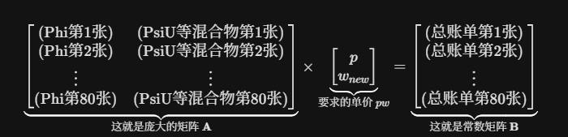
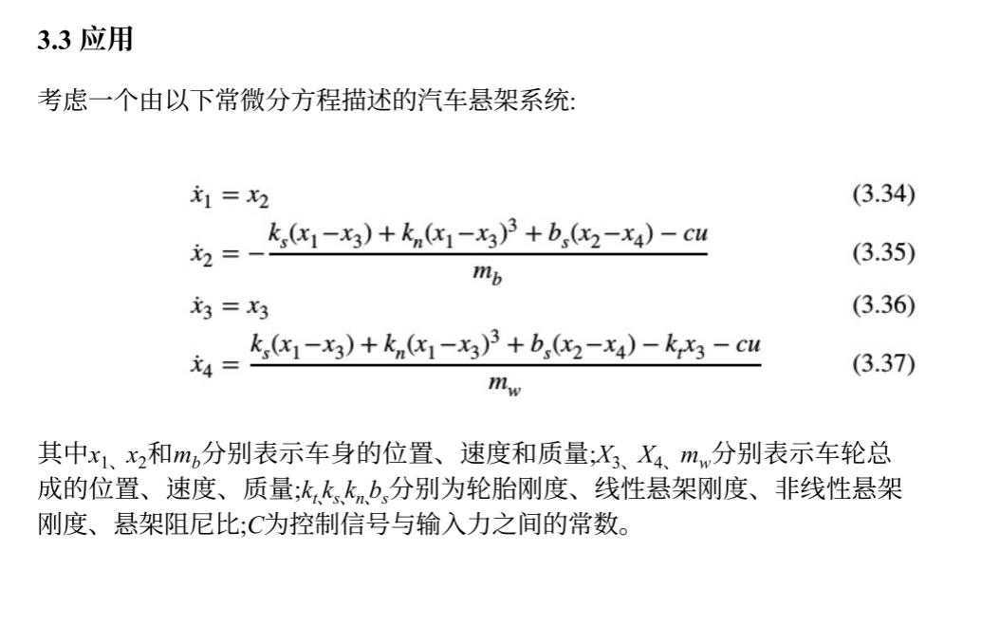
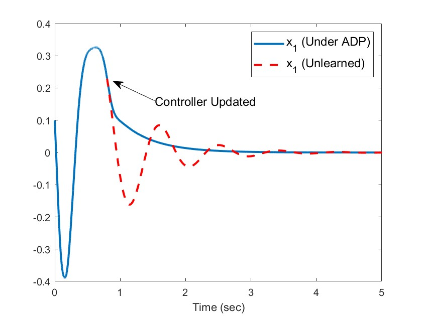
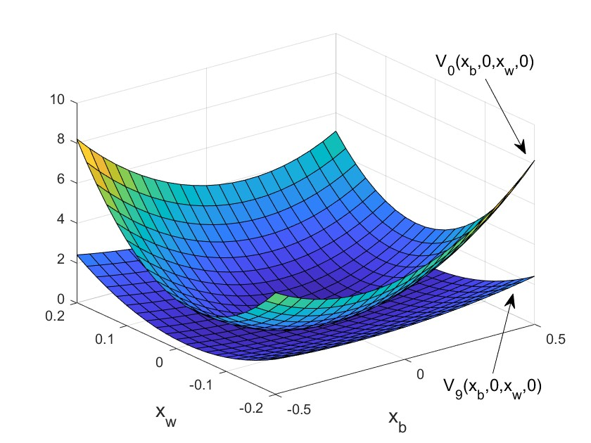
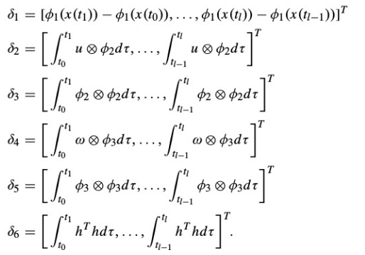
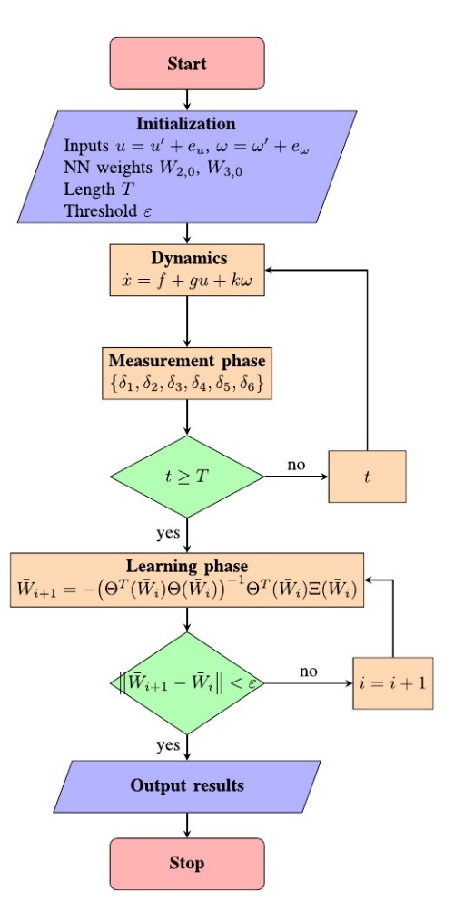

# MPC控制器

1.预测模型

代码里的状态空间矩阵（$A, B, C$ 矩阵）。控制器利用这个数学模型，结合当前的油门指令，推演出发动机未来 $N$ 步的转速和温度变化。这个 $N$​（你看多远），就是你代码里的 **预测时域 (Prediction Horizon = 20)**。

​                                             $$x(k+1) = A x(k) + B \Delta u(k)$$

​                                                             $$y(k) = C x(k)$$​

控制器站在当前的第 $k$ 步，要推演未来 $N_p$​（预测时域，你的代码里是 20）步的输出

为了让计算机好算，控制理论把这些等式极其优雅地打包成了一个巨大的矩阵乘法形式：

​                                                    $$Y = F x(k) + \Phi \Delta U$$

- **$Y$**：未来 20 步的预测输出向量 ：未来 20 步的预测输出向量 $[y(k+1), y(k+2), \dots, y(k+20)]^T$。
- **$x(k)$**：你当前这一瞬间从传感器读到的真实状态（**这就是反馈的源头**）
- **$\Delta U$**：未来 5 步（（控制时域 $N_c=5$）的未知控制增量序列 ）的未知控制增量序列 $[\Delta u(k), \Delta u(k+1), \dots, \Delta u(k+4)]^T$。
- **$F$ 和 $\Phi$**：完全由你的 $A, B, C$ 矩阵算出来的大常数矩阵。

**结论：** 第一步的内部计算，就是建立了一个线性方程，把**“未知的未来输入 $\Delta U$”**和**“未来的轨迹 $Y$”**死死地绑定在了一起。

2.滚动优化

 控制器会在每一个控制周期内，在线求解一个极其复杂的优化问题（代价函数 $J$ 最小化）。它不仅要让输出 $y$ 贴近目标值（不偏离目标值），还要惩罚剧烈的控制增量 $\Delta u$（不猛打方向盘）。控制器会一次性规划出未来 $M$ 步的控制动作序列。这个 $M$​​，就是你的 **控制时域 (Control Horizon = 5)**。

​                $$J = \sum_{i=1}^{20} 1.0 \times (\text{预测转速} - \text{目标转速})^2 + \sum_{j=0}^{4} 0.1 \times (\text{油门变化量})^2$$​

调整油门，让这个代价函数越小越好

3.反馈校正

虽然求解器算出了未来 5 步的控制序列 $[u(k), u(k+1), ..., u(k+4)]$，但它**永远只把第一个值 $u(k)$ 发送给执行机构**。下一个周期，它采集新的传感器状态 $x(k+1)$​ 作为新起点，把整个复杂的优化过程重新做一遍。这就叫**“滚动视界（Receding Horizon）”**。

# 对项目的理解与整理

三个阶段，项目的意义和方向进展

## **涡轮发动机工业现状：**

核心技术：增益调度 PID + 极值选择逻辑(保守稳定)

逻辑：内部有成百上千张表格（Look-up Tables）。它在不同的高度、马赫数和转速下，查表得到不同的 PID 参数（这就是**增益调度**的本质）。同时，为了防喘振和防超温，它用极其暴力的 `Min/Max` 比较器来强行切断供油。

优点是核心稳定，PID 算法极其简单，占用算力极小，代码行数少，容易证明它的绝对安全性。

局限性

## 技术过渡

核心技术：LPV-MPC（线性参数变化-模型预测控制）

模型逻辑：用高度/马赫数/转速作为调度参数（Scheduling Parameters），把发动机非线性的全包线，化解为随着状态实时变化的线性矩阵组合。这样，原本不可控的非线性优化，被降维成了**在线求解二次规划（QP）问题**。QP 问题是凸优化，有绝对的最优解，且求解时间有数学上限（确定性强）。

现状：目前 LPV-MPC 已经被广泛应用于地面重型燃气轮机的控制，以及下一代航空发动机（如变循环发动机）的台架试验中。LPV-MPC 是目前工业界为了解决多变量耦合和硬约束问题，所能接受的**最极限的先进算法**。


局限性：在于想要得到精确的LPV模型，工程师依然要在几百个稳态点去跑吹风试验、做系统辨识，工作量极其恐怖，对于本项目来说想要获得较为完整和精确的LPV模型也比较困难。

另一个局限性在于机载FADEC（理解为机载电脑）CPU算力有限还要求实时性，对于LPV-MPC模型来说，整个模型都需要在这个CPU上运行，运行繁琐，资源紧张，容错率低。

这个模型在真实发动机FADEC(全权限数字电子控制)系统中运行逻辑：

* 首先需要一个发动机在 50%、60%等十几个、甚至几十个不同稳态点下的 $A, B$ 矩阵集合。

* 系统会实时监测当前的转速和高度。

* 随着转速的上升，控制器会在后台**疯狂地切换（或者插值）** $A$ 和 $B$ 矩阵。

* 在 50% 转速用第一套矩阵算 MPC，到了 60% 转速瞬间切换成第二套矩阵算 MPC。

## ADP的意义

优势在于可以突破LPV-MPC算力和建模的瓶颈

1.神经网络的万能逼近定理，神经网络在数学上被证明可以**拟合任意复杂的非线性函数**。

  具体逻辑：智能体在这个全包线环境里不断试错，神经网络会自动去拟合发动机那条极其扭曲的**全局非线性流形（Manifold）**。不管你加多少个变量（高度、温度、老化度），对神经网络来说，无非就是输入层的神经元多加了几个节点而已，根本不存在维数灾难。

2.对于算力问题：ADP将自己的完整生命周期分成两个绝对隔离的阶段，离线训练和在线推理。

**离线训练**：

庞大的 Simulink 涡轮发动机非线性仿真， Actor-Critic 网络的疯狂试错， Bellman 方程的求解等等这些最费资源和时间的都会在在线推理前跑完，并不会消耗FADEC的算力资源。

离线学+在线用模式

**在线推理**：

当你在实验室把 ADP 训练到完美收敛后，得到**神经网络的权重矩阵（Weights）**。

你把这组微小的参数刷进 FADEC 的内存中。

**在飞行中，FADEC 每次只需要执行一次极其简单、没有任何循环迭代的“前向计算”（Forward Pass）：**

 `输出增量 = 激活函数 ( 权重矩阵 × 传感器状态向量 )`

可以看出FADEC的算力没有被过度消耗。

# 论文ADP

## 自适应动态规划(ADP)综述

### 开头

**定义与起源：**一种结合了强化学习(RL)和动态规划(DP)的智能控制方法，旨在解决传统动态规划中的“维数诅咒”问题(问题是即随着系统维度增加，计算量呈指数增长)

**核心逻辑：**它通过试错的方式，利用环境反馈的奖励或者惩罚信号，逐步寻求最优控制解。

**核心结构：**

* **批评家网络(critic NN):**负责政策评估，即近似系统的值函数(或其导数)，评价当前控制策略的好坏。

* **行动者网络(Actor NN)：**负责政策改进，根据批评家给出的评估来优化控制律

**ADP的学习过程主要基于两种迭代算法：**

* **策略迭代(PI):**从一个初始的“可容许控制策略”(能使系统稳定的策略)开始，交替进行评估和改进，最终收敛到最优解。

* **值迭代(VI):**不需要初始稳定策略，但在学习过程中系统的稳定性难以保证，因此在工业在线应用中受到一定限制。

### 主要内容

首先重点讨论最优调节问题：包括状态调节(是系统保持在平衡点)、输出调节和跟踪控制(如无人机或航天器的轨迹跟踪) 

最优状态调节器是使状态保持在均衡附近，使系统的价值函数最大化

## HJB公式推导过程：

### 写下离散形式的贝尔曼方程

在离散时间下，从当前时刻 $t$ 到无穷远的最小总代价 $V(x(t))$，可以拆解为：**“当前的瞬时代价”** 加上 **“从下一时刻开始的未来代价”**。

​                       $$ V(x(t)) = \min_{u} \bigg\{ \underbrace{r(x(t), u(t)) \Delta t}_{\text{当前步的代价}} + \underbrace{V(x(t+\Delta t))}_{\text{下一步开始的代价}} \bigg\} $$

这里 $r(x, u)$ 是单位时间代价（比如耗油率），乘以时间 $\Delta t$ 得到这一小步的总损耗。

### 对未来代价进行泰勒展开

这一步是推导的核心。当 $\Delta t$ 非常小时，我们可以用现在的状态 $V(x(t))$ 来预估极短时间后的 $V(x(t + \Delta t))$。

根据多元函数泰勒展开的一阶近似：  

​                        $$V(x(t + \Delta t)) \approx V(x(t)) + \frac{\partial V}{\partial t} \Delta t + \left( \frac{\partial V}{\partial x} \right)^T \Delta x$$

在**无限时间调节问题**中（通常假设系统不随时间显式变化），我们认为 $\frac{\partial V}{\partial t} = 0$。而 $\Delta x$ 可以写成 $\dot{x} \Delta t$。所以：

​                         $$V(x(t + \Delta t)) \approx V(x(t)) + \nabla V^T \dot{x} \Delta t$$

*其中 $\nabla V$​ 是代价函数对状态的梯度。*

### 代入并化简

我们将第二步展开的结果代回第一步的方程中：

​                         $$V(x(t)) = \min_{u} \Big\{ r(x, u) \Delta t + V(x(t)) + \nabla V^T \dot{x} \Delta t \Big\}$$

注意观察，等式左右两边都有 $V(x(t))$，我们可以把它们消掉。剩下的项都含有 $\Delta t$：

​                          $$0 = \min_{u} \Big\{ r(x, u) \Delta t + \nabla V^T \dot{x} \Delta t \Big\}$$

两边同时除以 $\Delta t$（因为 $\Delta t \neq 0$）：

​                          $$0 = \min_{u} \Big\{ r(x, u) + \nabla V^T \dot{x} \Big\}$$


### 引入动力学约束，得到 HJB 方程

我们知道系统是怎么运动的，即 $\dot{x} = f(x, u)$。把这个物理规律代入上式：

​                       $$0 = \min_{u} \Big\{ \underbrace{r(x, u) + \nabla V^T f(x, u)}_{\text{ }} \Big\}$$

这就是最终的 **HJB（Hamilton-Jacobi-Bellman）方程**。

## 求解HJB方程的主要算法

论文在第4-5页介绍了三种主要的迭代求解方法：

### 策略迭代（Policy Iteration, PI）

**核心思想**：交替进行策略评估和策略改进。

- **策略评估**（公式9）：固定当前控制 $u^{i-1}$，求解Lyapunov方程得到 $V^i$​

  $L(x, u^{i-1}) + (\nabla V^i)^T (f + g(x)u^{i-1}) = 0$​

  

- **策略改进**（公式10-11）：利用新的值函数更新控制策略

  $u^i = \underset{u}{\arg\min} \, H(x, u, \nabla V^i) = -\frac{1}{2} R^{-1} g^T \nabla V^i$

**特点**：需要初始可容许控制，但收敛快。

### 改进的在线技术（Improved Online Technique）

**解决的问题**：初始可容许控制难以获得。

**核心技巧**（公式13）：添加一个基于Lyapunov函数的稳定项到权值更新规则中


$\Xi(x, u) = \begin{cases} 0, & \text{if } (\nabla V_R)^T (f + g u) < 0 \\ 1, & \text{otherwise} \end{cases}$​


**效果**：当系统趋向不稳定时，强制学习过程沿Lyapunov函数下降的方向调整，从而放宽对初始控制的要求。

### 积分强化学习（Integral Reinforcement Learning, IRL）

**解决的问题**：系统动力学 *f*,*g* 未知。

**核心技巧**（公式14）：将微分形式的Bellman方程改写为积分形式

$V(x(t-T)) = \int_{t}^{t-T} L(x, u) d\nu + V(x(t))$

**效果**：方程中不再显式包含 *f*  , *g*，只依赖可测量的状态轨迹，实现无模型策略评估。


### ADP 的终极落地形态：Actor-Critic (演员-评论家) 架构

在工程落地中，ADP 最经典、最常用的结构就是 **Actor-Critic 架构**。你需要建立**两个**神经网络：

- **Critic 网络（评论家 / 评价网络）：**

  - **作用：** 它是贝尔曼方程的化身。负责拟合代价函数 $V(x)$。

  - **工作逻辑：** 它看着发动机当前的状态 $x_t$​ 和你给出的动作，冷酷地给出一个打分（Cost）。它的终极目标是让自己的打分越来越精准，完美符合贝尔曼方程。

    ​                  $$e_H = r(x, \hat{u}) + \nabla \hat{V}^T f(x, \hat{u})$$

  ​        Critic 网络的 Loss 函数就是 $Loss = \frac{1}{2} e_H^2$，因此这个评价网络是通过收敛HJB方程残差，每一次反向传播，都是在调整自己的权重，最终使其逼近0。

- **Actor 网络（演员 / 执行网络）：**

  - **作用：** 它就是你的**控制器**！负责输出控制增量 $\Delta u$。
  - **工作逻辑：** 它根本不懂复杂的流体力学，它只看 Critic 的脸色行事。如果它推了一下油门，Critic 给出高分（代价变小），它就强化这个动作对应的权重；如果 Critic 给出低分（超温了，代价激增），它就调整权重。

​          本质是评价网络最后的代价梯度的关联延申。


# 第三章(ADP实验)


本章 ADP 算法的终极目标，就是通过神经网络不断学习，最终找到一个最聪明的控制策略 $u^*$，使得这个积分的结果 $J$ 达到最小。

结合那个汽车悬挂的具体例子，来看看这个公式在实际物理系统中是怎么工作的

## HJB方程

算子方程$\mathcal{H}(V^*) = 0$和最优控制率$u^*$推导：

1.贝尔曼最优性原理

我们要计算从当前时刻到无穷远的最小总成本，把未来切成眼前的瞬间和未来的所有时间两部分                                  $$V^*(x(t)) = \min_{u} \left[ \int_{t}^{t+\Delta t} (q(x) + u^T R u) d\tau + V^*(x(t+\Delta t)) \right]$$

2.极限微积分——压榨时间

当 $\Delta t$ 极其微小（趋近于 0）时，上面积分里的一瞬间代价，约等于**（瞬时成本率 $\times$ 时间）**：

​                                                     $$\text{瞬时代价} \approx (q(x) + u^T R u) \Delta t$$

同时，根据泰勒展开（或者全微分公式），状态从 $x(t)$ 变到 $x(t+\Delta t)$ 后，价值函数的变化为：

​                                                $$V^*(x(t+\Delta t)) \approx V^*(x(t)) + \frac{dV^*}{dt} \Delta t$$

这里是最关键的一步，链式求导法则登场：由于 $\dot{x} = f(x) + g(x)u$（我们原本的物理系统），所以 $V^*$ 对时间的变化率可以写成：

​                                      $$\frac{dV^*}{dt} = \nabla V^{*T}(x) \cdot \dot{x} = \nabla V^{*T}(x) [f(x) + g(x)u]$$

3.合并方程

把第二步的东西塞到第一步的等式中：

​                         $$V^*(x) = \min_{u} \left[ (q(x) + u^T R u)\Delta t + V^*(x) + \nabla V^{*T}(x)(f(x) + g(x)u)\Delta t \right]$$

等式两边都有一个 $V^*(x)$，直接抵消掉！然后两边同除以 $\Delta t$，我们就得到了**连续时间下 HJB 方程的原始形态**：

​                       <mark> $0 = \min_{u} \left[ q(x) + u^T R u + \nabla V^{*T}(x)f(x) + \nabla V^{*T}(x)g(x)u \right]$ </mark>

物理含义：在最优状态下，你随便怎么选控制量 $u$，方括号里这东西的**最小可能值**，必须严格等于 0。

4.求极值

求最小值的微积分问题：如何找到一个极值点 $u^*$，让方括号里的东西最小

对 $u$ 求导，并令导数等于 0

令 $L(u) = u^T R u + \nabla V^{*T} g(x) u + \dots$（与 $u$ 无关的项忽略不看）

对 $u$ 求偏导数：

​                                                   $$\frac{\partial L}{\partial u} = 2 R u + g^T(x) \nabla V^*(x) = 0$$

解这个方程：                      

​                                                       <mark> $u^* = -\frac{1}{2} R^{-1} g^T(x) \nabla V^*(x)$ </mark>

**这就是论文截图里的公式 (3.4)最优控制律。**

## 常规策略迭代算法

1.策略评估

既然不知道最优解，那我们就随便先找一个能让系统稳定不崩溃的初始策略，叫它 $u_0$

把 $u_0$ 扔进系统里跑，**“在不改变策略的前提下，算算这套策略到底要花多少钱”**。

​              $$\nabla V_i^T(x)[f(x) + g(x)u_i] + r(x, u_i) = 0$$

因为 $u_i$ 已经是已知确定的了，解出当前策略 $u_i$ 对应的真实代价账单 $V_i(x)$

2.政策改进

顺着代价变小的方向（负梯度）

​           $$u_{i+1}(x) = -\frac{1}{2}R^{-1}(x)g^T(x)\nabla V_i(x)$$

用旧的代价账单 $V_i$，生成了一套全新的控制策略 $u_{i+1}$

**然后循环往复：** 用新策略 $u_{i+1}$ 去算新账单 $V_{i+1}$ $\rightarrow$ 再用新账单生成更新的策略 $u_{i+2}$ $\dots$

定理3.1.4是论证了每次迭代都是在接近最优解，当迭代次数 $i \to \infty$ 时，算出来的账单极限必定是 $V^*$，生成的策略极限必定是 $u^*$。

## 离策略(off-policy)学习：

常规策略迭代 (PI)是在理想的数学世界里推演

1.注入探索噪声e

​                                   $$\dot{x} = f(x) + g(x)(u_0 + e)$$

探索噪声为了收集更丰富的状态数据。

2.代数重写

作者在等式里**强行加了一个 $g(x)u_i$，又减去了一个 $g(x)u_i$**：

​                      $$\dot{x} = f(x) + g(x)u_i - g(x)u_i + g(x)u_0 + g(x)e$$

然后把后面三项合并成一个叫 $v_i$ 的东西（$v_i = u_0 - u_i + e$）

​                                    $$\dot{x} = f(x) + g(x)u_i(x) + g(x)v_i$$​

3.

按照链式求导法则，把伪装后的 $\dot{x}$ 代进去，得到第一行：

​                                 $$\dot{V}_i = \nabla V_i^T(x)[f(x) + g(x)u_i + g(x)v_i]$$

策略评估公式 (3.9) ：

 $$0 = \ \left[ q(x) + u^T R u + \nabla V^{*T}(x)f(x) + \nabla V^{*T}(x)g(x)u \right]$$

推出：

​                                 $\nabla V_i^T[f(x) + g(x)u_i] = -q(x) - u_i^T R u_i$

**策略改进公式 (3.10) ：**

​                                                   $u_{i+1} = -\frac{1}{2}R^{-1}g^T\nabla V_i$，

推出：                                 $\nabla V_i^T g(x) = -2u_{i+1}^T R(x)$

**最终都代换得到了公式 3.13 的最后一行：**

​                                     $$ \bbox[yellow, 4px]{ \dot{V}_i = -q(x) - u_i^T R(x)u_i - 2u_{i+1}^T R(x)v_i } $$

意义：

**系统的物理模型 $f(x)$ 和 $g(x)$ 彻底消失了**

- $q(x)$ 和 $R(x)$ 是自己设定的惩罚权重（已知）。
- $u_i$ 是你当前的旧策略（已知）。
- $v_i$ 是你通过物理传感器直接测量出来的实际偏差（已知）。

整个方程里，**只有 $\dot{V}_i$（未来的新账单）和 $u_{i+1}$（未来的新策略）是未知的。**

因此不需要复杂的微分方程建模，只需要收集它运行时的传感器数据，然后用**神经网络**去拟合这个等式，就能把最优控制律给硬生生地算出来。


## 引入神经网络

虽然得到了一个极其干净的偏微分方程（3.13）

它依然面临两个问题：

**计算机讨厌“瞬间（导数）”：** 计算机只能每隔几毫秒采一次样，算不了极其精确的瞬间变化率 $\dot{V}_i$。

**计算机无法储存“无限”：** $V_i(x)$ 和 $u_{i+1}(x)$ 是定义在连续空间里的函数，你不可能把每个坐标点的值都存进内存里。

解决方法：

1.时间积分：

对 (3.13) 两边同时在时间段 $[t, t+T]$​ 上做了一个积分

​                            $$ \bbox[#fff35d, 5px]{ V_i(x(t+T)) - V_i(x(t)) = -\int_t^{t+T} \left[ q(x) + u_i^T R(x)u_i + 2u_{i+1}^T R(x)v_i \right] d\tau } $$

只需要在 $t$ 时刻记录一下状态 $x(t)$，然后自己（探索） $T$ 秒钟，传感器一路收集数据，到了 $t+T$ 时刻再记录一下状态 $x(t+T)$。公式右边那个复杂的积分，直接用传感器采集到的离散数据累加（求和）就能算出来

2.引入神经网络

为了解决无限状态存储的问题，作者引入了**“基函数逼近（Basis Function Approximation）”**，这其实就是单层神经网络的数学本质
$$
\hat{V}_i(x) = \sum_{j=1}^{N_1} \hat{c}_{ij} \phi_j(x),
$$

$$
\hat{u}_{i+1}(x) = \sum_{j=1}^{N_2} \hat{w}_{ij} \psi_j(x),
$$

给每个基函数乘上一个**权重 $c$ 和 $w$​**，把它们加起来！只要找对了权重，就能拼凑（逼近）出那个未知的复杂曲线。代入得：

​                                                                    $$ \bbox[#fff35d, 5px]{ \sum_{j=1}^{N_1} \hat{c}_{ij} \left[ \phi_j(x(t_{k+1})) - \phi_j(x(t_k)) \right] } $$

​                                                                 $$ \bbox[#fff35d, 5px]{ = -\int_{t_k}^{t_{k+1}} 2 \sum_{j=1}^{N_2} \hat{w}_{ij} \psi_j^T(x) R(x) \hat{v}_i \, dt } $$

​                                                                 $$ \bbox[#fff35d, 5px]{ - \int_{t_k}^{t_{k+1}} \left[ q(x) + \hat{u}_i^T R(x) \hat{u}_i \right] dt + e_{i,k} } $$


**工程意义：** 从此以后，系统不再需要记住无限个状态的解，它**只需要记住那几个权重的数字**（$c_1, c_2...$ 和 $w_1, w_2...$​​）就可以了

3.最小二乘法

我们在运行第 $i$ 步策略更新时，机器人在真实物理世界里跑了一小段时间（从 $t_k$ 到 $t_{k+1}$）。在这段时间里，传感器疯狂记录数据。

在这个公式 (3.17) 里，**到底什么是未知的？**

只有那两个神经网络的权重：求和符号里的 $\hat{c}_{i,j}$ 和 $\hat{w}_{i,j}$​。这几十个数字是我们需要求出来的。

把公式打包化简再来看：

**打包 1（关于 $\phi$ 的差值）：**

设 $A_{k, j} = \phi_j(x(t_{k+1})) - \phi_j(x(t_k))$

*（物理意义：系统跑了 $T$ 秒后，第 $j$ 个基函数计算出来的值的变化量。这只是个具体算出来的常数）*

**打包 2（关于 $\psi$ 的积分）：**

设 $B_{k, j} = \int_{t_k}^{t_{k+1}} 2 \psi_j^T(x) R(x) \hat{v}_i dt$

*（物理意义：跑的过程中，传感器数据乘以基函数后积分累加的结果。这也是个算出来的常数）*

**打包 3（右边的常数项）：**

设 $Y_k = - \int_{t_k}^{t_{k+1}} [q(x) + \hat{u}_i^T R(x) \hat{u}_i] dt$

*（物理意义：跑的过程中，系统实实在在消耗的代价成本累加。这依然是个常数）*

替换之后变成一个极简等式：

​                    $$\sum_{j=1}^{N_1} \hat{c}_{i,j} A_{k,j} \quad + \quad \sum_{j=1}^{N_2} \hat{w}_{i,j} B_{k,j} \quad = \quad Y_k \quad + \quad e_{i,k}$$

把这个求和符号展开，它就是： $(\hat{c}_{i,1} A_{k,1} + \hat{c}_{i,2} A_{k,2} + \dots) + (\hat{w}_{i,1} B_{k,1} + \hat{w}_{i,2} B_{k,2} + \dots) = Y_k + e_{i,k}$

这就是一个标准的线性方程组， **权重 $c$ 和 $w$ 就是我们要解的未知数 $x$**

优化目标是降低误差平方和（$\sum e_{i,k}^2$），才能更好地拟合。





matlab中模型建立的求权重的主要代码

```matlab
A = [Phi -2*r*PsiU-2*r*PsiPsi*kron(w,eye(PsiLength))];
B = -(CostQ + PsiPsi*kron(w,w));
pw = A\B;
p = pw(1:PhiLength);
w = pw(PhiLength+1:end);
```

p和w都是权重，即为所求的目标

​                                          $$ \bbox[#fff35d, 5px]{ \sum_{j=1}^{N_1} \hat{c}_{ij} \left[ \phi_j(x(t_{k+1})) - \phi_j(x(t_k)) \right] } $$​

​                                          $$ \bbox[#fff35d, 5px]{ - \int_{t_k}^{t_{k+1}} 2 \sum_{j=1}^{N_2} \hat{w}_{ij} \psi_j^T(x) R(x) \hat{v}_i \, dt } $$​

​                                          $$ \bbox[#fff35d, 5px]{ = - \int_{t_k}^{t_{k+1}} \left[ q(x) + \hat{u}_i^T R(x) \hat{u}_i \right] dt + e_{i,k} } $$


​                                  $$- \int_{t_k}^{t_{k+1}} 2 \hat{w}_{new}^T \psi^T(x) R(x) \hat{v}_i dt$$

我们把 $\hat{v}_i = u - \hat{u}_i$​ 代进去：

$$\hat{v}_i = u - \hat{u}_i$$

代表的是“真实的物理推力 ($u$)”与“上一轮老习惯推力 ($\hat{u}_i$)”之间的差值。

​                                     $$- \int 2 \hat{w}_{new}^T \psi^T R (u - \hat{u}_i) dt$$

利用乘法分配律，把它拆成两项：

​                       $$= \underbrace{- \int 2 \hat{w}_{new}^T \psi^T R \cdot u \, dt}_{\text{第一项：与真实推力 } u \text{ 有关}} \quad + \quad \underbrace{\int 2 \hat{w}_{new}^T \psi^T R \cdot \hat{u}_i \, dt}_{\text{第二项：与老习惯 } \hat{u}_i \text{ 有关}}$$


​                            **`-2*r*PsiU`**`-2*r*PsiPsi*kron(...)`




案例代码实现：

1.在线数据采集：

初始状态加入探测噪声：u = sum(0.2 * sin([1 3 7 11 13 15] * t));6个不同频率的正弦波混合信号

每个0.1s采样一次，将算好的积分塞进Phi、PsiPsi、PsiU和CostQ四个集合里

最终循环80次采集结束。

2.离策略迭代学习

进入`for i = 1:IterMax` 循环迭代，根据刚才的采集数据构建A和B

执行核心算法：`pw = A \ B`。

把解出来的 `pw` 劈成两半：上半部分是代价权重 **`p`**，下半部分是控制权重 **`w`**。

看着新算出来的 `p` 和上一代的 `pp` 差距越来越小，直到 `norm(p-pp) <= 0.01`，最终控制器参数 **`w`** 正式诞生。




蓝线是接入训练的权重作为控制器



**横纵坐标 ($x_b$, $x_w$)：** 车厢位移和车轮位移。代表汽车处于不同的受力姿态。

**Z 轴 (价值 $V$)：** 未来会遭受的总痛苦（代价）。

第九次迭代之后发现代价函数相比初次逐渐趋向0


# 论文IADP

   基于在线数据的未知非线性零和博弈的迭代自适应动态规划方法

[IEEE Xplore Full-Text PDF:](https://ieeexplore.ieee.org/stamp/stamp.jsp?tp=&arnumber=7480425)

## 背景和挑战：

论文提出了一种迭代自适应动态规划 (IADP) 算法

核心背景：双人零和博弈(ZSG)

非线性系统的**H∞ **最优控制问题，理论上可完全等效为一个双人零和博弈模型：

•**控制器** **(Controller):**博弈一方，目标是选择最优控制策略u，最小化系统的整体性能代价。

•**外部干扰** **(Disturbance):**博弈另一方，试图选择最坏的干扰输入ω，最大化系统的性能代价。

**这类控制器本质上是在求解一个双人零和博弈问题，即控制器试图在最坏扰动下最小化性能指标**

**数学本质：HJI** **方程求解**

寻找上述鞍点策略的过程，在数学分析上，最终将归结为求解一个极其复杂的非线性偏微分方程：

​                        $$\nabla V^{*T}f + h^Th - \frac{1}{4}\nabla V^{*T}g R^{-1} g^T \nabla V^* + \frac{1}{4}\gamma^{-2}\nabla V^{*T}k k^T \nabla V^* = 0$$

**核心求解难点：**方程中包含未知的非线性系统动力学 f(x)，且存在关于梯度 ∇V 的二次非线性项，导致该非线性偏微分方程 (PDE) 极其难以直接解析求解。


## 核心创新：从微分到积分的无模型转化

****

放弃逐个时刻求解HJI方程，以此避免复杂的数学运算，建立等效的积分方程式。

值函数 $V_i$ 在**真实系统轨道**上的时间变化率 $\dot{V}_i$ ：

 $$\dot{V}_i = \nabla V_i^T \dot{x} = \nabla V_i^T(f + gu + k\omega)$$    

这里的 $u$ 和 $\omega$ 指的是系统在采集在线数据时，**实际施加给执行机构**的控制信号和外部干扰 


针对第 $i$ 次迭代的策略所建立的 **Lyapunov 方程** ：

$$0 = \nabla V_i^T(f + gu_i + k\omega_i) + h^Th + u_i^TRu_i - \gamma^2\omega_i^T\omega_i$$​

ui和wi都是理论值

做差得到：

$$\dot{V}_i = \nabla V_i^T g(u - u_i) + \nabla V_i^T k(\omega - \omega_i) - (h^Th + u_i^TRu_i - \gamma^2\omega_i^T\omega_i)$$​


控制策略PI迭代更新规律 $u_{i+1} = -\frac{1}{2}R^{-1}g^T\nabla V_i$             $\nabla V_i^T g = -2u_{i+1}^T R$​

干扰策略                             $\omega_{i+1} = \frac{1}{2}\gamma^{-2}k^T\nabla V_i$                  $\nabla V_i^T k = 2\gamma^2\omega_{i+1}^T$​

​          $$\dot{V}_i = -2u_{i+1}^T R(u - u_i) + 2\gamma^2\omega_{i+1}^T(\omega - \omega_i) - r(x, u_i, \omega_i)$$

再积分得：$$ V_i(x(t')) - V_i(x(t)) = \int_{t}^{t'} -2u_{i+1}^T R(u - u_i) d\tau + \int_{t}^{t'} 2\gamma^2\omega_{i+1}^T(\omega - \omega_i) d\tau + \int_{t}^{t'} -r(x, u_i, \omega_i) d\tau$$

   

在这个式子中**未知量有三个，分别是：$V_i$、$u_{i+1}$ 和 $\omega_{i+1}$** ，公式中**不再包含**未知的系统动力学项 (f(x), g(x)...)，仅由可测数据与待优化策略构成，为利用在线数据进行无模型策略迭代奠定了理论基石。

##  技术架构：神经网络逼近结构

为了逼近值函数和最优策略，我们采用了经典的**Actor-Critic**强化学习架构，并针对零和博弈的特点进行了扩展，形成了**Critic-Actor-Disturber**三网络结构，以协同求解HJI方程。


评价网络（Critic）负责评估当前状态的价值，执行网络（Actor）负责生成最优控制，而干扰网络（Disturber）则负责模拟最坏的外部环境，将网络都用基函数和权重的线性形式表示出来：

将网络参数化：                                              $$\begin{aligned}\hat{V}_i(x) &= W_{1,i+1}^T \phi_1(x) \\\hat{u}_{i+1}(x) &= W_{2,i+1}^T \phi_2(x) \\\hat{\omega}_{i+1}(x) &= W_{3,i+1}^T \phi_3(x).\end{aligned}$$

将参数化的表达代入到刚才积分出的式子中：
$$
e_k = (\phi_1(x(t_{k+1})) - \phi_1(x(t_k)))^T W_{1,i+1}
+ \int_{t_k}^{t_{k+1}} 2\phi_2^T W_{2,i+1} R(u - W_{2,i}^T\phi_2)d\tau
- \int_{t_k}^{t_{k+1}} 2\gamma^2\phi_3^T W_{3,i+1}(\omega - W_{3,i}^T\phi_3)d\tau
+ \int_{t_k}^{t_{k+1}} r(x, W_{2,i}^T\phi_2, W_{3,i}^T\phi_3)d\tau
$$


通过 Kronecker 积转化：

​              $$  \begin{aligned} \phi_2^T W_{2,i+1} R(u - W_{2,i}^T\phi_2) &= ((u - W_{2,i}^T\phi_2)^T R \otimes \phi_2^T)\text{v}(W_{2,i+1}) \\ \phi_3^T W_{3,i+1} (\omega - W_{3,i}^T\phi_3) &= ((\omega - W_{3,i}^T\phi_3)^T \otimes \phi_3^T)\text{v}(W_{3,i+1}) \end{aligned}$$


​                       **$$e_k = \theta_k^T(\bar{W}_i)\bar{W}_{i+1} + \xi_k(\bar{W}_i)$$​**

其中：

​              $$\begin{aligned} \theta_k(\bar{W}_i) &= \begin{bmatrix} \phi_1(x(t_{k+1})) - \phi_1(x(t_k)) \\ \int_{t_k}^{t_{k+1}} 2R(u - W_{2,i}^T\phi_2) \otimes \phi_2 d\tau \\ -\int_{t_k}^{t_{k+1}} 2\gamma^2(\omega - W_{3,i}^T\phi_3) \otimes \phi_3 d\tau \end{bmatrix} \in \mathbb{R}^{\bar{K}} \\ \\ \xi_k(\bar{W}_i) &= \int_{t_k}^{t_{k+1}} r(x, W_{2,i}^T\phi_2, W_{3,i}^T\phi_3) d\tau \in \mathbb{R} \end{aligned}$$

​               $\bar{W}_{i+1} = [W_{1,i+1}^T, \text{v}(W_{2,i+1})^T, \text{v}(W_{3,i+1})^T]^T \in \mathbb{R}^{\bar{K}}$


最小二乘法 (LS) 的优化目标函数：

​                               $$\min_{\bar{W}_{i+1}} \sum_{k=0}^{l-1} e_k^2$$

## 实现机制：双阶段闭环实现流程

**在线测量阶段：**

系统加入探测信号，闭环运行极短时间（例如几秒钟）。连续收集并存储系统状态转移和输入输出的数据矩阵。这是唯一需要物理交互的阶段，把收集到的纯物理数据积分，打包塞进 $\delta_1$ 到 $\delta_6$​ 这六个罐子里。



**离线学习阶段：**

算法在后台利用存储好的**同一批数据**，反复进行神经网络权重的迭代计算，直至收敛。

暴力算出下一步的新权重 $\bar{W}_{i+1}$​

$$E = \Theta \bar{W}_{i+1} + \Xi$$​

这是上面求出的误差式子，要使E最小，让E的模长的平方J最小：

$$J = \frac{1}{2} (\bar{W}_{i+1}^T \Theta^T \Theta \bar{W}_{i+1} + \bar{W}_{i+1}^T \Theta^T \Xi + \Xi^T \Theta \bar{W}_{i+1} + \Xi^T \Xi)$$​

为了找到让 $J$ 最小的 $\bar{W}_{i+1}$，我们需要对这个向量求导，并令导数为 $0$

$$\frac{\partial J}{\partial \bar{W}_{i+1}} = \Theta^T \Theta \bar{W}_{i+1} + \Theta^T \Xi = 0$$

最终得到：

$$\bar{W}_{i+1} = -(\Theta^T \Theta)^{-1} \Theta^T \Xi$$​

其中，$$\Theta = \begin{bmatrix} \theta_0^T \\ \theta_1^T \\ \vdots \\ \theta_{l-1}^T \end{bmatrix}, \quad \Xi = \begin{bmatrix} \xi_0 \\ \xi_1 \\ \vdots \\ \xi_{l-1} \end{bmatrix}, \quad E = \begin{bmatrix} e_0 \\ e_1 \\ \vdots \\ e_{l-1} \end{bmatrix}$$

**收敛判断（$||\bar{W}_{i+1} - \bar{W}_i|| < \varepsilon$​）**：

如果差值小于我们一开始设定的阈值 $\varepsilon$（yes），说明策略已经不再怎么变了，意味着算法成功收敛，找到了最优解。

**最终部署：**

将收敛后的**Actor** **网络**参数提取出来，部署为正式的最优**H∞** **控制器**，实现高精度闭环控制。

IADP算法流程图如下：



## 总结

**核心结论：无模型数据驱动的博弈求解范式**

IADP 算法成功实现了**完全脱离系统内部动力学模型** **f(x)**的未知非线性零和博弈求解，为解决复杂系统的 H∞ 最优控制问题提供了一种全新的、不依赖先验知识的**数据驱动的计算范式**。


# 解决基函数问题


基于稀疏核机的自适应评价设计在线学习控制

## 研究背景与传统ACD痛点

**自适应评价设计** **(ACD)** **机制**

ACD 是求解马尔可夫决策过程 (MDP) 的经典 Actor-Critic 学习方法，通过双网络协作实现策略优化：

**执行器** **(Actor)**

负责学习和执行控制策略，直接输出动作以与环境交互。

**评价器** **(Critic)**

负责评估当前策略表现，计算价值函数，为 Actor 提供学习信号。

**传统多层感知机** **(MLP)** **的局限**

**•** **特征依赖：**算法性能高度依赖于人工凭经验设计的特征提取函数(如多项式基底)，无法自适应挖掘数据特征。

**•** **维数灾难：**面对高维、复杂非线性动态系统，手动预设特征基底极易出错，导致算法收敛速度慢且泛化性严重不足。

## 底层：特征提取与字典维护

**核心任务：**利用近似线性相关(ALD)准则，从在线数据中自适应构建稀疏的核字典。

**解决问题：**摆脱人工特征设计，自动学习系统内在特征，解决维数灾难

**核心原理剖析一：核技巧** **(Kernel Trick)**

**核心思想：**利用 Mercer 定理，将低维系统状态*x*隐式映射至高维再生核希尔伯特空间 (RKHS)，无需显式定义映射函数*φ(·)*。

**数学表达：**k**(xᵢ, xⱼ) = ⟨φ(xᵢ), φ(xⱼ)⟩**—— 仅需计算高效的核函数(如高斯 RBF 核)即可度量相似度。

高斯核（衡量相似度）的公式是：

​                                $$k(x, z) = \exp\left(-\frac{||x - z||^2}{2\sigma^2}\right)$$

**核心原理剖析二：ALD** **字典稀疏化机制**

**应对在线学习样本趋于无穷的策略**

核方法虽能提取丰富特征，但直接将所有历史样本纳入字典会导致规模无限增长，造成计算爆炸，无法满足实时在线控制需求。ALD 机制正是为解决此问题而生。

**近似线性相关** **(ALD)** **判定逻辑**

当新状态样本**xₜ**到达时，计算其与当前字典**D**中所有已有基底与新状态做差的最小平方误差**δₜ**，以此衡量样本的“新颖度”。

​                                     $$\delta_t = \min_c \left\| \sum_{s_j \in D_t} c_j \phi(s_j) - \phi(s_t) \right\|^2 .$$

**动态字典更新规则**

• 若**δ**ₜ > μ (**阈值**)**: 视为有价值新特征，加入字典扩展维度。
 • 若**δ**ₜ ≤ μ (**阈值): 视为信息冗余，忽略样本以维持字典稀疏性。

只有当新采集的样本**无法**被字典中现有的基底向量线性近似时，才会将其加入字典。

## **中层：策略评估与价值逼近** **(Critic)**

**核心任务：**基于底层核特征，使用递归最小二乘时间差分(RLS-TD)算法快速准确逼近价值函数。

**解决问题：**实现评价器的快速收敛和对价值函数的精确估计。

**核心原理剖析三：评价器的** **RLS-TD** **更新**

  

## **KHDP算法的详细架构和运行机制拆解：**

KHDP 依然遵循经典的 Actor-Critic（执行器-评价器）框架：


**评价器 (Critic)：** 

在 KHDP 中，Critic 的任务是近似**动作值函数 (Action Value Function, 即 $Q(x,a)$)** 。它不再使用传统的 MLP 神经网络，而是使用核函数的线性组合来表示： $\tilde{Q}(s) = \sum_{i=1}^T \alpha_i k(s, s_i)$ 这里，$s$ 是状态-动作对 $(x,a)$，$k(s, s_i)$ 是核函数（如高斯核），$\alpha_i$ 是待学习的权重，$T$​ 是字典中选定的样本数 。  

​                   $$\tilde{Q}(s) = \alpha_1 k(s, s_1) + \alpha_2 k(s, s_2) + \dots + \alpha_T k(s, s_T)$$

**第一步：确定基准字典：**

$k(s, s_i)$：核函数（Kernel Function），用来计算当前输入 $s$ 与基准样本 $s_i$ 之间的“相似度”或在高维空间的内积 

算法会使用 **ALD（近似线性相关）** 稀疏化技术来过滤收集到的数据 。  

每遇到一个新样本，算法会测试它能不能用字典里已有的样本“线性组合”出来 。如果能，就丢弃；如果不能（即它包含了新的动力学特征），就把它加入字典 。  

经过这一步，你就得到了一个包含 $T$ 个代表性样本的精简字典 $\{s_1, s_2, \dots, s_T\}$​ 。


 **第二步：计算相似度（求 $k(s, s_i)$）**

当系统给出一个新的状态-动作对 $s$ 时，你需要把它和字典里的每一个 $s_i$ 进行比对。

- 通常会使用**高斯核函数 (Gaussian Kernel)** 。  
- 计算公式为：$k(s, s_i) = e^{-\frac{||s - s_i||^2}{\sigma^2}}$ 。  
- 如果当前输入 $s$ 离字典样本 $s_i$ 很近，结果就接近 1；如果很远，结果就接近 0。


 **第三步：在线学习权重（求 $\alpha_i$）**

这些权重 $\alpha_i$ 就是算法的“灵魂”，它们是在系统运行过程中实时学出来的 。  

- 算法利用 **递归最小二乘时序差分 (RLS-TD)** 算法来更新权重向量 $\vec{\alpha} = [\alpha_1, \alpha_2, \dots, \alpha_T]^T$ 。  

- 每一次迭代，算法都会根据当前的奖励 $r_t$ 和时序差分误差，稍微修正一下每个 $\alpha_i$ 的值，使得近似的 $Q$​ 值越来越逼近真实的贝尔曼方程解 。  

  

确立了评价器 (Critic) 的学习目标：在最小二乘意义下逼近最优价值函数：

​                 $E_0[\phi(s_t)(\tilde{Q}(s_t) - \gamma\tilde{Q}(s_{t+1}))] = E_0[\phi(s_t)r_t]$

最优权重 $W$ 可以表示为有限个字典样本特征的线性组合

​                      $W = \sum_{i=1}^T \phi(s_i)\alpha_i$​

**推导最终产生了一个矩阵方程：$\alpha = A^{-1}b$****​

​                $$A_T = \sum_{t=1}^N \vec{k}(s_t) [\vec{k}^T(s_t) - \gamma \vec{k}^T(s_{t+1})]$$

​                      $$b_T = \sum_{t=1}^N \vec{k}(s_t) r_t$$

递推最小二乘(RLS)更新的推导：

对矩阵 $A_T$ 求逆，计算量极大。为了实现在线学习，引入了遗忘因子 $\mu$，并将 $A_t$ 写成递推形式：

​             $$A_t = \mu A_{t-1} + \vec{k}(s_t)(\vec{k}^T(s_t) - \gamma \vec{k}^T(s_{t+1}))$$

令 $P_t = A_t^{-1}$。这里需要用到**矩阵求逆引理**

​                 $$(A + uv^T)^{-1} = A^{-1} - \frac{A^{-1}uv^TA^{-1}}{1 + v^TA^{-1}u}$$

将我们的变量代入引理：

- 对应 $A$：$\mu A_{t-1}$，因此 $A^{-1} = \frac{1}{\mu} A_{t-1}^{-1} = \frac{1}{\mu} P_{t-1}$
- 对应 $u$：$\vec{k}(s_t)$
- 对应 $v^T$：$\vec{k}^T(s_t) - \gamma \vec{k}^T(s_{t+1})$


代入公式后：

$$P_t = \frac{1}{\mu} P_{t-1} - \frac{\frac{1}{\mu} P_{t-1} \vec{k}(s_t) (\vec{k}^T(s_t) - \gamma \vec{k}^T(s_{t+1})) \frac{1}{\mu} P_{t-1}}{1 + (\vec{k}^T(s_t) - \gamma \vec{k}^T(s_{t+1})) \frac{1}{\mu} P_{t-1} \vec{k}(s_t)}$$

分子分母同时乘以 $\mu$，即可得到图片中式(27)关于 $P_{t+1}$ 的更新公式（图片中下标整体加了1）：

$$P_{t+1} = \frac{1}{\mu} \left[ P_t - \frac{P_t \vec{k}(s_t)(\vec{k}^T(s_t) - \gamma \vec{k}^T(s_{t+1}))P_t}{\mu + (\vec{k}^T(s_t) - \gamma \vec{k}^T(s_{t+1}))P_t \vec{k}(s_t)} \right]$$

计算**增益向量** $\beta_{t+1}$

$\beta_{t+1}$等于 $P_{t+1} \vec{k}(s_t)$

​                    $\beta_{t+1} = \frac{P_t k(s_t)}{\mu + (k^T(s_t) - \gamma k^T(s_{t+1})) P_t k(s_t)}$​

权重在线进化：

​                    $\alpha_{t+1} = \alpha_t + \beta_{t+1}(r_t - TD_{err})$​

 

$$TD_{err} = \big( \vec{k}^T(x_t) - \gamma D(x_t)\vec{k}^T(x_{t+1}) \big) \vec{\alpha}_t$$

**前半部分 $\vec{k}^T(x_t)\vec{\alpha}_t$：**

这正好等于网络对当前状态的协状态评估，即 $\tilde{\lambda}(x_t)$。

**后半部分 $\gamma D(x_t)\vec{k}^T(x_{t+1})\vec{\alpha}_t$：**

这等于网络对未来状态的协状态评估 $\tilde{\lambda}(x_{t+1})$，乘以折扣因子 $\gamma$，再乘以系统的动力学梯度 $D(x_t)$​。


**物理意义**：每走一步，系统就算出一个增益向量 $\beta_{t+1}$，再乘上当前真实奖励与预期的 TD 误差。这使得 Critic 能够在在线运行中，，把不确定性（协方差 $P$ 矩阵）一层层降下来，实现极快的收敛。最终，Actor 网络基于 Critic 给出的 $Q$ 值进行策略梯度下降

**算出最终权重**


**第四步：线性求和（得出最终结果）**

当你有了固定的字典 $s_i$、计算出了核函数值 $k(s, s_i)$，并且通过 RLS-TD 更新了当前的权重 $\alpha_i$ 后，剩下的就是最简单的乘法和加法：

把每一项的权重和相似度相乘，然后全部加起来，就得到了当前状态动作下的评估值 $\tilde{Q}(s)$。


**执行器 (Actor)：** 


actor用多层神经网络，去拟合x和a的关系，最终去求出权重参数，状态x作为输入，a作为输出

$a_t = g(x_t, \vec{\theta}_t)$ 其中 $\vec{\theta}_t$ 是执行器网络的权重 。

Critic 的终极作用在于给 Actor 提供“策略梯度$$\frac{\partial \tilde{Q}(x_t, a_t)}{\partial a_t}$$


代价函数：$E_a = \frac{1}{2}Q^2(x_t, a_t)$   目标是最小化这个代价

梯度下降更新律：$\vec{\theta}_{t+1} = \vec{\theta}_t - \eta_t \Delta \vec{\theta}_t$   

$$\Delta\vec{\theta}_t = \frac{\partial E_a}{\partial \vec{\theta}_t} = Q(x_t, a_t)\frac{\partial Q(x_t, a_t)}{\partial a_t}\frac{\partial a_t}{\partial \vec{\theta}_t}.$$


## KDHP

**KDHP 依然遵循经典的 Actor-Critic（执行器-评价器）框架，但它属于效率更高的“对偶启发式设计”：**

**评价器 (Critic)：**

**第一步：确定基准字典：**

在 KDHP 中，Critic 的任务不再是近似 Q 值，而是直接近似**值函数的导数 (即状态梯度 $\lambda(x)$)**。它同样不使用传统的 MLP 神经网络，而是使用核函数的线性组合来表示：

​                           $$\tilde{\lambda}(x_t) = \sum_{i=1}^T \alpha_i k(x_t, x_i)$$

$k(x, x_i)$：核函数（Kernel Function），用来计算当前输入状态 $x$ 与基准样本 $x_i$ 之间的“相似度”或在高维空间的内积。

**第二步：计算相似度（求 $k(x, x_i)$）** 当系统给出一个新的状态 $x$ 时，你需要把它和字典里的每一个 $x_i$ 进行比对。

​                   $$k(x, x_i) = e^{-\frac{||x - x_i||^2}{\sigma^2}}$$

如果当前输入 $x$ 离字典样本 $x_i$ 很近，结果就接近 1；如果很远，结果就接近 0。

第三步：在线学习权重（求 $\alpha_i$）

这些权重 $\alpha_i$ 就是算法的“灵魂”，它们是在系统运行过程中实时学出来的。 算法利用**引入系统动力学补偿的 递归最小二乘时序差分 (RLS-TD)** 算法来更新权重向量 $\vec{\alpha} = [\alpha_1, \alpha_2, \dots, \alpha_T]^T$。

评价器 (Critic) 的学习目标：在最小二乘意义下逼近最优值函数的导数：


​           $$\lambda(x_t) = \frac{\partial R_t}{\partial x_t} + \gamma E\left[\lambda(x_{t+1}) \left(\frac{\partial x_{t+1}}{\partial x_t} + \frac{\partial x_{t+1}}{\partial a_t} \frac{\partial a_t}{\partial x_t}\right)\right]$$


权重更新过程：

计算增益向量 $\beta_{t+1}$（这里的分母会引入动力学特征项 $D^T$）：

​             $$\beta_{t+1} = \frac{P_t k(x_t)}{\mu + D^T(x_t) P_t k(x_t)}$$

权重在线进化：

​             $$\alpha_{t+1} = \alpha_t + \beta_{t+1}(\text{真实梯度反馈} - \text{预测梯度})$$

更新协方差：

​             $$P_{t+1} = \frac{1}{\mu} [P_t - \text{更新项}]$$


**执行器 (Actor)：**

依然采用多层感知机（MLPNN）来近似策略函数（Policy Function），根据当前状态输出控制动作：

$$a_t = g(x_t, \vec{\theta}_t)$$

其中 $\vec{\theta}_t$​ 是执行器网络的权重。

Actor 保留多层神经网络，去拟合 $x$ 和 $a$ 的非线性关系，状态 $x$ 作为输入，$a$ 作为输出。

**Critic 的终极作用在于，它不再像 KHDP 那样只给出一个评分 $Q$，而是直接给 Actor 提供更精准的“目标梯度 $\tilde{\lambda}(x_{t+1})$”。**

- 策略映射：

  $$a_t = g(x_t, \vec{\theta}_t)$$

- 更新律：

  $$\vec{\theta}_{t+1} = \vec{\theta}_t - \eta_t \Delta \vec{\theta}_t$$

- 计算参数梯度（利用 Critic 传回的 $\tilde{\lambda}$ 和系统模型动态）：

  $$\Delta\vec{\theta}_t = \tilde{\lambda}(x_{t+1}) \frac{\partial x_{t+1}}{\partial a_t} \frac{\partial a_t}{\partial \vec{\theta}_t}$$


